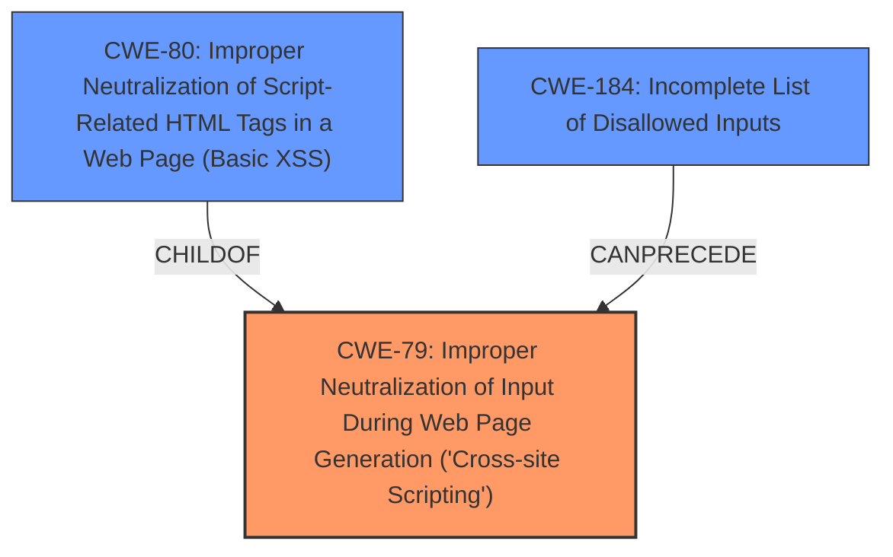

# Analysis Report for CVE-2022-28703

# Vulnerability Analysis Report: CVE-2022-28703

## Description


## Analysis (with Relationship Data)

# Summary
| CWE ID | CWE Name | Confidence | CWE Abstraction Level | CWE Vulnerability Mapping Label | CWE-Vulnerability Mapping Notes |
|---|---|---|---|---|---|
| CWE-79 | Improper Neutralization of Input During Web Page Generation ('Cross-site Scripting') | 1.0 | Base | Allowed | Primary CWE |
| CWE-80 | Improper Neutralization of Script-Related HTML Tags in a Web Page (Basic XSS) | 0.7 | Variant | Allowed | Secondary Candidate |
| CWE-184 | Incomplete List of Disallowed Inputs | 0.6 | Base | Allowed | Secondary Candidate |

## Evidence and Confidence

*   **Confidence Score:** 0.9
*   **Evidence Strength:** HIGH

## Relationship Analysis
The primary CWE selected is CWE-79, which represents the base class of Cross-Site Scripting vulnerabilities. CWE-80 is a variant of CWE-79, focusing on script-related HTML tags, offering a more specific classification if the vulnerability exclusively involves these tags. CWE-184 highlights the potential for an incomplete list of disallowed inputs, which can lead to XSS vulnerabilities.



## Vulnerability Chain
The vulnerability chain starts with **improper input sanitization**, leading to a **cross-site scripting** vulnerability, and resulting in arbitrary JavaScript code injection.

## Summary of Analysis
The initial analysis identified CWE-79 as the primary candidate due to the **cross-site scripting** vulnerability described. The "CVE Reference Links Content Summary" section confirms that the application fails to properly neutralize script-related HTML tags, allowing the injection of arbitrary JavaScript code. This aligns directly with CWE-79's description of **improper neutralization of user-controllable input** before it is placed in output used as a web page. CWE-80 was also considered as a more specific variant, but the description of the vulnerability does not explicitly limit the XSS to only script-related HTML tags. CWE-184 was considered because the **improper input sanitization** could result from an incomplete list of disallowed inputs.

The final decision to prioritize CWE-79 is based on the high confidence that the vulnerability allows for the injection of arbitrary javascript code.

Relevant CWE Information:

# Enhanced Context (25 CWEs)
The following CWEs were identified as potentially relevant to this vulnerability:

## CWE-80: Improper Neutralization of Script-Related HTML Tags in a Web Page (Basic XSS)
**Abstraction Level**: Variant
**Similarity Score**: 0.78
**Source**: dense

**Description**:
The product receives input from an upstream component, but it does not neutralize or incorrectly neutralizes special characters such as "<", ">", and "&" that could be interpreted as web-scripting elements when they are sent to a downstream component that processes web pages.

**Mapping Guidance**:
- Usage: Allowed
- Rationale: This CWE entry is at the Variant level of abstraction, which is a preferred level of abstraction for mapping to the root causes of vulnerabilities.

## CWE-79: Improper Neutralization of Input During Web Page Generation ('Cross-site Scripting')
**Technical Explanation:**

CWE-79 [Improper Neutralization of Input During Web Page Generation ('Cross-site Scripting')] is the primary CWE. The vulnerability description explicitly states a stored **cross-site scripting** vulnerability exists due to **improper input sanitization**. The "CVE Reference Links Content Summary" section confirms that the application fails to properly neutralize script-related HTML tags, allowing the injection of arbitrary JavaScript code. This directly aligns with CWE-79's description of **improper neutralization of user-controllable input** before it is placed in output used as a web page.
   - **How the vulnerability's details match the CWE's characteristics:** The description highlights the lack of proper input sanitization, leading to the injection of malicious script that is executed in the context of other users' browsers.
   - **The security implications and potential impact:** An attacker can inject malicious JavaScript code, potentially leading to session hijacking, data theft, or other malicious activities.
   - **Any parent-child relationships or chain patterns that influenced your mapping:** CWE-79 is the base class for XSS vulnerabilities, with more specific variants available.
   - **Whether the weakness is primary or secondary in the vulnerability:** This is the primary weakness.
   - **How the official MITRE mapping guidance influenced your decision:** The mapping guidance allows for the use of CWE-79 as it is a base level of abstraction.

**Confidence Score:** 1.0

## CWE-80: Improper Neutralization of Script-Related HTML Tags in a Web Page (Basic XSS)
**Technical Explanation:**

CWE-80 [Improper Neutralization of Script-Related HTML Tags in a Web Page (Basic XSS)] is a secondary candidate. It's a variant of CWE-79 that focuses on the **improper neutralization** of specific HTML tags. If the vulnerability is limited to only these tags, then CWE-80 would be a better fit. However, the description does not provide enough evidence to limit the scope to only script-related HTML tags.
   - **How the vulnerability's details match the CWE's characteristics:** If the XSS vulnerability is specifically related to the improper handling of HTML tags like `<script>`, `<iframe>`, etc., then this CWE would be a more specific fit.
   - **The security implications and potential impact:** Similar to CWE-79, the impact is the ability to inject malicious script, leading to potential session hijacking, data theft, etc.
   - **Any parent-child relationships or chain patterns that influenced your mapping:** CWE-80 is a child of CWE-79.
   - **Whether the weakness is primary or secondary in the vulnerability:** This is a secondary candidate, more specific than CWE-79 if the XSS is limited to HTML tags.
   - **How the official MITRE mapping guidance influenced your decision:** The mapping guidance allows for the use of CWE-80 if it is an appropriate fit.

**Confidence Score:** 0.7

## CWE-184: Incomplete List of Disallowed Inputs
**Technical Explanation:**

CWE-184 [Incomplete List of Disallowed Inputs] is a secondary candidate. The **improper input sanitization** described could be caused by an incomplete list of disallowed inputs. If the application is using a denylist to prevent XSS, and that denylist is missing certain characters or patterns, then this CWE would be applicable.
   - **How the vulnerability's details match the CWE's characteristics:** The vulnerability description mentions **improper input sanitization**, which could be due to an incomplete list of disallowed inputs.
   - **The security implications and potential impact:** An attacker could bypass the input validation by using inputs that are not on the denylist, leading to XSS.
   - **Any parent-child relationships or chain patterns that influenced your mapping:** CWE-184 can precede CWE-79 in a vulnerability chain.
   - **Whether the weakness is primary or secondary in the vulnerability:** This is a secondary candidate; the primary cause is the lack of sanitization, but an incomplete list could be the reason for the lack of sanitization.
   - **How the official MITRE mapping guidance influenced your decision:** The mapping guidance allows for the use of CWE-184.

**Confidence Score:** 0.6

## Other CWEs Considered:

*   CWE-89 [Improper Neutralization of Special Elements used in an SQL Command ('SQL Injection')]: While **improper input sanitization** is mentioned, there's no indication of SQL injection. The vulnerability specifically targets web page generation, making CWE-79 more appropriate.
*   CWE-138 [Improper Neutralization of Special Elements]: This is a high-level class, and CWE-79 provides a more specific classification.
*   CWE-352 [Cross-Site Request Forgery (CSRF)]: There is no mention of CSRF in the vulnerability description.
*   CWE-644: Improper Neutralization of HTTP Headers for Scripting Syntax: The vulnerability is in the body of the web page, not in the HTTP headers.
*   CWE-1287: Improper Validation of Specified Type of Input: While related to input validation, the core issue is the lack of neutralization for web page generation, making CWE-79 more direct.
*   CWE-116: Improper Encoding or Escaping of Output: Similar to CWE-79 but more general. The specific issue is


## CWE Relationship Analysis

Current CWEs represent these abstraction levels: .


### Vulnerability Chain Analysis

**Chain starting from CWE-89:**
- 89 (Improper Neutralization of Special Elements used in an SQL Command ('SQL Injection')) - ROOT


**Chain starting from CWE-80:**
- 80 (Improper Neutralization of Script-Related HTML Tags in a Web Page (Basic XSS)) - ROOT


### CWE Relationship Diagram

```mermaid
graph TD
    classDef primary fill:#f96,stroke:#333,stroke-width:2px
    classDef secondary fill:#69f,stroke:#333
    classDef tertiary fill:#9e9,stroke:#333
```


*Report generated on 2025-03-30 13:07:20*
