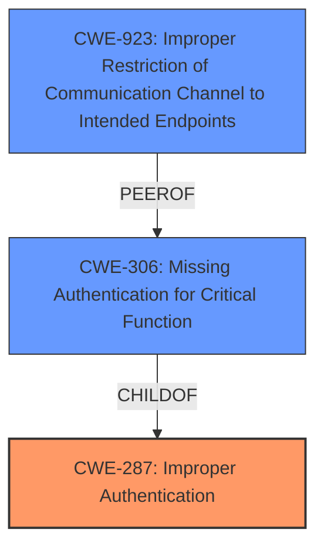

# Analysis Report for CVE-2022-28704

# Vulnerability Analysis Report: CVE-2022-28704

## Description


## Analysis (with Relationship Data)

# Summary

| CWE ID  | CWE Name                                                                       | Confidence | CWE Abstraction Level | CWE Vulnerability Mapping Label | CWE-Vulnerability Mapping Notes |
| :-------- | :----------------------------------------------------------------------------- | :--------- | :---------------------- | :------------------------------ | :------------------------------ |
| CWE-287   | Improper Authentication                                                        | 0.85       | Class                   | Primary                         | Discouraged                    |
| CWE-306   | Missing Authentication for Critical Function                                 | 0.75       | Base                    | Secondary                       | Allowed                      |
| CWE-923   | Improper Restriction of Communication Channel to Intended Endpoints           | 0.65       | Class                   | Secondary                       | Allowed-with-Review          |

## Evidence and Confidence

*   **Confidence Score:** 0.75
*   **Evidence Strength:** HIGH

## Relationship Analysis

The primary relationship is that **CWE-306 [Missing Authentication for Critical Function]** is a ChildOf **CWE-287 [Improper Authentication]**. **CWE-923 [Improper Restriction of Communication Channel to Intended Endpoints]** is a peer of **CWE-306**. The abstraction levels influenced the decision to primarily map to the Class level, **CWE-287 [Improper Authentication]**, but to also include the Base level **CWE-306 [Missing Authentication for Critical Function]** and Class level **CWE-923 [Improper Restriction of Communication Channel to Intended Endpoints]** to capture the nuances of the vulnerability.



## Vulnerability Chain

The vulnerability chain starts with **Improper Access Control**, leading to the ability to log in with root privileges and perform arbitrary operations. The chain includes:

1.  **Improper Access Control:** The root cause, allowing unauthorized access.
2.  **Default SSH access:** Allowing SSH connections from the WAN side by default.
3.  **Default Credentials:** Using default credentials, if unchanged, permits unauthorized access.
4.  **Root Privilege Login:** Remote attacker logs in with root privileges.
5.  **Arbitrary Operation:** Attacker performs arbitrary operations on the device.

## Summary of Analysis

The initial assessment identified the root cause as **Improper Access Control**, leading to the ability to log in with root privileges.

The analysis is based on the provided evidence, particularly the "CVE Reference Links Content Summary," which highlights the **Improper Access Control**, **default SSH access**, and **default credentials**.

>   The vulnerability stems from **Improper Access Control**. Specifically, the Rakuten Casa device is configured by default to accept SSH connections from the WAN side...The device is shipped with default credentials, which if left unchanged, allow unauthorized access.

Based on the evidence, the best primary mapping is **CWE-287 [Improper Authentication]**, a Class level CWE, because the device does not properly authenticate SSH connections, particularly when default credentials are used. It is also appropriate to include **CWE-306 [Missing Authentication for Critical Function]**, a Base level CWE, because the authentication mechanism is insufficient, especially in default configurations. Finally, including **CWE-923 [Improper Restriction of Communication Channel to Intended Endpoints]** is appropriate because the SSH service is exposed on the WAN side without proper endpoint validation.

**CWE-285 [Improper Authorization]** and **CWE-862 [Missing Authorization]** were considered but not selected as the primary CWE because the issue is more fundamentally about authentication. While authorization is a part of access control, the initial flaw is that the system insufficiently verifies the identity of the user.

**CWE-78 [Improper Neutralization of Special Elements used in an OS Command ('OS Command Injection')]** was considered, but this vulnerability does not appear to involve any injection of OS commands.

Relevant CWE Information:

# Enhanced Context (25 CWEs)

## CWE-653: Improper Isolation or Compartmentalization
**Abstraction Level**: Class
**Similarity Score**: 0.76
**Source**: dense

**Description**:
The product does not properly compartmentalize or isolate functionality, processes, or resources that require different privilege levels, rights, or permissions.
**Rationale for Exclusion**: This CWE is not specific to the authentication or access control issues described in the vulnerability. The core problem is not about isolating functionality but about allowing unauthorized access.

## CWE-274: Improper Handling of Insufficient Privileges
**Abstraction Level**: Base
**Similarity Score**: 0.76
**Source**: dense

**Description**:
The product does not handle or incorrectly handles when it has insufficient privileges to perform an operation, leading to resultant weaknesses.
**Rationale for Exclusion**: This CWE does not apply because the vulnerability is about gaining excessive privileges due to **improper access control**, not about handling insufficient privileges.

## CWE-266: Incorrect Privilege Assignment
**Abstraction Level**: Base
**Similarity Score**: 0.75
**Source**: dense

**Description**:
A product incorrectly assigns a privilege to a particular actor, creating an unintended sphere of control for that actor.
**Rationale for Exclusion**: While there is a privilege issue, it stems from **improper authentication** and default settings, not an explicit incorrect assignment of privileges.

## CWE-280: Improper Handling of Insufficient Permissions or Privileges
**Abstraction Level**: Base
**Similarity Score**: 0.75
**Source**: dense

**Description**:
The product does not handle or incorrectly handles when it has insufficient privileges to access resources or functionality as specified by their permissions. This may cause it to follow unexpected code paths that may leave the product in an invalid state.
**Rationale for Exclusion**: This CWE does not fit because the vulnerability is about gaining root privileges due to **improper access control**, not about handling insufficient privileges.

## CWE-668: Exposure of Resource to Wrong Sphere
**Abstraction Level**: Class
**Similarity Score**: 0.74
**Source**: dense

**Description**:
The product exposes a resource to the wrong control sphere, providing unintended actors with inappropriate access to the resource.
**Rationale for Exclusion**: While related, the primary issue is more specifically about authentication failures and allowing external access via SSH.

## CWE-664: Improper Control of a Resource Through its Lifetime
**Abstraction Level**: Pillar
**Similarity Score**: 0.74
**Source**: dense

**Description**:
The product does not maintain or incorrectly maintains control over a resource throughout its lifetime of creation, use, and release.
**Rationale for Exclusion**: This CWE is too broad and does not capture the specific vulnerability related to **improper authentication** and default settings.

## CWE-267: Privilege Defined With Unsafe Actions
**Abstraction Level**: Base
**Similarity Score**: 0.74
**Source**: dense

**Description**:
A particular privilege, role, capability, or right can be used to perform unsafe actions that were not intended, even when it is assigned to the correct entity.
**Rationale for Exclusion**: The problem is not with the definition of privileges but with **improper authentication** and **improper access control** that allows unauthorized entities to gain root privileges.

## CWE-1220: Insufficient Granularity of Access Control
**Abstraction Level**: Base
**Similarity Score**: 0.74
**Source**: dense

**Description**:
The product implements access controls via a policy or other feature with the intention to disable or restrict accesses (reads and/or writes) to assets in a system from untrusted agents. However, implemented access controls lack required granularity, which renders the control policy too broad because it allows accesses from unauthorized agents to the security-sensitive assets.
**Rationale for Exclusion**: While related to access control, the main issue is with the failure of proper authentication and allowing external SSH access by default.

## CWE-807: Reliance on Untrusted Inputs in a Security Decision
**Abstraction Level**: Base
**Similarity Score**: 0.73
**Source**: dense

**Description**:
The product uses a protection mechanism that relies on the existence or values of an input, but the input can be modified by an untrusted actor in a way that bypasses the protection mechanism.
**Rationale for Exclusion**: This CWE is not applicable because the **improper access control** isn't necessarily related to reliance on untrusted inputs. The issue is with default settings and allowing SSH access.

## CWE-404: Improper Resource Shutdown or Release
**Abstraction Level**: Class
**Similarity Score**: 0.73
**Source**: dense

**Description**:
The product does not release or incorrectly releases a resource before it is made


## CWE Relationship Analysis

Current CWEs represent these abstraction levels: .


### Vulnerability Chain Analysis

**Chain starting from CWE-862:**
- 862 (Missing Authorization) - ROOT


**Chain starting from CWE-266:**
- 266 (Incorrect Privilege Assignment) - ROOT


### CWE Relationship Diagram

```mermaid
graph TD
    classDef primary fill:#f96,stroke:#333,stroke-width:2px
    classDef secondary fill:#69f,stroke:#333
    classDef tertiary fill:#9e9,stroke:#333
```


*Report generated on 2025-03-30 20:42:48*
