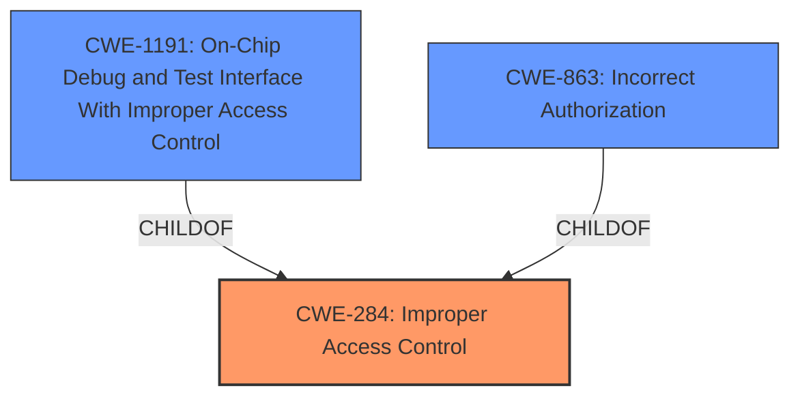

# Analysis for CVE-2022-28709

# Summary
| CWE ID | CWE Name | Confidence | CWE Abstraction Level | CWE Vulnerability Mapping Label | CWE-Vulnerability Mapping Notes |
|---|---|---|---|---|---|
| CWE-284 | Improper Access Control | 0.75 | Pillar | Primary | Discouraged |
| CWE-1191 | On-Chip Debug and Test Interface With Improper Access Control | 0.60 | Base | Secondary | Allowed |
| CWE-863 | Incorrect Authorization | 0.50 | Class | Secondary | Allowed-with-Review |

## Evidence and Confidence

*   **Confidence Score:** 0.70
*   **Evidence Strength:** MEDIUM

## Relationship Analysis
The primary relationship influencing the CWE selection is the parent-child relationship, specifically how the more general CWE-284 (**Improper Access Control**) relates to more specific potential classifications like CWE-1191 (**On-Chip Debug and Test Interface With Improper Access Control**). While CWE-284 is a high-level pillar, the description points towards a specific area of concern (firmware of Ethernet Controllers), which could potentially align with a more specific child like CWE-1191 or CWE-863 (**Incorrect Authorization**).

## Vulnerability Chain
The vulnerability chain is relatively simple: **Improper access control** leads to a denial of service. The specific mechanism of how the access control failure leads to denial of service isn't elaborated upon in the description, so the chain is limited to the root cause and the direct impact.

## Summary of Analysis
The initial assessment heavily leans on the provided evidence, especially the **Vulnerability Description Key Phrases** which explicitly identify "**Improper access control**" as the **rootcause**. The **CVE Reference Links Content Summary** reinforces this by stating that the **Root Cause of Vulnerability** is **Improper access control** in the firmware.

The retriever results suggest several CWEs, but many are too abstract (e.g., CWE-691, CWE-693) or relate to memory safety issues that don't directly align with the provided description (e.g., CWE-119).

Given the limited information, a precise classification is challenging. While CWE-284 is a high-level pillar and discouraged for use when more specific options exist, the lack of details on the exact access control mechanism that failed makes it difficult to select a more targeted CWE with high confidence.

CWE-1191 is a possibility because it relates to on-chip debug access control, which could be relevant for firmware vulnerabilities. However, without more information about the specific vulnerability, it's hard to say with certainty that this is the correct classification. The phrase "privileged user" may imply an authorization weakness, and CWE-863 (**Incorrect Authorization**) is a possibility, although it is also a class-level CWE, further information would be needed to identify the exact authorization failure.

The final decision is to classify the vulnerability as CWE-284 (**Improper Access Control**) as the primary CWE due to the clear identification of this weakness in the vulnerability description. CWE-1191 (**On-Chip Debug and Test Interface With Improper Access Control**) and CWE-863 (**Incorrect Authorization**) are retained as secondary candidates. This is based on the possibility that the vulnerability may be related to debug interface access or authorization issues within the firmware, but more information would be needed to confirm this. The selection of CWE-284 is based on the evidence available.

Relevant CWE Information:

# Enhanced Context (25 CWEs)
The following CWEs were identified as potentially relevant to this vulnerability:

## CWE-691: Insufficient Control Flow Management
**Abstraction Level**: Pillar
**Similarity Score**: 0.76
**Source**: dense

**Description**:
The code does not sufficiently manage its control flow during execution, creating conditions in which the control flow can be modified in unexpected ways.

**Mapping Guidance**:
- Usage: Discouraged
- Rationale: This CWE entry is extremely high-level, a Pillar. However, classification research is limited for weaknesses of this type, so there can be gaps or organizational difficulties within CWE that force use of this weakness, even at such a high level of abstraction.

## CWE-653: Improper Isolation or Compartmentalization
**Abstraction Level**: Class
**Similarity Score**: 0.75
**Source**: dense

**Description**:
The product does not properly compartmentalize or isolate functionality, processes, or resources that require different privilege levels, rights, or permissions.

**Mapping Guidance**:
- Usage: Allowed
- Rationale: This CWE entry is at the Base level of abstraction, which is a preferred level of abstraction for mapping to the root causes of vulnerabilities.

## CWE-667: Improper Locking
**Abstraction Level**: Class
**Similarity Score**: 0.75
**Source**: dense

**Description**:
The product does not properly acquire or release a lock on a resource, leading to unexpected resource state changes and behaviors.

**Mapping Guidance**:
- Usage: Allowed-with-Review
- Rationale: This CWE entry is a Class and might have Base-level children that would be more appropriate

## CWE-274: Improper Handling of Insufficient Privileges
**Abstraction Level**: Base
**Similarity Score**: 0.75
**Source**: dense

**Description**:
The product does not handle or incorrectly handles when it has insufficient privileges to perform an operation, leading to resultant weaknesses.

**Mapping Guidance**:
- Usage: Discouraged
- Rationale: This CWE entry could be deprecated in a future version of CWE.

## CWE-1220: Insufficient Granularity of Access Control
**Abstraction Level**: Base
**Similarity Score**: 0.74
**Source**: dense

**Description**:
The product implements access controls via a policy or other feature with the intention to disable or restrict accesses (reads and/or writes) to assets in a system from untrusted agents. However, implemented access controls lack required granularity, which renders the control policy too broad because it allows accesses from unauthorized agents to the security-sensitive assets.

**Mapping Guidance**:
- Usage: Allowed
- Rationale: This CWE entry is at the Base level of abstraction, which is a preferred level of abstraction for mapping to the root causes of vulnerabilities.

## CWE-664: Improper Control of a Resource Through its Lifetime
**Abstraction Level**: Pillar
**Similarity Score**: 0.74
**Source**: dense

**Description**:
The product does not maintain or incorrectly maintains control over a resource throughout its lifetime of creation, use, and release.

**Mapping Guidance**:
- Usage: Discouraged
- Rationale: This CWE entry is high-level when lower-level children are available.

## CWE-280: Improper Handling of Insufficient Permissions or Privileges 
**Abstraction Level**: Base
**Similarity Score**: 0.74
**Source**: dense

**Description**:
The product does not handle or incorrectly handles when it has insufficient privileges to access resources or functionality as specified by their permissions. This may cause it to follow unexpected code paths that may leave the product in an invalid state.

**Mapping Guidance**:
- Usage: Allowed
- Rationale: This CWE entry is at the Base level of abstraction, which is a preferred level of abstraction for mapping to the root causes of vulnerabilities.

## CWE-693: Protection Mechanism Failure
**Abstraction Level**: Pillar
**Similarity Score**: 0.74
**Source**: dense

**Description**:
The product does not use or incorrectly uses a protection mechanism that provides sufficient defense against directed attacks against the product.

**Mapping Guidance**:
- Usage: Discouraged
- Rationale: This CWE entry is extremely high-level, a Pillar.

## CWE-41: Improper Resolution of Path Equivalence
**Abstraction Level**: Base
**Similarity Score**: 0.74
**Source**: dense

**Description**:
The product is vulnerable to file system contents disclosure through path equivalence. Path equivalence involves the use of special characters in file and directory names. The associated manipulations are intended to generate multiple names for the same object.

**Mapping Guidance**:
- Usage: Allowed
- Rationale: This CWE entry is at the Base level of abstraction, which is a preferred level of abstraction for mapping to the root causes of vulnerabilities.

## CWE-668: Exposure of Resource to Wrong Sphere
**Abstraction Level**: Class
**Similarity Score**: 0.74
**Source**: dense

**Description**:
The product exposes a resource to the wrong control sphere, providing unintended actors with inappropriate access to the resource.

**Mapping Guidance**: