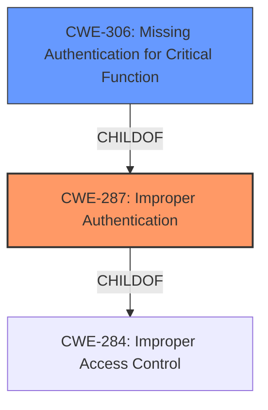

# Analysis for CVE-2022-28713

# Summary
| CWE ID | CWE Name | Confidence | CWE Abstraction Level | CWE Vulnerability Mapping Label | CWE-Vulnerability Mapping Notes |
|---|---|---|---|---|---|
| CWE-287 | Improper Authentication | 1.0 | Class | Primary | Discouraged |
| CWE-306 | Missing Authentication for Critical Function | 0.75 | Base | Secondary | Allowed |

## Evidence and Confidence

*   **Confidence Score:** 0.9
*   **Evidence Strength:** HIGH

## Relationship Analysis
The primary relationship influencing the CWE selection is the ChildOf relationship between CWE-306 (Missing Authentication for Critical Function) and CWE-287 (Improper Authentication). While CWE-287 is a higher-level class, the vulnerability description explicitly mentions **improper authentication**, making it a relevant starting point. However, the fact that an attacker can obtain data without logging in suggests a complete lack of authentication for a critical function, aligning more closely with CWE-306. The decision to include CWE-306 as a secondary candidate reflects this more specific scenario.

## Vulnerability Chain
The vulnerability chain begins with the **improper authentication** (**CWE-287**), leading to unauthorized access to facility information. A more precise cause would be **missing authentication** (**CWE-306**) for a critical function (accessing facility information). This missing authentication directly results in the impact: a remote attacker obtaining data without logging in.

## Summary of Analysis
Initially, **CWE-287 (Improper Authentication)** was considered due to the explicit mention of "**improper authentication**" in the vulnerability description. However, further analysis of the vulnerability description and the retriever results suggests that **CWE-306 (Missing Authentication for Critical Function)** is a more appropriate, specific mapping. The ability to obtain data "without logging in" strongly indicates a complete lack of authentication, which is precisely what CWE-306 describes. Since CWE-306 is a child of CWE-287, it provides a more granular and accurate representation of the vulnerability.

The evidence supporting this decision comes directly from the vulnerability description: "**Improper authentication** vulnerability in Scheduler of Cybozu Garoon 4.10.0 to 5.5.1 allows a remote attacker to obtain some data of Facility Information **without logging in** to the product." The phrase "**without logging in**" is the critical piece of evidence suggesting a complete absence of authentication. The CVE Reference Links Content Summary also supports this, stating "**CWE-287:** Improper Authentication. The system fails to properly verify the identity of the user requesting access to the Scheduler, allowing unauthorized access to facility information."

While the retriever results list several potential CWEs, including CWE-285 (Improper Authorization) and CWE-200 (Exposure of Sensitive Information to an Unauthorized Actor), these are less relevant than CWE-287 and CWE-306. CWE-285 focuses on incorrect authorization checks, which is distinct from the absence of authentication. CWE-200 describes the impact (information exposure) rather than the root cause (authentication failure).

The final decision favors CWE-287 as the primary CWE, with CWE-306 as a secondary mapping to provide more context. This choice reflects a balance between the explicit mention of "**improper authentication**" and the more specific scenario of completely missing authentication for a critical function. I am overriding the general mapping guidance that discourages the use of CWE-287 in favor of more specific CWEs because the description explicitly mentions "improper authentication" but also including CWE-306 as a secondary.

Relevant CWE Information:

# Enhanced Context (25 CWEs)
The following CWEs were identified as potentially relevant to this vulnerability:

## CWE-1289: Improper Validation of Unsafe Equivalence in Input
**Abstraction Level**: Base
**Similarity Score**: 0.79
**Source**: dense

**Description**:
The product receives an input value that is used as a resource identifier or other type of reference, but it does not validate or incorrectly validates that the input is equivalent to a potentially-unsafe value.

**Mapping Guidance**:
- Usage: Allowed
- Rationale: This CWE entry is at the Base level of abstraction, which is a preferred level of abstraction for mapping to the root causes of vulnerabilities.

## CWE-807: Reliance on Untrusted Inputs in a Security Decision
**Abstraction Level**: Base
**Similarity Score**: 0.78
**Source**: dense

**Description**:
The product uses a protection mechanism that relies on the existence or values of an input, but the input can be modified by an untrusted actor in a way that bypasses the protection mechanism.

**Mapping Guidance**:
- Usage: Allowed
- Rationale: This CWE entry is at the Base level of abstraction, which is a preferred level of abstraction for mapping to the root causes of vulnerabilities.

## CWE-183: Permissive List of Allowed Inputs
**Abstraction Level**: Base
**Similarity Score**: 0.76
**Source**: dense

**Description**:
The product implements a protection mechanism that relies on a list of inputs (or properties of inputs) that are explicitly allowed by policy because the inputs are assumed to be safe, but the list is too permissive - that is, it allows an input that is unsafe, leading to resultant weaknesses.

**Mapping Guidance**:
- Usage: Allowed
- Rationale: This CWE entry is at the Base level of abstraction, which is a preferred level of abstraction for mapping to the root causes of vulnerabilities.

## CWE-538: Insertion of Sensitive Information into Externally-Accessible File or Directory
**Abstraction Level**: Base
**Similarity Score**: 0.75
**Source**: dense

**Description**:
The product places sensitive information into files or directories that are accessible to actors who are allowed to have access to the files, but not to the sensitive information.

**Mapping Guidance**:
- Usage: Allowed
- Rationale: This CWE entry is at the Base level of abstraction, which is a preferred level of abstraction for mapping to the root causes of vulnerabilities.

## CWE-274: Improper Handling of Insufficient Privileges
**Abstraction Level**: Base
**Similarity Score**: 0.75
**Source**: dense

**Description**:
The product does not handle or incorrectly handles when it has insufficient privileges to perform an operation, leading to resultant weaknesses.

**Mapping Guidance**:
- Usage: Discouraged
- Rationale: This CWE entry could be deprecated in a future version of CWE.

## CWE-303: Incorrect Implementation of Authentication Algorithm
**Abstraction Level**: Base
**Similarity Score**: 0.75
**Source**: dense

**Description**:
The requirements for the product dictate the use of an established authentication algorithm, but the implementation of the algorithm is incorrect.

**Mapping Guidance**:
- Usage: Allowed
- Rationale: This CWE entry is at the Base level of abstraction, which is a preferred level of abstraction for mapping to the root causes of vulnerabilities.

## CWE-472: External Control of Assumed-Immutable Web Parameter
**Abstraction Level**: Base
**Similarity Score**: 0.75
**Source**: dense

**Description**:
The web application does not sufficiently verify inputs that are assumed to be immutable but are actually externally controllable, such as hidden form fields.

**Mapping Guidance**:
- Usage: Allowed
- Rationale: This CWE entry is at the Base level of abstraction, which is a preferred level of abstraction for mapping to the root causes of vulnerabilities.

## CWE-179: Incorrect Behavior Order: Early Validation
**Abstraction Level**: Base
**Similarity Score**: 0.75
**Source**: dense

**Description**:
The product validates input before applying protection mechanisms that modify the input, which could allow an attacker to bypass the validation via dangerous inputs that only arise after the modification.

**Mapping Guidance**:
- Usage: Allowed
- Rationale: This CWE entry is at the Base level of abstraction, which is a preferred level of abstraction for mapping to the root causes of vulnerabilities.

## CWE-184: Incomplete List of Disallowed Inputs
**Abstraction Level**: Base
**Similarity Score**: 0.75
**Source**: dense

**Description**:
The product implements a protection mechanism that relies on a list of inputs (or properties of inputs) that are not allowed by policy or otherwise require other action to neutralize before additional processing takes place, but the list is incomplete.

**Mapping Guidance**:
- Usage: Allowed
- Rationale: This CWE entry is at the Base level of abstraction, which is a preferred level of abstraction for mapping to the root causes of vulnerabilities.

## CWE-657: Violation of Secure Design Principles
**Abstraction Level**: Class
**Similarity Score**: