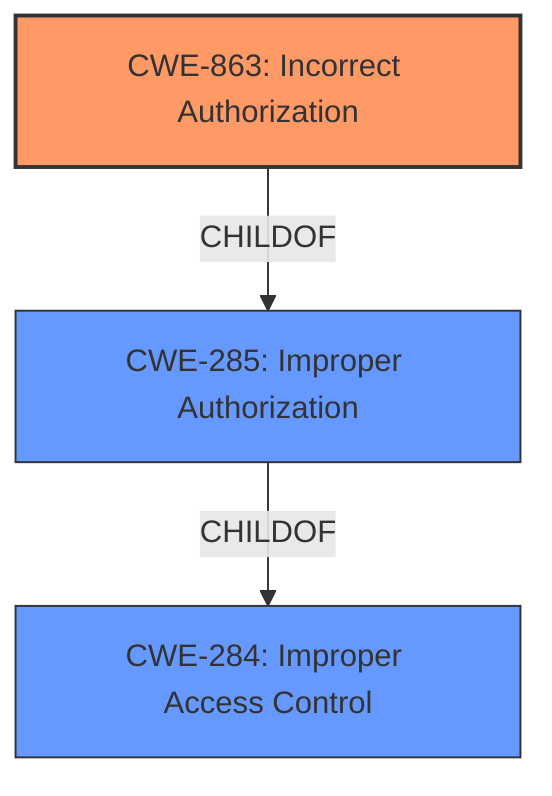

# Analysis for CVE-2022-28775

# Summary
| CWE ID | CWE Name | Confidence | CWE Abstraction Level | CWE Vulnerability Mapping Label | CWE-Vulnerability Mapping Notes |
|---|---|---|---|---|---|
| CWE-863 | Incorrect Authorization | 1.0 | Class | Primary | Allowed-with-Review |

## Evidence and Confidence

*   **Confidence Score:** 1.0
*   **Evidence Strength:** HIGH

## Relationship Analysis
The primary identified CWE is CWE-863, which is a Class-level CWE. It falls under the broader category of access control issues. Specifically, it indicates that an authorization check is performed, but it's done incorrectly. This is a more specific description than the general "Improper Access Control" (CWE-284) or "Improper Authorization" (CWE-285).

## Vulnerability Chain
The vulnerability chain starts with **improper access control**, leading to the ability for an attacker to write files without proper permissions.

## Summary of Analysis
The analysis is based on the provided evidence, specifically the vulnerability description and the CVE reference summary.

The vulnerability description explicitly states "**Improper access control** vulnerability". The CVE reference confirms the root cause as "**Root cause:** Improper access control.". It further elaborates, "**Weakness/Vulnerability:** The vulnerability lies in the lack of proper access control mechanisms within Samsung Flow. This allows an attacker to bypass intended permission checks and write arbitrary files."

The retriever results suggested several CWEs. CWE-863 "Incorrect Authorization" had a high similarity score and aligns well with the vulnerability description, which involves an error in how authorization is handled. It also fits the description of performing the authorization check incorrectly.

CWE-285 "Improper Authorization" was also considered but is a more general Class-level CWE, and the evidence supports the more specific CWE-863. The mapping guidance for CWE-285 discourages its use when lower-level CWEs are applicable.

CWE-284 "Improper Access Control" is a very high-level Pillar CWE and is discouraged for use due to its generality.

I am selecting CWE-863 as the primary CWE because it represents a more specific and accurate description of the vulnerability than the other options. The evidence clearly points to an **incorrect authorization** mechanism that allows attackers to bypass intended permission checks. CWE-863 is at an appropriate level of specificity (Class) given the available information.