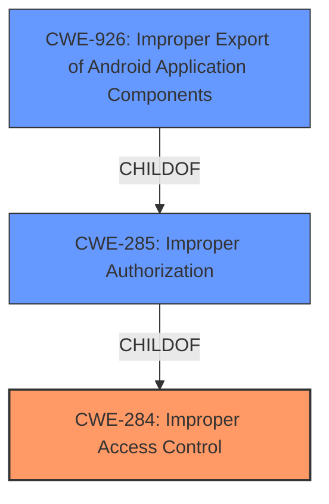

# Enhanced Analysis for CVE-2022-28776

# Summary
| CWE ID | CWE Name | Confidence | CWE Abstraction Level | CWE Vulnerability Mapping Label | CWE-Vulnerability Mapping Notes |
|---|---|---|---|---|---|
| CWE-284 | Improper Access Control | 0.8 | Pillar | Primary | Discouraged |
| CWE-926 | Improper Export of Android Application Components | 0.6 | Variant | Secondary | Allowed |

## Evidence and Confidence

*   **Confidence Score:** 0.8
*   **Evidence Strength:** HIGH

## Relationship Analysis
The primary CWE, CWE-284 (Improper Access Control), is a high-level Pillar. While it broadly describes the vulnerability, the MITRE mapping guidance discourages its use due to its high-level nature. CWE-926 (Improper Export of Android Application Components) is a Variant of CWE-285 (Improper Authorization) and a child of CWE-284. The relationships indicate that while the root cause is improper access control, the specific context of an Android application exporting components without proper restrictions makes CWE-926 a relevant, though less confident, secondary classification.



## Vulnerability Chain
The vulnerability chain starts with **improper access control**, which allows an attacker to install applications from the Galaxy Store without user interactions.

## Summary of Analysis
The initial analysis identified **CWE-284 (Improper Access Control)** as the primary weakness, based on the vulnerability description's key phrase and the CVE reference summary that highlights **"Improper access control"** as the root cause. However, CWE-284 is a high-level Pillar, and MITRE discourages its use.

The secondary analysis considered more specific CWEs. **CWE-926 (Improper Export of Android Application Components)** was considered because the vulnerability involves an Android application (Galaxy Store) and the unauthorized installation of applications, suggesting a potential issue with exported components. While the description doesn't explicitly state that the vulnerability is in an exported component, it is a plausible scenario within the context of an Android application, justifying its inclusion as a secondary CWE.

The evidence supporting CWE-284 is derived directly from the vulnerability description: "**Improper access control** vulnerability in Galaxy Store". The justification for including CWE-926 is less direct, based on the context that the Galaxy Store is an Android application and the exploitation involves installing applications without user interaction, which could stem from an improperly exported component.

The selection of CWEs reflects a balance between direct evidence (CWE-284) and contextual inference (CWE-926), recognizing that the available information may not provide a complete picture of the underlying weakness. Despite MITRE guidance to avoid the high level CWE-284, it is the only rootcause mentioned in the text.

Relevant CWE Information:
### CWE-274: Improper Handling of Insufficient Privileges
**Abstraction Level**: Base
**Similarity Score**: 0.76
**Source**: dense

**Description**:
The product does not handle or incorrectly handles when it has insufficient privileges to perform an operation, leading to resultant weaknesses.

**Mapping Guidance**:
- Usage: Discouraged
- Rationale: This CWE entry could be deprecated in a future version of CWE.

*This CWE was not selected because the vulnerability isn't about insufficient privileges of the product itself, but about unauthorized access by an attacker.*

### CWE-280: Improper Handling of Insufficient Permissions or Privileges 
**Abstraction Level**: Base
**Similarity Score**: 0.75
**Source**: dense

**Description**:
The product does not handle or incorrectly handles when it has insufficient privileges to access resources or functionality as specified by their permissions. This may cause it to follow unexpected code paths that may leave the product in an invalid state.

**Mapping Guidance**:
- Usage: Allowed
- Rationale: This CWE entry is at the Base level of abstraction, which is a preferred level of abstraction for mapping to the root causes of vulnerabilities.

*This CWE was not selected because the vulnerability isn't about the product having insufficient privileges, but about the attacker bypassing access controls.*

### CWE-653: Improper Isolation or Compartmentalization
**Abstraction Level**: Class
**Similarity Score**: 0.75
**Source**: dense

**Description**:
The product does not properly compartmentalize or isolate functionality, processes, or resources that require different privilege levels, rights, or permissions.

**Mapping Guidance**:
- Usage: Allowed
- Rationale: This CWE entry is at the Base level of abstraction, which is a preferred level of abstraction for mapping to the root causes of vulnerabilities.

*This CWE was not selected because the description doesn't focus on a lack of isolation, but specifically on improper access control.*

### CWE-1220: Insufficient Granularity of Access Control
**Abstraction Level**: Base
**Similarity Score**: 0.75
**Source**: dense

**Description**:
The product implements access controls via a policy or other feature with the intention to disable or restrict accesses (reads and/or writes) to assets in a system from untrusted agents. However, implemented access controls lack required granularity, which renders the control policy too broad because it allows accesses from unauthorized agents to the security-sensitive assets.

**Mapping Guidance**:
- Usage: Allowed
- Rationale: This CWE entry is at the Base level of abstraction, which is a preferred level of abstraction for mapping to the root causes of vulnerabilities.

*This CWE was not selected because the description doesn't specify if the access control policy lacks granularity, just that it's improper.*

### CWE-668: Exposure of Resource to Wrong Sphere
**Abstraction Level**: Class
**Similarity Score**: 0.75
**Source**: dense

**Description**:
The product exposes a resource to the wrong control sphere, providing unintended actors with inappropriate access to the resource.

**Mapping Guidance**:
- Usage: Discouraged
- Rationale: CWE-668 is high-level and is often misused as a catch-all when lower-level CWE IDs might be applicable. It is sometimes used for low-information vulnerability reports [REF-1287]. It is a level-1 Class (i.e., a child of a Pillar). It is not useful for trend analysis.

*This CWE was not selected because the description is too generic. While resources are being exposed to the wrong sphere, the root cause is specifically improper access control, which is better represented by CWE-284.*

### CWE-267: Privilege Defined With Unsafe Actions
**Abstraction Level**: Base
**Similarity Score**: 0.74
**Source**: dense

**Description**:
A particular privilege, role, capability, or right can be used to perform unsafe actions that were not intended, even when it is assigned to the correct entity.

**Mapping Guidance**:
- Usage: Allowed
- Rationale: This CWE entry is at the Base level of abstraction, which is a preferred level of abstraction for mapping to the root causes of vulnerabilities.

*This CWE was not selected because the description doesn't focus on unsafe actions tied to a privilege, but on the broader issue of improper access control.*

### CWE-639: Authorization Bypass Through User-Controlled Key
**Abstraction Level**: Base
**Similarity Score**: 0.74
**Source**: dense

**Description**:
The system's authorization functionality does not prevent one user from gaining access to another user's data or record by modifying the key value identifying the data.

**Mapping Guidance**:
- Usage: Allowed
- Rationale: This CWE entry is at the Base level of abstraction, which is a preferred level of abstraction for mapping to the root causes of vulnerabilities.

*This CWE was not selected because there is no mention of user-controlled keys being used to bypass authorization.*

### CWE-807: Reliance on Untrusted Inputs in a Security Decision
**Abstraction Level**: Base
**Similarity Score**: 0.74
**Source**: dense

**Description**:
The product uses a protection mechanism that relies on the existence or values of an input, but the input can be modified by an untrusted actor in a way that bypasses the protection mechanism.

**Mapping Guidance**:
- Usage: Allowed
- Rationale: This CWE entry is at the Base level of abstraction, which is a preferred level of abstraction for mapping to the root causes of vulnerabilities.

*This CWE was not selected because the vulnerability description does not describe the input being modified to bypass a security decision. The vulnerability relies on improper access controls.*

### CWE-345: Insufficient Verification of Data Authenticity
**Abstraction Level**: Class
**Similarity Score**: 0.74
**Source**: dense

**Description**:
The product does not sufficiently verify the origin or authenticity of data, in a way


## CWE Relationship Analysis

Current CWEs represent these abstraction levels: .


### Vulnerability Chain Analysis

**Chain starting from CWE-280:**
- 280 (Improper Handling of Insufficient Permissions or Privileges ) - ROOT


**Chain starting from CWE-284:**
- 284 (Improper Access Control) - ROOT


### CWE Relationship Diagram

```mermaid
graph TD
    classDef primary fill:#f96,stroke:#333,stroke-width:2px
    classDef secondary fill:#69f,stroke:#333
    classDef tertiary fill:#9e9,stroke:#333
```