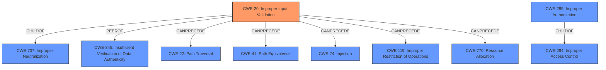

# Enhanced Analysis for CVE-2022-28781

# Summary
| CWE ID | CWE Name | Confidence | CWE Abstraction Level | CWE Vulnerability Mapping Label | CWE-Vulnerability Mapping Notes |
|---|---|---|---|---|---|
| CWE-20 | Improper Input Validation | 0.9 | Class | Primary | Discouraged |
| CWE-285 | Improper Authorization | 0.7 | Class | Secondary | Discouraged |

## Evidence and Confidence

*   **Confidence Score:** 0.8
*   **Evidence Strength:** HIGH

## Relationship Analysis
The primary CWE is CWE-20 **Improper Input Validation**, a Class-level CWE. It is related to several other CWEs through parent-child and chain relationships. It's a child of CWE-707 (Improper Neutralization of Special Elements used in a Command) and has peer relationships with CWE-345 (Insufficient Verification of Data Authenticity). It can precede CWE-22 (Improper Limitation of a Pathname to a Restricted Directory), CWE-41 (Improper Resolution of Path Equivalence), CWE-74 (Improper Neutralization of Special Elements in Output Used by a Downstream Component), CWE-119 (Improper Restriction of Operations within the Bounds of a Memory Buffer), and CWE-770 (Allocation of Resources Without Limits or Throttling).

CWE-285 **Improper Authorization** is a Class-level CWE and a child of CWE-284 (Improper Access Control).



## Vulnerability Chain
The vulnerability chain starts with **improper input validation** (CWE-20), which allows attackers to launch arbitrary activities with system privilege. This can be viewed as a form of **improper authorization** (CWE-285) since the system is not properly checking if the caller has the necessary privileges to perform the action.

## Summary of Analysis
The initial assessment identifies **improper input validation** as the root cause. The description states: "**Improper input validation** in Settings prior to SMR-May-2022 Release 1 allows attackers to launch arbitrary activity with system privilege. The patch adds proper validation logic to check the caller." This statement provides direct evidence of **improper input validation**.

The "CVE Reference Links Content Summary" section reinforces this by stating: "The vulnerability is due to **improper input validation** in the Settings application." and "Improper input validation allows attackers to launch arbitrary activities with system privileges."

CWE-20 is a Class-level CWE, and the mapping guidance discourages its use when more specific CWEs are available. However, in this case, the description specifically mentions **improper input validation** as the root cause, making CWE-20 the most appropriate primary CWE.

CWE-285 **Improper Authorization** is considered a secondary CWE because the **improper input validation** leads to the ability to launch arbitrary activities with system privileges. This implies that the system is not correctly authorizing the caller before allowing the activity to be launched. While **improper input validation** is the direct cause, the impact is that it bypasses authorization checks.

The selected CWEs are at the optimal level of specificity given the provided information. While more specific input validation CWEs exist (e.g., CWE-1284, CWE-1285), the general term **improper input validation** is explicitly used in the vulnerability description.

Relevant CWE Information:

# Enhanced Context (25 CWEs)
The following CWEs were identified as potentially relevant to this vulnerability:

## CWE-1220: Insufficient Granularity of Access Control
**Abstraction Level**: Base
**Similarity Score**: 0.76
**Source**: dense

**Description**:
The product implements access controls via a policy or other feature with the intention to disable or restrict accesses (reads and/or writes) to assets in a system from untrusted agents. However, implemented access controls lack required granularity, which renders the control policy too broad because it allows accesses from unauthorized agents to the security-sensitive assets.

**Mapping Guidance**:
- Usage: Allowed
- Rationale: This CWE entry is at the Base level of abstraction, which is a preferred level of abstraction for mapping to the root causes of vulnerabilities.

CWE-1220 is not selected because the vulnerability is directly related to **improper input validation**, not the granularity of access control.

## CWE-274: Improper Handling of Insufficient Privileges
**Abstraction Level**: Base
**Similarity Score**: 0.76
**Source**: dense

**Description**:
The product does not handle or incorrectly handles when it has insufficient privileges to perform an operation, leading to resultant weaknesses.

**Mapping Guidance**:
- Usage: Discouraged
- Rationale: This CWE entry could be deprecated in a future version of CWE.

CWE-274 is not selected because the vulnerability is caused by **improper input validation** rather than the handling of insufficient privileges.

## CWE-653: Improper Isolation or Compartmentalization
**Abstraction Level**: Class
**Similarity Score**: 0.75
**Source**: dense

**Description**:
The product does not properly compartmentalize or isolate functionality, processes, or resources that require different privilege levels, rights, or permissions.

**Mapping Guidance**:
- Usage: Allowed
- Rationale: This CWE entry is at the Base level of abstraction, which is a preferred level of abstraction for mapping to the root causes of vulnerabilities.

CWE-653 is not selected because the vulnerability is directly caused by **improper input validation**, not the lack of isolation or compartmentalization.

## CWE-807: Reliance on Untrusted Inputs in a Security Decision
**Abstraction Level**: Base
**Similarity Score**: 0.75
**Source**: dense

**Description**:
The product uses a protection mechanism that relies on the existence or values of an input, but the input can be modified by an untrusted actor in a way that bypasses the protection mechanism.

**Mapping Guidance**:
- Usage: Allowed
- Rationale: This CWE entry is at the Base level of abstraction, which is a preferred level of abstraction for mapping to the root causes of vulnerabilities.

CWE-807 is not selected because, although the vulnerability involves untrusted input, the root cause is the **improper validation** of that input, making CWE-20 a more accurate representation.

## CWE-280: Improper Handling of Insufficient Permissions or Privileges 
**Abstraction Level**: Base
**Similarity Score**: 0.75
**Source**: dense

**Description**:
The product does not handle or incorrectly handles when it has insufficient privileges to access resources or functionality as specified by their permissions. This may cause it to follow unexpected code paths that may leave the product in an invalid state.

**Mapping Guidance**:
- Usage: Allowed
- Rationale: This CWE entry is at the Base level of abstraction, which is a preferred level of abstraction for mapping to the root causes of vulnerabilities.

CWE-280 is not selected because the root cause is **improper input validation**, not the handling of insufficient permissions.

## CWE-639: Authorization Bypass Through User-Controlled Key
**Abstraction Level**: Base
**Similarity Score**: 0.75
**Source**: dense

**Description**:
The system's authorization functionality does not prevent one user from gaining access to another user's data or record by modifying the key value identifying the data.

**Mapping Guidance**:
- Usage: Allowed
- R


## CWE Relationship Analysis

Current CWEs represent these abstraction levels: .


### Vulnerability Chain Analysis

**Chain starting from CWE-41:**
- 41 (Improper Resolution of Path Equivalence) - ROOT


**Chain starting from CWE-280:**
- 280 (Improper Handling of Insufficient Permissions or Privileges ) - ROOT


### CWE Relationship Diagram

```mermaid
graph TD
    classDef primary fill:#f96,stroke:#333,stroke-width:2px
    classDef secondary fill:#69f,stroke:#333
    classDef tertiary fill:#9e9,stroke:#333
```