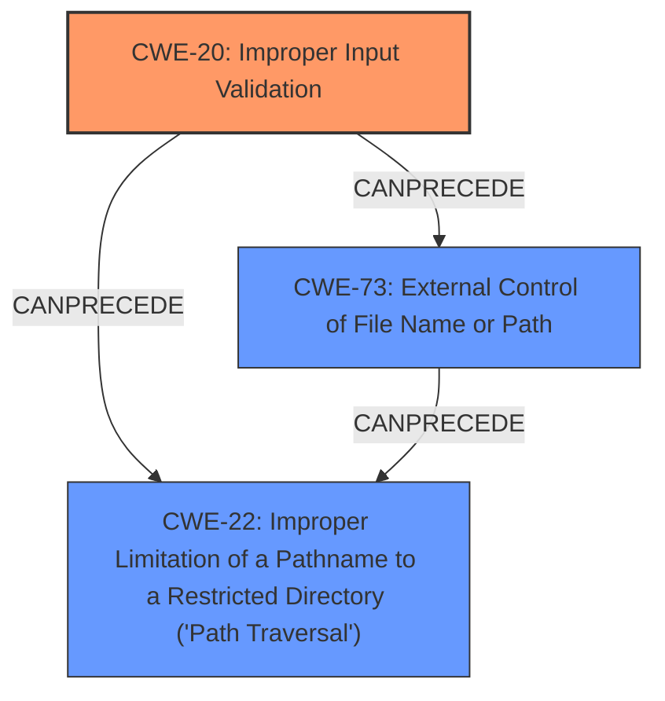

# Analysis Report for CVE-2022-28791

# Vulnerability Analysis Report: CVE-2022-28791

## Description


## Analysis (with Relationship Data)

# Summary
| CWE ID | CWE Name | Confidence | CWE Abstraction Level | CWE Vulnerability Mapping Label | CWE-Vulnerability Mapping Notes |
|---|---|---|---|---|---|
| CWE-20 | Improper Input Validation | 0.8 | Class | Primary | Discouraged |
| CWE-73 | External Control of File Name or Path | 0.6 | Base | Secondary | Allowed |
| CWE-22 | Improper Limitation of a Pathname to a Restricted Directory ('Path Traversal') | 0.5 | Base | Secondary | Allowed |

## Evidence and Confidence

*   **Confidence Score:** 0.7
*   **Evidence Strength:** MEDIUM

## Relationship Analysis
The primary CWE is CWE-20, which is a class-level CWE. While discouraged for direct mapping, it accurately reflects the **improper input validation** root cause. CWE-73 and CWE-22 are related as potential consequences of **improper input validation** when file paths are involved. The graph shows CWE-20 can precede CWE-22 and CWE-73.



## Vulnerability Chain
The vulnerability chain begins with **improper input validation** (CWE-20). This allows an attacker to control the file name or path (CWE-73), potentially leading to path traversal (CWE-22) and ultimately file overwriting.

## Summary of Analysis
The initial assessment identified **improper input validation** as the primary weakness, which aligns with the description. The "Retriever Results" also list CWE-20 as the top candidate. The description states the **rootcause** is "**Improper input validation** vulnerability...allows attacker to overwrite files stored in a specific path."

However, CWE-20 is a class-level CWE and is discouraged for direct mapping. The description also mentions "overwrite files stored in a specific path," suggesting CWE-73 (External Control of File Name or Path) and CWE-22 (Improper Limitation of a Pathname to a Restricted Directory ('Path Traversal')). CWE-73 is about external control of file names, and CWE-22 is about path traversal.

The evidence points to a scenario where **improper input validation** leads to the attacker being able to control the file path, and thus overwrite files. Therefore, the final decision is to map to CWE-20 as the primary weakness because it is the **rootcause**, with CWE-73 and CWE-22 as secondary weaknesses that describe the impact and mechanism.

CWE-20 is selected because the vulnerability description explicitly mentions **"Improper input validation"** as the root cause. Even though it's discouraged, there isn't a more specific child CWE that directly addresses the lack of validation on file paths. CWE-73 and CWE-22 help clarify the specific impact related to file paths.

Other CWEs considered but not used:

*   CWE-179: Incorrect Behavior Order: Early Validation - While validation might be happening at the wrong time, the description doesn't provide enough information to confirm this.
*   CWE-190: Integer Overflow or Wraparound - This is not relevant as the vulnerability description does not involve integer calculations.
*   CWE-269: Improper Privilege Management - This is not relevant as the description focuses on input validation, not privilege management.
*   CWE-128: Wrap-around Error - This is not relevant as the vulnerability description does not involve wrap-around errors.
*   CWE-1285: Improper Validation of Specified Index, Position, or Offset in Input - This is not directly applicable since the description doesn't specify that the input is an index, position, or offset.
*   CWE-59: Improper Link Resolution Before File Access ('Link Following') - This is not directly applicable since the description doesn't specify that the vulnerability is due to improper link resolution before file access.
*   CWE-668: Exposure of Resource to Wrong Sphere - This is too broad and doesn't accurately capture the specific vulnerability.
*   CWE-179: Incorrect Behavior Order: Early Validation - This is not relevant because the vulnerability description doesn't give enough information about when validation is occurring.


## CWE Relationship Analysis

Current CWEs represent these abstraction levels: .


### Vulnerability Chain Analysis

**Chain starting from CWE-190:**
- 190 (Integer Overflow or Wraparound) - ROOT


**Chain starting from CWE-179:**
- 179 (Incorrect Behavior Order: Early Validation) - ROOT


### CWE Relationship Diagram

```mermaid
graph TD
    classDef primary fill:#f96,stroke:#333,stroke-width:2px
    classDef secondary fill:#69f,stroke:#333
    classDef tertiary fill:#9e9,stroke:#333
```


*Report generated on 2025-03-30 22:30:09*
