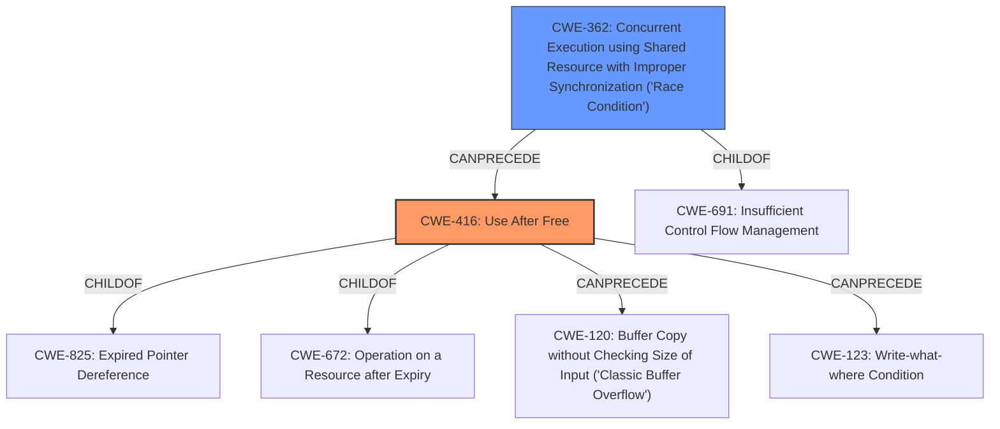

# Analysis Report for CVE-2022-28796

# Vulnerability Analysis Report: CVE-2022-28796

## Description


## Analysis (with Relationship Data)

# Summary
| CWE ID | CWE Name | Confidence | CWE Abstraction Level | CWE Vulnerability Mapping Label | CWE-Vulnerability Mapping Notes |
|---|---|---|---|---|---|
| CWE-416 | Use After Free | 1.0 | Variant | Allowed | Primary CWE |
| CWE-362 | Concurrent Execution using Shared Resource with Improper Synchronization ('Race Condition') | 0.9 | Class | Allowed-with-Review | Secondary CWE |

## Evidence and Confidence

*   **Confidence Score:** 0.95
*   **Evidence Strength:** HIGH

## Relationship Analysis
The primary weakness is CWE-416 **Use After Free**, which occurs due to a CWE-362 **Concurrent Execution using Shared Resource with Improper Synchronization ('Race Condition')**. CWE-416 is a variant of CWE-825 **Expired Pointer Dereference**, and also a child of CWE-672 **Operation on a Resource after Expiry**. CWE-362 is a class and a child of CWE-691 **Insufficient Control Flow Management**.



## Vulnerability Chain
The vulnerability chain starts with a **race condition** (CWE-362) in the `jbd2_journal_wait_updates` function which leads to the **use-after-free** vulnerability (CWE-416). The race condition allows the transaction associated with `journal->j_running_transaction` to be committed and freed while `jbd2_journal_wait_updates` is still running, resulting in accessing freed memory.

## Summary of Analysis
Based on the provided information, the vulnerability is primarily a **use-after-free** (CWE-416) caused by a **race condition** (CWE-362). The vulnerability description explicitly mentions a **use-after-free** and a **race condition**.

The "CVE Reference Links Content Summary" section provides further evidence: "The vulnerability stems from a race condition in the `jbd2_journal_wait_updates()` function... This can result in a use-after-free scenario."

The Retriever Results also supports this assessment, with CWE-416 and CWE-362 being the top matches.

CWE-416 is chosen as the primary CWE because the core issue is that the code accesses memory after it has been freed. The race condition (CWE-362) is the trigger for the use-after-free, but the actual vulnerability lies in accessing the freed memory.

The evidence supports mapping both the root cause (CWE-362) and the resulting weakness (CWE-416). CWE-416 is at the Variant level of abstraction, which is preferred and CWE-362 is at the Class level.

CWE-667 **Improper Locking** was considered but not chosen because while locking might be involved in preventing race conditions, the core issue here isn't specifically about improper locking mechanisms, but about the concurrent access to a shared resource leading to a use-after-free. CWE-367 **Time-of-check Time-of-use (TOCTOU) Race Condition** was considered, but it is not a TOCTOU vulnerability since the state of a resource isn't being checked before use.
CWE-366 **Race Condition within a Thread** was considered but CWE-362 is a better fit because it is more general.


## CWE Relationship Analysis

Current CWEs represent these abstraction levels: .


### Vulnerability Chain Analysis

**Chain starting from CWE-825:**
- 825 (Expired Pointer Dereference) - ROOT


**Chain starting from CWE-672:**
- 672 (Operation on a Resource after Expiration or Release) - ROOT


### CWE Relationship Diagram

```mermaid
graph TD
    classDef primary fill:#f96,stroke:#333,stroke-width:2px
    classDef secondary fill:#69f,stroke:#333
    classDef tertiary fill:#9e9,stroke:#333
```


*Report generated on 2025-03-31 07:07:38*
