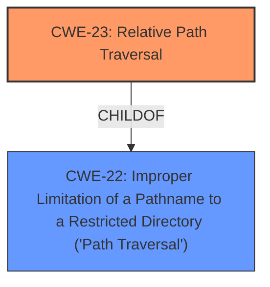

# Analysis Report for CVE-2022-28814

# Vulnerability Analysis Report: CVE-2022-28814

## Description


## Analysis (with Relationship Data)

# Summary

| CWE ID | CWE Name | Confidence | CWE Abstraction Level | CWE Vulnerability Mapping Label | CWE-Vulnerability Mapping Notes |
|---|---|---|---|---|---|
| CWE-23 | Relative Path Traversal | 1.0 | Base | Allowed | Primary CWE |

## Evidence and Confidence

*   **Confidence Score:** 1.0
*   **Evidence Strength:** HIGH

## Relationship Analysis
The primary relationship that influenced my decision was the ChildOf relationship between CWE-23 and CWE-22, where CWE-23 is a specific type of path traversal. Since the vulnerability description explicitly mentions "relative path traversal", CWE-23 is the more accurate and specific choice.



## Vulnerability Chain
The vulnerability chain is straightforward: the **relative path traversal** weakness allows remote attackers to read arbitrary files, leading to full control of the device.
  - The root cause is the **relative path traversal**.
  - The impact is reading arbitrary files and gaining full control of the device.

## Summary of Analysis
The initial analysis focused on the provided vulnerability description and the summary of the CVE reference links. The key phrase "**relative path traversal**" strongly suggests CWE-23 as the primary weakness. The retriever results also list CWE-22 and CWE-23 as highly relevant, but the explicit mention of "relative" in the description makes CWE-23 the more precise mapping.

The evidence directly supports the selection of CWE-23. "Vulnerability Description Key Phrases" section lists the weakness as "**relative path traversal**". The "CVE Reference Links Content Summary" also confirms that "**The vulnerability is due to a relative path traversal flaw**."

The graph relationships confirm that CWE-23 is a specific type of CWE-22. Selecting CWE-23 provides the optimal level of specificity.

Relevant CWE Information:

# Enhanced Context (25 CWEs)
The following CWEs were identified as potentially relevant to this vulnerability:

## CWE-23: Relative Path Traversal
**Abstraction Level**: Base
**Similarity Score**: 0.81
**Source**: dense

**Description**:
The product uses external input to construct a pathname that should be within a restricted directory, but it does not properly neutralize sequences such as ".." that can resolve to a location that is outside of that directory.

**Mapping Guidance**:
- Usage: Allowed
- Rationale: This CWE entry is at the Base level of abstraction, which is a preferred level of abstraction for mapping to the root causes of vulnerabilities.

## CWE-22: Improper Limitation of a Pathname to a Restricted Directory ('Path Traversal')
**Abstraction Level**: Base
**Similarity Score**: 8141.36
**Source**: sparse

**Description**:
The product uses external input to construct a pathname that is intended to identify a file or directory that is located underneath a restricted parent directory, but the product does not properly neutralize special elements within the pathname that can cause the pathname to resolve to a location that is outside of the restricted directory.

**Mapping Guidance**:
- Usage: Allowed
- Rationale: This CWE entry is at the Base level of abstraction, which is a preferred level of abstraction for mapping to the root causes of vulnerabilities.

## CWE-73: External Control of File Name or Path
**Abstraction Level**: Base
**Similarity Score**: 0.81
**Source**: dense

**Description**:
The product allows user input to control or influence paths or file names that are used in filesystem operations.

**Mapping Guidance**:
- Usage: Allowed
- Rationale: This CWE entry is at the Base level of abstraction, which is a preferred level of abstraction for mapping to the root causes of vulnerabilities.

## CWE-59: Improper Link Resolution Before File Access ('Link Following')
**Abstraction Level**: Base
**Similarity Score**: 0.80
**Source**: dense

**Description**:
The product attempts to access a file based on the filename, but it does not properly prevent that filename from identifying a link or shortcut that resolves to an unintended resource.

**Mapping Guidance**:
- Usage: Allowed
- Rationale: This CWE entry is at the Base level of abstraction, which is a preferred level of abstraction for mapping to the root causes of vulnerabilities.

## CWE-98: Improper Control of Filename for Include/Require Statement in PHP Program ('PHP Remote File Inclusion')
**Abstraction Level**: variant
**Similarity Score**: 4.53
**Source**: graph

**Description**:
CWE-98: Improper Control of Filename for Include/Require Statement in PHP Program ('PHP Remote File Inclusion')

**Mapping Guidance**:
- Usage: Allowed
- Rationale: This CWE entry is at the Variant level of abstraction, which is a preferred level of abstraction for mapping to the root causes of vulnerabilities.

## CWE-434: Unrestricted Upload of File with Dangerous Type
**Abstraction Level**: Base
**Similarity Score**: 3.32
**Source**: graph

**Description**:
The product allows the upload or transfer of dangerous file types that are automatically processed within its environment.

**Mapping Guidance**:
- Usage: Allowed
- Rationale: This CWE entry is at the Base level of abstraction, which is a preferred level of abstraction for mapping to the root causes of vulnerabilities.

### Other CWEs Considered But Not Used:
- CWE-22: Improper Limitation of a Pathname to a Restricted Directory ('Path Traversal') - Considered but not used because CWE-23 is a more specific type of path traversal.
- CWE-73: External Control of File Name or Path - While external control of the file name or path is a prerequisite for path traversal, it is not the core weakness in this case. The primary issue is the improper neutralization of path traversal sequences.
- CWE-59: Improper Link Resolution Before File Access ('Link Following') - Not relevant because the vulnerability description does not mention anything about symbolic links.
- CWE-98: Improper Control of Filename for Include/Require Statement in PHP Program ('PHP Remote File Inclusion') - Not relevant as the application is not a PHP application using include/require statements.
- CWE-434: Unrestricted Upload of File with Dangerous Type - The description doesn't mention any file uploads.


## CWE Relationship Analysis

Current CWEs represent these abstraction levels: .


### Vulnerability Chain Analysis

**Chain starting from CWE-98:**
- 98 (Improper Control of Filename for Include/Require Statement in PHP Program ('PHP Remote File Inclusion')) - ROOT


**Chain starting from CWE-434:**
- 434 (Unrestricted Upload of File with Dangerous Type) - ROOT


### CWE Relationship Diagram

```mermaid
graph TD
    classDef primary fill:#f96,stroke:#333,stroke-width:2px
    classDef secondary fill:#69f,stroke:#333
    classDef tertiary fill:#9e9,stroke:#333
```


*Report generated on 2025-03-31 03:50:03*
