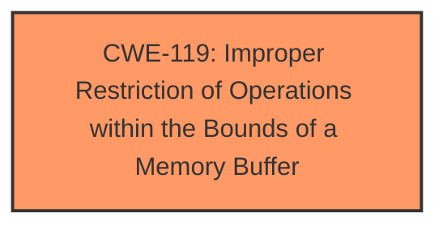

# Raw Analyzer Response for CVE-2022-28858

# Summary
| CWE ID | CWE Name | Confidence | CWE Abstraction Level | CWE Vulnerability Mapping Label | CWE-Vulnerability Mapping Notes |
|---|---|---|---|---|---|
| CWE-119 | Improper Restriction of Operations within the Bounds of a Memory Buffer | 0.7 | Class | Primary | Discouraged usage, but chosen due to the high-level nature of the description. |

## Evidence and Confidence

*   **Confidence Score:** 0.7
*   **Evidence Strength:** MEDIUM

## Relationship Analysis
The selected CWE, CWE-119, stands as a Class-level weakness. While more specific Base or Variant level CWEs would normally be preferred, the limited details in the vulnerability description prevent a more precise classification. The description indicates a general **improper buffer restriction**, pointing towards a memory corruption issue, which aligns with the broad scope of CWE-119.

## Vulnerability Chain
The vulnerability chain starts with an **improper buffer restriction** within the firmware. This leads to a potential memory corruption scenario due to operations outside the intended buffer boundaries. Successful exploitation allows a privileged user to escalate their privileges via local access.
  - **Root Cause:** **Improper buffer restriction** (CWE-119)
  - **Impact:** Escalation of privilege

## Summary of Analysis
The initial assessment focuses on the provided vulnerability description, which indicates an **improper buffer restriction** in the firmware. This weakness can potentially lead to privilege escalation if exploited by a privileged user with local access.

The selection of CWE-119 is based on the evidence, but with some reservations. The MITRE mapping guidance discourages the use of CWE-119 due to its high-level nature and potential for misuse when more specific CWEs could be applied. However, in this case, the provided information is insufficient to pinpoint a more precise weakness. The description clearly states "improper buffer restriction," aligning with the core concept of CWE-119, which involves operations outside the intended boundaries of a memory buffer.

The retriever results also suggest CWE-119 as a potential match, further supporting the initial assessment. While other CWEs like CWE-125 (Out-of-bounds Read) or CWE-787 (Out-of-bounds Write) could be considered, the current information doesn't provide enough detail to differentiate between read or write issues. Therefore, selecting CWE-119 is a reasonable choice given the available evidence.

The level of specificity is limited by the information provided. If more details were available, such as the specific type of buffer operation (read or write) or the root cause of the restriction issue (e.g., incorrect length calculation), a more specific CWE could be selected.

Relevant CWE Information:

# Enhanced Context (25 CWEs)
The following CWEs were identified as potentially relevant to this vulnerability:

## CWE-119: Improper Restriction of Operations within the Bounds of a Memory Buffer
**Abstraction:** Class
**Similarity Score**: 6531.86
**Source**: sparse

**Description**:
The product performs operations on a memory buffer, but it reads from or writes to a memory location outside the buffer's intended boundary. This may result in read or write operations on unexpected memory locations that could be linked to other variables, data structures, or internal program data.

**Mapping Guidance**:
- Usage: Discouraged
- Rationale: CWE-119 is commonly misused in low-information vulnerability reports when lower-level CWEs could be used instead, or when more details about the vulnerability are available.

## CWEs Considered But Not Used:
*   **CWE-125: Out-of-bounds Read**: This CWE was considered because a buffer restriction issue could lead to an out-of-bounds read. However, the description doesn't specify whether the vulnerability involves reading data past the end of the buffer, so it was not selected.
*   **CWE-787: Out-of-bounds Write**: Similar to CWE-125, this CWE was considered because the buffer restriction issue could also lead to writing data outside the buffer's boundaries. However, without specific information about the type of operation, it was not possible to select this CWE with confidence.
*   **CWE-20: Improper Input Validation**: While input validation issues can contribute to buffer overflows, the primary weakness described is the **improper buffer restriction** itself, making CWE-119 a more direct fit.
*   **CWE-863: Incorrect Authorization**: This CWE was not chosen because the **improper buffer restriction** is the root cause, not an authorization issue, even though the impact leads to privilege escalation.