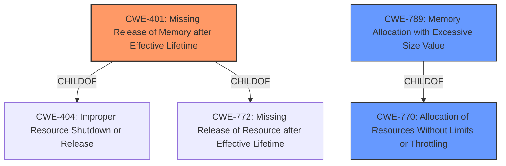

# Analysis Report for CVE-2022-28871

# Vulnerability Analysis Report: CVE-2022-28871

## Description


## Analysis (with Relationship Data)

# Summary
| CWE ID | CWE Name | Confidence | CWE Abstraction Level | CWE Vulnerability Mapping Label | CWE-Vulnerability Mapping Notes |
|---|---|---|---|---|---|
| CWE-401 | Missing Release of Memory after Effective Lifetime | 0.9 | Variant | Allowed | Primary CWE |
| CWE-770 | Allocation of Resources Without Limits or Throttling | 0.7 | Base | Allowed | Secondary Candidate |
| CWE-789 | Memory Allocation with Excessive Size Value | 0.6 | Variant | Allowed | Secondary Candidate |

## Evidence and Confidence

*   **Confidence Score:** 0.8
*   **Evidence Strength:** HIGH

## Relationship Analysis
The primary CWE, CWE-401, is a variant of CWE-404 (Improper Resource Shutdown or Release), indicating a more specific type of resource management issue. It's also a child of CWE-772 (Missing Release of Resource after Effective Lifetime), further refining the concept to memory specifically. The secondary CWEs, CWE-770 and CWE-789, are related to uncontrolled resource allocation, with CWE-789 being a child of CWE-770, focusing on excessive size values in memory allocation. This hierarchy helps to pinpoint the root cause more accurately.



## Vulnerability Chain
The vulnerability chain starts with the `fsicapd` component's **failure to properly release memory**, leading to **excessive memory consumption**. This ultimately results in a **denial-of-service** due to the scanning engine crashing. The root cause is the **memory leak**, and the impact is service disruption.

## Summary of Analysis
The initial assessment focused on the **memory leak** in the `fsicapd` component of F-Secure Atlant, as indicated by the "Vulnerability Description Key Phrases" and the "CVE Reference Links Content Summary". The retriever results suggested CWE-401 (Missing Release of Memory after Effective Lifetime) as the top candidate, supported by the "alternate_terms" retriever which picked up on "Memory Leak". This aligns well with the vulnerability description, which states that the component **consumes too much memory** while scanning files, eventually crashing the scanning engine.

CWE-401 is a Variant-level CWE, which is a preferred level of abstraction. Its description, "The product does not sufficiently track and release allocated memory after it has been used, which slowly consumes remaining memory," accurately reflects the **root cause** of the vulnerability.

CWE-770 (Allocation of Resources Without Limits or Throttling) and CWE-789 (Memory Allocation with Excessive Size Value) were also considered because the component consumes excessive memory while scanning. These CWEs are related to uncontrolled resource allocation and excessive memory allocation based on untrusted sizes. However, CWE-401 is a more precise fit because the issue is not necessarily about allocating too much memory initially, but rather failing to release it after use.

Therefore, CWE-401 is the primary CWE, representing the **root cause** of the vulnerability, while CWE-770 and CWE-789 are secondary candidates that describe contributing factors. The evidence directly supports the selection of CWE-401, making it the optimal choice.


## CWE Relationship Analysis

Current CWEs represent these abstraction levels: .


### Vulnerability Chain Analysis

**Chain starting from CWE-401:**
- 401 (Missing Release of Memory after Effective Lifetime) - ROOT


**Chain starting from CWE-772:**
- 772 (Missing Release of Resource after Effective Lifetime) - ROOT


### CWE Relationship Diagram

```mermaid
graph TD
    classDef primary fill:#f96,stroke:#333,stroke-width:2px
    classDef secondary fill:#69f,stroke:#333
    classDef tertiary fill:#9e9,stroke:#333
```


*Report generated on 2025-03-30 19:59:39*
