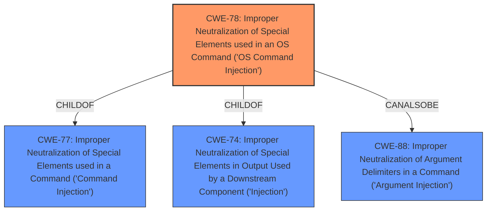

# Raw Analyzer Response for CVE-2022-28895

# Summary
| CWE ID | CWE Name | Confidence | CWE Abstraction Level | CWE Vulnerability Mapping Label | CWE-Vulnerability Mapping Notes |
|---|---|---|---|---|---|
| CWE-78 | Improper Neutralization of Special Elements used in an OS Command ('OS Command Injection') | 1.0 | Base | Primary | Allowed |

## Evidence and Confidence

*   **Confidence Score:** 1.0
*   **Evidence Strength:** HIGH

## Relationship Analysis
The primary CWE is CWE-78, which is a Base level CWE. It is a child of the Class CWE-77 which is Improper Neutralization of Special Elements used in a Command ('Command Injection'). It is also related to CWE-88, Improper Neutralization of Argument Delimiters in a Command ('Argument Injection'), through a CanAlsoBe relationship.

## Vulnerability Chain
The chain of root cause and weaknesses that followed for the Vulnerability Description:
1.  The root cause is **command injection** in the `/setnetworksettings/IPAddress` component.
2.  The impact is that attackers can escalate privileges to root.

## Summary of Analysis
The vulnerability description clearly states that there is a **command injection** vulnerability. The description also indicates that the vulnerability can be exploited to escalate privileges to root. The CWE for similar CVE descriptions lists CWE-78 as the primary match. The retriever results also lists CWE-78 as a possible match.

The vulnerability description states: "A **command injection** vulnerability in the component /setnetworksettings/IPAddress of D-Link DIR882 DIR882A1_FW130B06 allows attackers to escalate privileges to root via a crafted payload."

CWE-78 is the most appropriate CWE because it describes a scenario where the product constructs an OS command using externally-influenced input, but it does not neutralize special elements that could modify the intended command. The vulnerability description mentions a **command injection** vulnerability, which directly aligns with CWE-78.

I considered CWE-77, Improper Neutralization of Special Elements used in a Command ('Command Injection'), but it is a class-level CWE. CWE-78, Improper Neutralization of Special Elements used in an OS Command ('OS Command Injection') is more specific since it is related to OS commands. Therefore, CWE-78 is a better fit.
I also considered CWE-74, Improper Neutralization of Special Elements in Output Used by a Downstream Component ('Injection'), but it is a class-level CWE and is too general.
I also considered CWE-88, Improper Neutralization of Argument Delimiters in a Command ('Argument Injection'), since it has a CanAlsoBe relationship with CWE-78. However, the vulnerability description states that it is a **command injection** vulnerability, so CWE-78 is a better fit.
I also considered CWE-184, Incomplete List of Disallowed Inputs, but it doesn't fit the description of the vulnerability.

Relevant CWE Information: