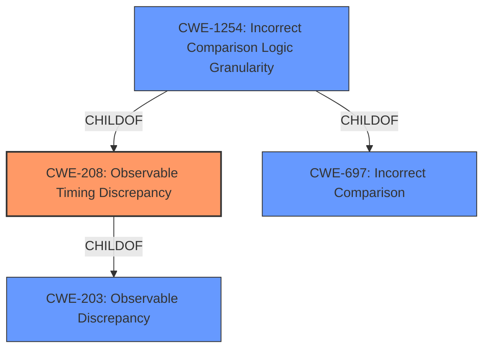

# Raw Analyzer Response for CVE-2022-2891

# Summary
| CWE ID | CWE Name | Confidence | CWE Abstraction Level | CWE Vulnerability Mapping Label | CWE-Vulnerability Mapping Notes |
|---|---|---|---|---|---|
| CWE-208 | Observable Timing Discrepancy | 0.9 | Base | Allowed | Primary CWE. The vulnerability description explicitly mentions time-based attacks and information leakage about authentication codes. |
| CWE-697 | Incorrect Comparison | 0.5 | Pillar | Discouraged | Secondary CWE. The description mentions comparison operators, but it's more specific to timing discrepancies than a general incorrect comparison. |

## Evidence and Confidence

*   **Confidence Score:** 0.9
*   **Evidence Strength:** HIGH

## Relationship Analysis
The primary relationship impacting the decision is that CWE-208 (Observable Timing Discrepancy) is a child of CWE-203 (Observable Discrepancy). However, CWE-208 is more specific to timing-based attacks, making it a better fit. CWE-697 (Incorrect Comparison) is a high-level pillar. The relationship between CWE-208 and CWE-1254 (Incorrect Comparison Logic Granularity), where CWE-1254 is a child of both CWE-208 and CWE-697, suggests that a more granular comparison logic issue could lead to timing discrepancies, but the provided information does not focus on the granularity of the comparison logic.

## Vulnerability Chain
The vulnerability chain starts with the **use of comparison operators that don't mitigate time-based attacks**, leading to an **information leak** about the authentication codes.

## Summary of Analysis
The initial analysis focused on the root cause, which is the **use of comparison operators that don't mitigate time-based attacks**. The CVE description and key phrases explicitly mention this weakness. The Retriever Results listed CWE-208 (Observable Timing Discrepancy) as the top match, which aligns with the time-based attack.

The assessment is based primarily on the provided evidence: "The WP 2FA WordPress plugin before 2.3.0 **uses comparison operators that dont mitigate time-based attacks**, which could be abused to leak information about the authentication codes being compared." The "CVE Reference Links Content Summary" also confirms that the "plugin **uses comparison operators that do not mitigate time-based attacks**" causing a "Time-based side-channel attack vulnerability due to insecure comparison operators."

The graph relationships influenced the decision by highlighting the connection between timing discrepancies and incorrect comparisons, but the evidence strongly supports a timing-specific issue.

CWE-208 is the optimal level of specificity because it directly addresses the timing-based nature of the vulnerability. While CWE-697 (Incorrect Comparison) is relevant, it is a more general category. CWE-1254 (Incorrect Comparison Logic Granularity) is a child of both CWE-208 and CWE-697, but the description lacks the finer points of the granularity of the comparison.

Relevant CWE Information:
# Enhanced Context (25 CWEs)
The following CWEs were identified as potentially relevant to this vulnerability:

## CWE-208: Observable Timing Discrepancy
**Abstraction Level**: Base
**Similarity Score**: 0.81
**Source**: dense

**Description**:
Two separate operations in a product require different amounts of time to complete, in a way that is observable to an actor and reveals security-relevant information about the state of the product, such as whether a particular operation was successful or not.

**Mapping Guidance**:
- Usage: Allowed
- Rationale: This CWE entry is at the Base level of abstraction, which is a preferred level of abstraction for mapping to the root causes of vulnerabilities.

## CWE-697: Incorrect Comparison
**Abstraction Level**: Pillar
**Similarity Score**: 0.76
**Source**: dense

**Description**:
The product compares two entities in a security-relevant context, but the comparison is incorrect, which may lead to resultant weaknesses.

**Mapping Guidance**:
- Usage: Discouraged
- Rationale: This CWE entry is extremely high-level, a Pillar. However, sometimes this weakness is forced to be used due to the lack of in-depth weakness research.

## CWE-1390: Weak Authentication
**Abstraction Level**: Class
**Similarity Score**: 0.76
**Source**: sparse

**Description**:
The product uses an authentication mechanism to restrict access to specific users or identities, but the mechanism does not sufficiently prove that the claimed identity is correct.

**Mapping Guidance**:
- Usage: Allowed-with-Review
- Rationale: This CWE entry is a Class and might have Base-level children that would be more appropriate