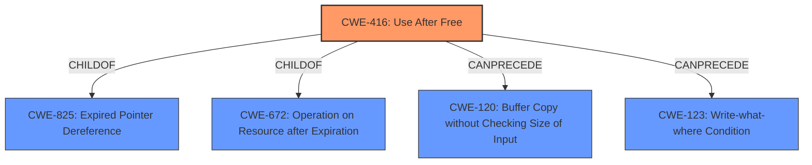

# Enhanced Analysis for CVE-2022-2896

# Summary
| CWE ID | CWE Name | Confidence | CWE Abstraction Level | CWE Vulnerability Mapping Label | CWE-Vulnerability Mapping Notes |
|---|---|---|---|---|---|
| CWE-416 | Use After Free | 1 | Variant | Allowed | Primary CWE |

## Evidence and Confidence

*   **Confidence Score:** 1
*   **Evidence Strength:** HIGH

## Relationship Analysis
The primary identified CWE is CWE-416 (**Use After Free**), which is a variant-level CWE. It has parent-child relationships to CWE-825 (**Expired Pointer Dereference**) and CWE-672 (**Operation on Resource after Expiration**). It also has a chain relationship: CanPrecede -> CWE-120 (**Buffer Copy without Checking Size of Input**), CanPrecede -> CWE-123 (**Write-what-where Condition**). The variant level is the preferred level of abstraction.



## Vulnerability Chain
The vulnerability chain for this description is relatively simple:
1.  **Root Cause:** **Use after free** (CWE-416) while processing a specific project file.
2.  **Impact:** Arbitrary code execution, privilege escalation, or denial-of-service condition.

## Summary of Analysis
The initial assessment strongly points to CWE-416 (**Use After Free**) as the primary weakness. The vulnerability description explicitly states "**use after free** while processing a specific project file." The CVE Reference Links Content Summary further reinforces this, noting "**Weaknesses/Vulnerabilities Present:** - Use-After-Free (CWE-416)." The retriever results also list CWE-416 as the top combined result.

The evidence from the vulnerability description is very clear and directly supports the selection of CWE-416 (**Use After Free**). The **weakness** is explicitly mentioned as **use after free**. This clear and direct connection, combined with the retriever results and CVE summary, leads to a high confidence score.

CWE-366 (**Race Condition within a Thread**), CWE-362 (**Concurrent Execution using Shared Resource with Improper Synchronization ('Race Condition')**), and CWE-364 (**Signal Handler Race Condition**) were considered because they appeared in the Retriever Results. However, there is no evidence to suggest that this vulnerability involves multiple threads, concurrent execution, or signal handlers. Thus, they were not selected.

CWE-415 (**Double Free**) was considered as a peer of CWE-416 (**Use After Free**). However, the vulnerability description does not mention that the same memory address is freed twice.

CWE-401 (**Missing Release of Memory after Effective Lifetime**) and CWE-775 (**Missing Release of File Descriptor or Handle after Effective Lifetime**) were considered as potential memory management issues. However, the vulnerability is specifically a **use after free**, rather than a memory leak or a missing release of a file descriptor.

CWE-416 (**Use After Free**) is the most specific and accurate representation of the vulnerability. The evidence clearly indicates that the memory is being reused or referenced after it has been freed.


## CWE Relationship Analysis

Current CWEs represent these abstraction levels: .


### Vulnerability Chain Analysis

**Chain starting from CWE-825:**
- 825 (Expired Pointer Dereference) - ROOT


**Chain starting from CWE-775:**
- 775 (Missing Release of File Descriptor or Handle after Effective Lifetime) - ROOT


### CWE Relationship Diagram

```mermaid
graph TD
    classDef primary fill:#f96,stroke:#333,stroke-width:2px
    classDef secondary fill:#69f,stroke:#333
    classDef tertiary fill:#9e9,stroke:#333
```