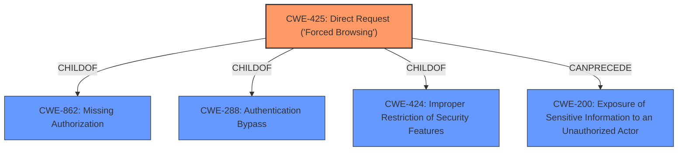

# Analysis for CVE-2022-28991

# Summary
| CWE ID | CWE Name | Confidence | CWE Abstraction Level | CWE Vulnerability Mapping Label | CWE-Vulnerability Mapping Notes |
|---|---|---|---|---|---|
| CWE-425 | Direct Request ('Forced Browsing') | 0.7 | Base | Allowed | Primary CWE |
| CWE-200 | Exposure of Sensitive Information to an Unauthorized Actor | 0.6 | Class | Discouraged | Secondary Candidate |

## Evidence and Confidence

*   **Confidence Score:** 0.7
*   **Evidence Strength:** LOW

## Relationship Analysis
The primary CWE selected is CWE-425, which is a Base level CWE. It is a child of CWE-862 (Missing Authorization), CWE-288 (Authentication Bypass), and CWE-424 (Improper Restriction of Security Features). The relationship between CWE-425 and CWE-200 is that CWE-425 can precede CWE-200; direct request can lead to sensitive information exposure. The abstraction levels influenced the selection by favoring the Base level CWE-425 over the Class level CWE-200 when the evidence supports it.

## Vulnerability Chain
The vulnerability chain starts with the **lack of access control** (potential CWE-284 or more specifically CWE-862), leading to **direct request** (CWE-425), which results in **information disclosure** (CWE-200). The missing link in this chain based on the evidence is the specific mechanism for lacking access control, since it is not defined in the Vulnerability Description or CVE reference links.

## Summary of Analysis
The initial analysis pointed towards **information disclosure**, however, the description indicates that the root cause is due to the application not adequately enforcing authorization. The description states: "Multi Store Inventory Management System v1.0 was discovered to contain an **information disclosure** vulnerability which allows attackers to access sensitive files." The primary weakness based on the description is the **lack of proper access control** which allows attackers to directly request and access sensitive files. The retriever results also list CWE-425 as the top combined result.

The graph relationships influenced the final selection by showing how CWE-425 can precede CWE-200, meaning the direct request is the means to the information disclosure.

CWE-425 is at the optimal level of specificity because it describes the direct request that leads to the **information disclosure**. While CWE-200 is related and represents the impact, CWE-425 better captures the weakness.

Relevant CWE Information:

# Enhanced Context (25 CWEs)

## CWE-425: Direct Request ('Forced Browsing')
**Abstraction:** Base
**Status:** Incomplete

### Description
The web application does not adequately enforce appropriate authorization on all restricted URLs, scripts, or files.

### Extended Description
Web applications susceptible to direct request attacks often make the false assumption that such resources can only be reached through a given navigation path and so only apply authorization at certain points in the path.

### Alternative Terms
forced browsing: The "forced browsing" term could be misinterpreted to include weaknesses such as CSRF or XSS, so its use is discouraged.

### Relationships
ChildOf -> CWE-862
ChildOf -> CWE-862
ChildOf -> CWE-288
ChildOf -> CWE-424
CanPrecede -> CWE-471
CanPrecede -> CWE-98

### Mapping Guidance
**Usage:** Allowed
**Rationale:** This CWE entry is at the Base level of abstraction, which is a preferred level of abstraction for mapping to the root causes of vulnerabilities.
**Comments:** Carefully read both the name and description to ensure that this mapping is an appropriate fit. Do not try to 'force' a mapping to a lower-level Base/Variant simply to comply with this preferred level of abstraction.
**Reasons:**
- Acceptable-Use

### Additional Notes
**[Relationship]** Overlaps Modification of Assumed-Immutable Data (MAID), authorization errors, container errors; often primary to other weaknesses such as XSS and SQL injection.

**[Theoretical]** "Forced browsing" is a step-based manipulation involving the omission of one or more steps, whose order is assumed to be immutable. The application does not verify that the first step was performed successfully before the second step. The consequence is typically "authentication bypass" or "path disclosure," although it can be primary to all kinds of weaknesses, especially in languages such as PHP, which allow external modification of assumed-immutable variables.

### Observed Examples
- **CVE-2022-29238:** Access-control setting in web-based document collaboration tool is not properly implemented by the code, which prevents listing hidden directories but does not prevent direct requests to files in those directories.
- **CVE-2022-23607:** Python-based HTTP library did not scope cookies to a particular domain such that "supercookies" could be sent to any domain on redirect.
- **CVE-2004-2144:** Bypass authentication via direct request.