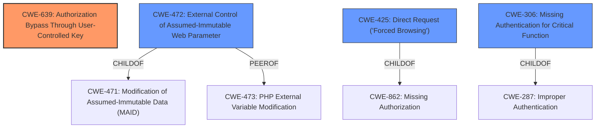

# Analysis for CVE-2022-28993

# Summary
| CWE ID | CWE Name | Confidence | CWE Abstraction Level | CWE Vulnerability Mapping Label | CWE-Vulnerability Mapping Notes |
|---|---|---|---|---|---|
| CWE-639 | Authorization Bypass Through User-Controlled Key | 0.75 | Base | Allowed | Primary CWE |
| CWE-472 | External Control of Assumed-Immutable Web Parameter | 0.6 | Base | Allowed | Secondary CWE |
| CWE-425 | Direct Request ('Forced Browsing') | 0.5 | Base | Allowed | Secondary CWE |
| CWE-306 | Missing Authentication for Critical Function | 0.5 | Base | Allowed | Secondary CWE |

## Evidence and Confidence

*   **Confidence Score:** 0.7
*   **Evidence Strength:** MEDIUM

## Relationship Analysis
The primary weakness, CWE-639 Authorization Bypass Through User-Controlled Key, is a Base level CWE, making it specific and actionable. CWE-472 External Control of Assumed-Immutable Web Parameter is related as a potential mechanism by which a user-controlled key can be modified, and it is a peer of CWE-473 and a child of CWE-471. CWE-425 Direct Request ('Forced Browsing') is related as a potential bypass, and it's a child of CWE-862. CWE-306 Missing Authentication for Critical Function is a possible bypass in conjunction with CWE-639, and it is a child of CWE-287. The relationships help understand how the vulnerability manifests and the potential attack vectors.

## Vulnerability Chain
The vulnerability chain starts with a crafted POST request, potentially exploiting **CWE-472 External Control of Assumed-Immutable Web Parameter** to modify a user-controlled key. This leads to **CWE-639 Authorization Bypass Through User-Controlled Key**, resulting in account takeover. **CWE-425 Direct Request ('Forced Browsing')** or **CWE-306 Missing Authentication for Critical Function** can be alternate, or parallel, paths to achieve the same result.

## Summary of Analysis
The initial assessment focused on identifying the root cause of the account takeover vulnerability. The vulnerability description mentions a "crafted POST request" leading to an account takeover. This suggests a potential flaw in how authorization is handled. The "Retriever Results" highlighted several relevant CWEs, including **CWE-425 Direct Request ('Forced Browsing')**, **CWE-306 Missing Authentication for Critical Function**, **CWE-285 Improper Authorization**, **CWE-472 External Control of Assumed-Immutable Web Parameter**, and **CWE-287 Improper Authentication**.

Based on the provided evidence, **CWE-639 Authorization Bypass Through User-Controlled Key** appears to be the most fitting primary CWE. This is because the vulnerability involves the attacker crafting a POST request to manipulate a key that controls authorization, leading to unauthorized access to accounts.

The evidence is limited, but the description focuses on the ability to take over accounts through a crafted request. This points to a flaw in authorization mechanisms where a user-controlled value is used to grant access to resources or functionality belonging to other users. The other CWEs are considered as secondary factors contributing to or resulting from the primary weakness.
**CWE-472 External Control of Assumed-Immutable Web Parameter** could be a way to achieve the bypass by modifying hidden fields or cookies to manipulate the user-controlled key.
**CWE-425 Direct Request ('Forced Browsing')** could be a parallel attack vector where the attacker directly requests resources belonging to other users by manipulating the user-controlled key in the request.
**CWE-306 Missing Authentication for Critical Function** could be a contributing factor if critical functions lack proper authentication checks, allowing attackers to exploit the user-controlled key to gain unauthorized access.

The selected CWEs are at the optimal level of specificity because they directly address the root cause and potential attack vectors described in the vulnerability description. **CWE-639** is a Base-level CWE that accurately describes the authorization bypass, while **CWE-472**, **CWE-425**, and **CWE-306** provide additional context on how the bypass can be achieved.

Relevant CWE Information:

**CWE-89 Improper Neutralization of Special Elements used in an SQL Command ('SQL Injection')** was considered but not selected because there is no mention of SQL in the vulnerability description.

**CWE-90 Improper Neutralization of Special Elements used in an LDAP Query ('LDAP Injection')** was considered but not selected because there is no mention of LDAP in the vulnerability description.

**CWE-285 Improper Authorization** and **CWE-287 Improper Authentication** were considered but not selected as the primary CWE because they are Class-level CWEs and less specific than **CWE-639**.