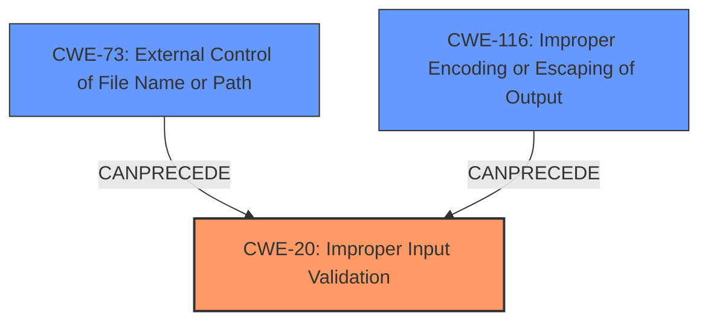

# Analysis Report for CVE-2022-29049

# Vulnerability Analysis Report: CVE-2022-29049

## Description


## Analysis (with Relationship Data)

# Summary
| CWE ID | CWE Name | Confidence | CWE Abstraction Level | CWE Vulnerability Mapping Label | CWE-Vulnerability Mapping Notes |
|---|---|---|---|---|---|
| CWE-20 | Improper Input Validation | 0.9 | Class | Primary | Allowed-with-Review |
| CWE-73 | External Control of File Name or Path | 0.7 | Base | Secondary | Allowed |
| CWE-116 | Improper Encoding or Escaping of Output | 0.6 | Class | Secondary | Allowed-with-Review |

## Evidence and Confidence

*   **Confidence Score:** 0.8
*   **Evidence Strength:** HIGH

## Relationship Analysis
The primary CWE is CWE-20, which focuses on the **improper validation** of input. The secondary CWEs, CWE-73 and CWE-116, can be related to how this **lack of validation** can lead to external control of file names or improper encoding/escaping, ultimately resulting in XSS or other exploits.



## Vulnerability Chain
The vulnerability chain starts with the **lack of input validation** (CWE-20), which allows an attacker to inject malicious input. This **unsafe input** can then lead to external control of file names or paths (CWE-73), or it can cause improper encoding/escaping of output (CWE-116), ultimately leading to vulnerabilities like Cross-Site Scripting (XSS).

## Summary of Analysis
The vulnerability stems from the Jenkins promoted builds Plugin **not validating the names of promotions defined in Job DSL**. This **lack of validation** allows attackers with Job/Configure permissions to create promotions with unsafe names, potentially leading to XSS attacks or `config.xml` file replacement.

The initial assessment points to **improper input validation** as the primary weakness, represented by CWE-20. The description clearly states that the plugin **does not validate the names of promotions**. This aligns with CWE-20's focus on the **failure to validate input**.

The following evidence from the provided content was essential to mapping decision:
*   Vulnerability Description Key Phrases: "**rootcause:** **does not validate the names of promotions defined in Job DSL**"
*   CVE Reference Links Content Summary: "The `promoted builds` plugin **does not validate the names of promotions** defined using the `Job DSL` plugin."
*   CVE Reference Links Content Summary: "**Insufficient input validation**"

CWE-73 (External Control of File Name or Path) is considered a secondary CWE. While the vulnerability description focuses on the **lack of validation** rather than direct manipulation of file names, the CVE Reference Links Content Summary mentions "potential for `config.xml` file replacement," suggesting that the **unsafe names** could be used to manipulate file paths indirectly.

CWE-116 (Improper Encoding or Escaping of Output) is another secondary CWE. The CVE Reference Links Content Summary mentions "Cross-site scripting (XSS) vulnerability" as a potential impact, implying that the **unsafe names** are not properly encoded or escaped when they are used in the application's output.

CWE-862, CWE-285, and CWE-863 were considered but were not deemed as good a fit as CWE-20. While authorization is involved, the root cause is the **lack of input validation**, which precedes and enables potential authorization bypass issues. The focus is on the initial **failure to validate the input**, not the authorization mechanism itself.
CWE-256 and CWE-522 were related to credential storage, which wasn't relevant to the vulnerability description.
CWE-379 and CWE-276 were related to file permissions, which wasn't relevant to the vulnerability description.
CWE-424 was related to protecting alternate paths, which wasn't relevant to the vulnerability description.

The selected CWEs are at the optimal level of specificity. CWE-20 captures the root cause, while CWE-73 and CWE-116 represent potential consequences or related weaknesses that could be exploited due to the **lack of validation**.


## CWE Relationship Analysis

Current CWEs represent these abstraction levels: .


### Vulnerability Chain Analysis

**Chain starting from CWE-862:**
- 862 (Missing Authorization) - ROOT


**Chain starting from CWE-424:**
- 424 (Improper Protection of Alternate Path) - ROOT


### CWE Relationship Diagram

```mermaid
graph TD
    classDef primary fill:#f96,stroke:#333,stroke-width:2px
    classDef secondary fill:#69f,stroke:#333
    classDef tertiary fill:#9e9,stroke:#333
```


*Report generated on 2025-03-30 23:05:47*
