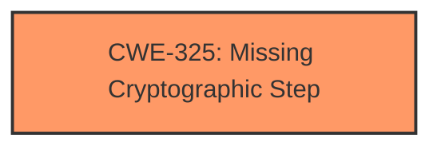

# Analysis for CVE-2022-29054

# Summary
| CWE ID  | CWE Name                                   | Confidence | CWE Abstraction Level | CWE Vulnerability Mapping Label | CWE-Vulnerability Mapping Notes |
| :------- | :----------------------------------------- | :--------- | :---------------------- | :------------------------------ | :------------------------------ |
| CWE-325 | Missing Cryptographic Step                 | 1          | Base                    | Primary                         | Allowed                       |

## Evidence and Confidence

*   **Confidence Score:** 1
*   **Evidence Strength:** HIGH

## Relationship Analysis
The primary identified CWE is CWE-325, which stands alone. The provided data does not suggest any child, parent, or peer relationships that would alter the selection of this CWE.

## Vulnerability Chain
The chain of events is straightforward: the **missing cryptographic step [CWE-325]** leads directly to the ability to decipher the encrypted key.

## Summary of Analysis
The primary assessment is based on the direct evidence of a **missing cryptographic step [CWE-325]** in the encryption process.

The vulnerability description explicitly states: "A **missing cryptographic steps vulnerability [CWE-325]** in the functions that encrypt the DHCP and DNS keys... may allow an attacker in possession of the encrypted key to decipher it."

The chosen CWE is at the optimal level of specificity, as it directly addresses the root cause of the vulnerability, which is the **absence of a necessary cryptographic procedure [CWE-325]**.

Relevant CWE Information:

# Enhanced Context (25 CWEs)

## CWE-325: Missing Cryptographic Step
**Abstraction:** Base
**Status:** Draft

### Description
The product does not implement a required step in a cryptographic algorithm, resulting in weaker encryption than advertised by the algorithm.

### Mapping Guidance
**Usage:** Allowed
**Rationale:** This CWE entry is at the Base level of abstraction, which is a preferred level of abstraction for mapping to the root causes of vulnerabilities.

### Relationships
ChildOf -> CWE-573
PeerOf -> CWE-358

### Observed Examples
- **CVE-2001-1585:** Missing challenge-response step allows authentication bypass using public key.

All other CWEs were considered but rejected because they didn't directly address the identified root cause.
- CWE-321 (Use of Hard-coded Cryptographic Key), CWE-798 (Use of Hard-coded Credentials), and CWE-1394 (Use of Default Cryptographic Key) were rejected because the vulnerability isn't about using specific types of keys, but about the encryption process itself.
- CWE-327 (Use of a Broken or Risky Cryptographic Algorithm) was rejected because the problem isn't a broken algorithm, but a missing step in the algorithm implementation.
- CWE-347 (Improper Verification of Cryptographic Signature) was rejected because the vulnerability doesn't involve signature verification.
- CWE-208 (Observable Timing Discrepancy) was rejected as it is not relevant to the described **missing cryptographic step [CWE-325]**.
- CWE-326 (Inadequate Encryption Strength) was rejected because it refers to situations where the encryption is theoretically sound but not strong enough, while the vulnerability description points to a **missing cryptographic step [CWE-325]**.
- CWE-1286 (Improper Validation of Syntactic Correctness of Input) was rejected as it is not relevant to the described **missing cryptographic step [CWE-325]**.
- CWE-1204 (Generation of Weak Initialization Vector (IV)) was rejected as it is not relevant to the described **missing cryptographic step [CWE-325]**.