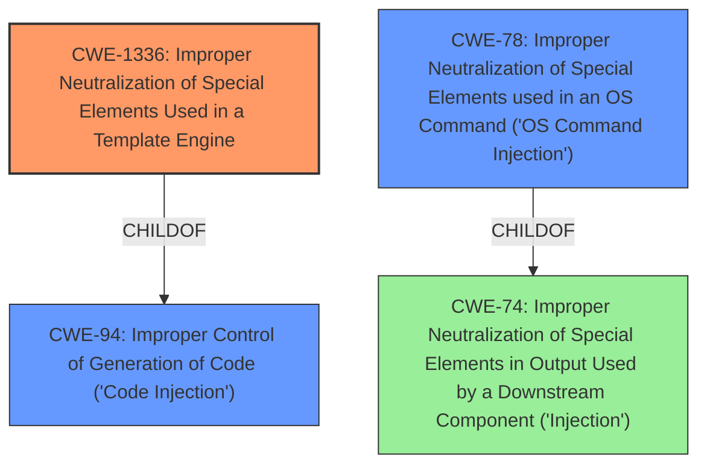

# Raw Analyzer Response for CVE-2022-29078

# Summary
| CWE ID | CWE Name | Confidence | CWE Abstraction Level | CWE Vulnerability Mapping Label | CWE-Vulnerability Mapping Notes |
|---|---|---|---|---|---|
| CWE-1336 | Improper Neutralization of Special Elements Used in a Template Engine | 1.0 | Base | Allowed | Primary CWE: The vulnerability is a direct result of the application's **failure to neutralize special elements** within the template engine, allowing for the injection of arbitrary code. |
| CWE-78 | Improper Neutralization of Special Elements used in an OS Command ('OS Command Injection') | 0.75 | Base | Allowed | Secondary CWE: The injected code results in the execution of OS commands, indicating a secondary weakness related to OS command injection. |
| CWE-94 | Improper Control of Generation of Code ('Code Injection') | 0.65 | Base | Allowed-with-Review | Secondary CWE: The template engine is used to generate code which then gets executed due to **improper neutralization**. |

## Evidence and Confidence

*   **Confidence Score:** 0.9
*   **Evidence Strength:** HIGH

## Relationship Analysis
The primary weakness is **CWE-1336 [Improper Neutralization of Special Elements Used in a Template Engine]**, which allows an attacker to inject arbitrary code into the template engine. This can lead to **CWE-94 [Improper Control of Generation of Code ('Code Injection')]**, where the injected code is then executed, and subsequently to **CWE-78 [Improper Neutralization of Special Elements used in an OS Command ('OS Command Injection')]** if the injected code executes OS commands. **CWE-1336** is a **ChildOf** **CWE-94** and is **PeerOf** **CWE-917**. **CWE-78** is **ChildOf** **CWE-74**. Selecting **CWE-1336** as the primary weakness provides the most accurate representation of the vulnerability.

## Vulnerability Chain
The vulnerability chain starts with **CWE-1336 [Improper Neutralization of Special Elements Used in a Template Engine]**, which leads to **CWE-94 [Improper Control of Generation of Code ('Code Injection')]**, and culminates in **CWE-78 [Improper Neutralization of Special Elements used in an OS Command ('OS Command Injection')]**.

## Summary of Analysis
The initial assessment identified the **server-side template injection** as the root cause. Based on the provided evidence, the primary weakness is **CWE-1336 [Improper Neutralization of Special Elements Used in a Template Engine]**. The **Vulnerability Description** states the vulnerability as "**server-side template injection** in settings[view options][outputFunctionName]." The **CVE Reference Links Content Summary** supports this by stating: "The core vulnerability is that user-controlled data can influence the template rendering process by injecting code within the `outputFunctionName`" and "The `outputFunctionName` option is directly used in the generated Javascript code, leading to the execution of injected code." This aligns with the description of **CWE-1336**, which describes a scenario where a product uses a template engine but does not properly neutralize special elements, allowing for injection attacks. The retriever results also supports **CWE-1336** as the top match. The **CWE-1336** is at the Base level of abstraction, which is a preferred level of abstraction for mapping to the root causes of vulnerabilities and has a Usage of Allowed.

**CWE-78 [Improper Neutralization of Special Elements used in an OS Command ('OS Command Injection')]** is added as a secondary weakness because the injected code can lead to the execution of OS commands. The evidence to support this is from the **Vulnerability Description**, which states the impact as "execute OS command" and the **CVE Reference Links Content Summary**, which states "By injecting malicious JavaScript code into the `outputFunctionName`, an attacker can achieve remote code execution on the server." This aligns with the description of **CWE-78**, which describes a scenario where a product constructs an OS command using externally-influenced input but does not properly neutralize special elements, allowing for the modification of the intended OS command. The **CWE-78** is at the Base level of abstraction, which is a preferred level of abstraction for mapping to the root causes of vulnerabilities and has a Usage of Allowed.

**CWE-94 [Improper Control of Generation of Code ('Code Injection')]** is added as a secondary weakness because the template engine is generating code, which is then executed due to **improper neutralization**. The **CVE Reference Links Content Summary** states "The `outputFunctionName` option is directly used in the generated Javascript code, leading to the execution of injected code." This aligns with the description of **CWE-94**, which describes a scenario where a product constructs a code segment using externally-influenced input but does not properly neutralize special elements, allowing for the modification of the syntax or behavior of the intended code segment. The **CWE-94** is at the Base level of abstraction and has a Usage of Allowed-with-Review.

Other CWEs considered but not used:

*   **CWE-917 [Improper Neutralization of Special Elements used in an Expression Language Statement ('Expression Language Injection')]**: While this CWE is related to expression language injection, **CWE-1336** is a more specific fit for template injection.
*   **CWE-88 [Improper Neutralization of Argument Delimiters in a Command ('Argument Injection')]**: While OS command injection is a possible outcome, the root cause is the template injection, making **CWE-1336** the more appropriate primary weakness.
*   **CWE-74 [Improper Neutralization of Special Elements in Output Used by a Downstream Component ('Injection')]**: This is a high-level class, and more specific CWEs like **CWE-1336**, **CWE-78**, and **CWE-94** are more appropriate.

Relevant CWE Information:
INSERT