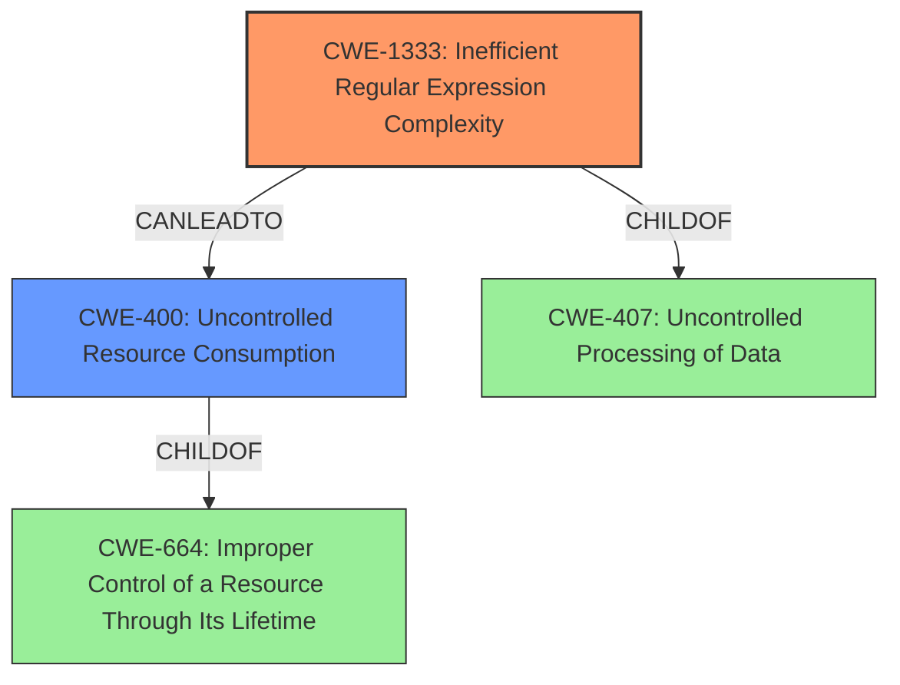

# Analysis for CVE-2022-2908

# Summary
| CWE ID    | CWE Name                                     | Confidence | CWE Abstraction Level | CWE Vulnerability Mapping Label | CWE-Vulnerability Mapping Notes |
| :-------- | :------------------------------------------- | :--------- | :-------------------- | :------------------------------ | :------------------------------ |
| CWE-1333  | Inefficient Regular Expression Complexity    | 0.9        | Base                  | Allowed                         | Primary CWE                     |
| CWE-400   | Uncontrolled Resource Consumption            | 0.7        | Class                 | Discouraged                     | Secondary Candidate             |

## Evidence and Confidence

*   **Confidence Score:** 0.8
*   **Evidence Strength:** HIGH

## Relationship Analysis
The primary CWE is CWE-1333, a Base level weakness describing inefficient regular expression complexity. The secondary weakness is CWE-400, a Class level weakness describing uncontrolled resource consumption. CWE-1333 is a child of CWE-407: Uncontrolled Processing of Data, while CWE-400 is a child of CWE-664: Improper Control of a Resource Through Its Lifetime. CWE-1333 can lead to CWE-400 by exhausting CPU resources.

## Vulnerability Chain
The vulnerability chain starts with the **inefficient regular expression** (CWE-1333) which leads to **high CPU usage**, resulting in a denial-of-service (DoS) condition by **exhausting server CPU resources** (CWE-400).

## Summary of Analysis
The initial analysis focused on identifying the root cause and the resulting impact. The primary weakness, as indicated by the CVE description and supporting evidence, is CWE-1333 (**Inefficient Regular Expression Complexity**). This is due to the vulnerability stemming from a regular expression in `commit_trailers_filter.rb` that is susceptible to catastrophic backtracking. The crafted input in the commit message triggers this, leading to high CPU usage. The retriever results also listed CWE-1333 as the top candidate.

The resulting impact of the vulnerability is the denial-of-service condition, which is best described by CWE-400 (**Uncontrolled Resource Consumption**). The evidence supports this, as the crafted input causes high CPU usage, exhausting server resources.

The graph relationships influenced the final selection by highlighting the chain of events. The **inefficient regular expression** (CWE-1333) directly leads to **resource exhaustion** (CWE-400).

The selected CWEs are at the optimal level of specificity. CWE-1333 is a Base level weakness, providing a specific description of the inefficient regular expression. CWE-400, while a Class, accurately describes the resulting impact of resource exhaustion due to the inefficient regex.

Relevant CWE Information:

# Enhanced Context (25 CWEs)
The following CWEs were identified as potentially relevant to this vulnerability:

## CWE-668: Exposure of Resource to Wrong Sphere
**Abstraction Level**: Class
**Similarity Score**: 0.76
**Source**: dense

**Description**:
The product exposes a resource to the wrong control sphere, providing unintended actors with inappropriate access to the resource.

**Mapping Guidance**:
- Usage: Discouraged
- Rationale: CWE-668 is high-level and is often misused as a catch-all when lower-level CWE IDs might be applicable. It is sometimes used for low-information vulnerability reports [REF-1287]. It is a level-1 Class (i.e., a child of a Pillar). It is not useful for trend analysis.

*This CWE was not selected, as the vulnerability does not expose a resource to the wrong control sphere, but rather exhausts CPU resources.*

## CWE-404: Improper Resource Shutdown or Release
**Abstraction Level**: Class
**Similarity Score**: 0.75
**Source**: dense

**Description**:
The product does not release or incorrectly releases a resource before it is made available for re-use.

**Mapping Guidance**:
- Usage: Allowed-with-Review
- Rationale: This CWE entry is a Class and might have Base-level children that would be more appropriate

*This CWE was not selected, as the vulnerability does not involve improper resource shutdown or release, but rather resource exhaustion due to inefficient processing.*

## CWE-41: Improper Resolution of Path Equivalence
**Abstraction Level**: Base
**Similarity Score**: 0.75
**Source**: dense

**Description**:
The product is vulnerable to file system contents disclosure through path equivalence. Path equivalence involves the use of special characters in file and directory names. The associated manipulations are intended to generate multiple names for the same object.

**Mapping Guidance**:
- Usage: Allowed
- Rationale: This CWE entry is at the Base level of abstraction, which is a preferred level of abstraction for mapping to the root causes of vulnerabilities.

*This CWE was not selected, as the vulnerability does not involve path equivalence issues.*

## CWE-405: Asymmetric Resource Consumption (Amplification)
**Abstraction Level**: Class
**Similarity Score**: 0.75
**Source**: dense

**Description**:
The product does not properly control situations in which an adversary can cause the product to consume or produce excessive resources without requiring the adversary to invest equivalent work or otherwise prove authorization, i.e., the adversary's influence is "asymmetric."

**Mapping Guidance**:
- Usage: Allowed-with-Review
- Rationale: This CWE entry is a Class and might have Base-level children that would be more appropriate

*This CWE was not selected because while there is asymmetric resource consumption, the root cause is the inefficient regular expression.*

## CWE-639: Authorization Bypass Through User-Controlled Key
**Abstraction Level**: Base
**Similarity Score**: 0.75
**Source**: dense

**Description**:
The system's authorization functionality does not prevent one user from gaining access to another user's data or record by modifying the key value identifying the data.

**Mapping Guidance**:
- Usage: Allowed
- Rationale: This CWE entry is at the Base level of abstraction, which is a preferred level of abstraction for mapping to the root causes of vulnerabilities.

*This CWE was not selected, as the vulnerability is not related to authorization bypass.*

## CWE-1289: Improper Validation of Unsafe Equivalence in Input
**Abstraction Level**: Base
**Similarity Score**: 0.75
**Source**: dense

**Description**:
The product receives an input value that is used as a resource identifier or other type of reference, but it does not validate or incorrectly validates that the input is equivalent to a potentially-unsafe value.

**Mapping Guidance**:
- Usage: Allowed
- Rationale: This CWE entry is at the Base level of abstraction, which is a preferred level of abstraction for mapping to the root causes of vulnerabilities.

*This CWE was not selected, as the vulnerability isn't about validating equivalence of inputs but is about regular expression inefficiency.*

## CWE-664: Improper Control of a Resource Through its Lifetime
**Abstraction Level**: Pillar
**Similarity Score**: 0.75
**Source**: dense

**Description**:
The product does not maintain or incorrectly maintains control over a resource throughout its lifetime of creation, use, and release.

**Mapping Guidance**:
- Usage: Discouraged
- Rationale: This CWE entry is high-level when lower-level children are available.

*This CWE was not selected because it is too high-level. CWE-400 is a better child choice.*

## CWE-807: Reliance on Untrusted Inputs in a Security Decision
**Abstraction Level**: Base
**Similarity Score**: 0.75
**Source**: dense

**Description**:
The product uses a protection mechanism that relies on the existence or values of an input, but the input can be modified by an untrusted actor in a way that bypasses the protection mechanism.

**Mapping Guidance**:
- Usage: Allowed
- Rationale: This CWE entry is at the Base level of abstraction, which is a preferred level of abstraction for mapping to the root causes of vulnerabilities.

*This CWE was not selected, as the vulnerability is about regular expression inefficiency and not about relying on untrusted inputs for security decisions.*

## CWE-799: Improper Control of Interaction Frequency
**Abstraction Level**: Class
**Similarity Score**: 0.74
**Source**: dense

**Description**: