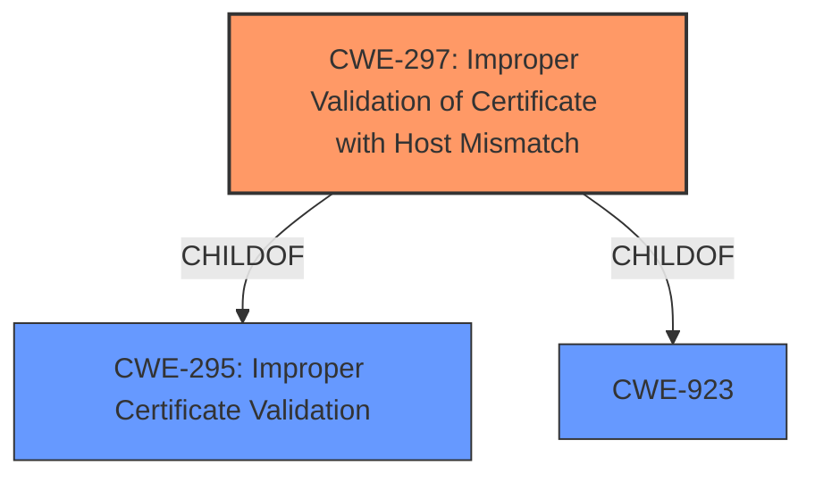

# Enhanced Analysis for CVE-2022-29082

# Summary
| CWE ID | CWE Name | Confidence | CWE Abstraction Level | CWE Vulnerability Mapping Label | CWE-Vulnerability Mapping Notes |
|---|---|---|---|---|---|
| CWE-297 | Improper Validation of Certificate with Host Mismatch | 1.0 | Variant | Allowed | Primary CWE |

## Evidence and Confidence

*   **Confidence Score:** 1.0
*   **Evidence Strength:** HIGH

## Relationship Analysis
The primary identified CWE is CWE-297, which is a Variant of CWE-295 (Improper Certificate Validation) and CWE-923. This hierarchical relationship indicates that CWE-297 is a more specific case of general certificate validation issues, focusing on the host mismatch aspect. The relationships guide the selection towards the most specific CWE that fits the vulnerability.



## Vulnerability Chain
The vulnerability chain consists of:
  1.  **Root Cause:** **Improper Validation of Certificate with Host Mismatch** (CWE-297)
  2.  **Impact:** Remote attackers may be able to spoof certificates, potentially leading to unauthorized access or information disclosure.

## Summary of Analysis
The initial analysis identified **Improper Validation of Certificate with Host Mismatch** as the root cause. The "Vulnerability Description Key Phrases" section and the "CVE Reference Links Content Summary" section both explicitly state this as the root cause.

The evidence from the vulnerability description clearly points to **CWE-297 [Improper Validation of Certificate with Host Mismatch]** as the primary weakness. The description states: "Dell EMC NetWorker ... contain an **Improper Validation of Certificate with Host Mismatch** vulnerability in Rabbitmq port 5671 which could allow remote attackers to spoof certificates." The retriever results also list CWE-297 as the top candidate with a high similarity score.

The hierarchical relationships confirm that CWE-297 is a specific variant of CWE-295, providing a more precise classification. The mapping guidance for CWE-297 recommends its use when the host-specific data in the certificate is not properly checked.

Based on the evidence and the relationship analysis, **CWE-297** is the most appropriate and specific CWE for this vulnerability.


## CWE Relationship Analysis

Current CWEs represent these abstraction levels: .


### Vulnerability Chain Analysis

**Chain starting from CWE-297:**
- 297 (Improper Validation of Certificate with Host Mismatch) - ROOT


**Chain starting from CWE-923:**
- 923 (Improper Restriction of Communication Channel to Intended Endpoints) - ROOT


### CWE Relationship Diagram

```mermaid
graph TD
    classDef primary fill:#f96,stroke:#333,stroke-width:2px
    classDef secondary fill:#69f,stroke:#333
    classDef tertiary fill:#9e9,stroke:#333
```