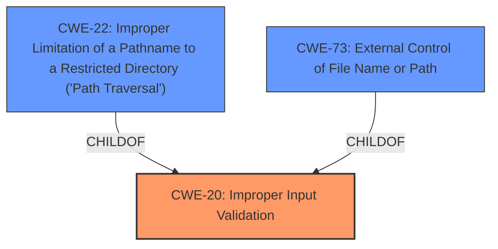

# Analysis for CVE-2022-29154

# Summary
| CWE ID | CWE Name | Confidence | CWE Abstraction Level | CWE Vulnerability Mapping Label | CWE-Vulnerability Mapping Notes |
|---|---|---|---|---|---|
| CWE-20 | Improper Input Validation | 0.9 | Class | Primary CWE | Discouraged |
| CWE-22 | Improper Limitation of a Pathname to a Restricted Directory ('Path Traversal') | 0.8 | Base | Secondary Candidate | Allowed |
| CWE-73 | External Control of File Name or Path | 0.7 | Base | Secondary Candidate | Allowed |

## Evidence and Confidence

*   **Confidence Score:** 0.8
*   **Evidence Strength:** HIGH

## Relationship Analysis
The primary weakness is classified as CWE-20, a Class-level CWE, indicating **improper input validation**. While generally discouraged, its application here is justified by the high-level description of **insufficient validation of file names**. The related CWE-22 (Improper Limitation of a Pathname to a Restricted Directory) and CWE-73 (External Control of File Name or Path) are considered as they represent more specific instances of the **improper input validation** leading to path traversal and external control of file paths respectively.

## Vulnerability Chain
The vulnerability chain starts with the **insufficient validation of file names** (CWE-20) by the rsync client. This leads to a malicious server being able to control the file names, potentially leading to writing files outside the intended directory (CWE-22) or controlling the file path (CWE-73), ultimately resulting in arbitrary file overwrite and potential remote code execution.

## Summary of Analysis
The initial assessment considered several CWEs from the Retriever Results, including CWE-59, CWE-22, CWE-427, and CWE-23. However, the core issue is best represented by the **improper input validation** (CWE-20) that allows the subsequent path manipulation. The vulnerability description and CVE details both emphasize **insufficient validation** as the root cause.

The Retriever Results offer several potentially relevant CWEs.

*   CWE-59 (Improper Link Resolution Before File Access ('Link Following')): While a possible outcome, the primary issue isn't about following links but about **improper validation** of the file names themselves.
*   CWE-22 (Improper Limitation of a Pathname to a Restricted Directory ('Path Traversal')): A more specific consequence of the **improper validation**.
*   CWE-427 (Uncontrolled Search Path Element): Not directly relevant as the vulnerability doesn't involve search paths.
*   CWE-23 (Relative Path Traversal): A specific type of path traversal, but the **insufficient validation** is a more general weakness.
*   CWE-918 (Server-Side Request Forgery (SSRF)): Irrelevant as the vulnerability doesn't involve server-side requests.

The final decision to focus on CWE-20, with CWE-22 and CWE-73 as secondary considerations, is based on the **Vulnerability Description Key Phrases**, particularly "**insufficient validation of file names**," and the **CVE Reference Links Content Summary**, which highlights **insufficient controls**. While CWE-20 is a Class-level CWE and generally discouraged, it accurately captures the high-level weakness. The more specific Base-level CWEs like CWE-22 and CWE-73 represent potential attack vectors enabled by the **improper validation**, but do not represent the root cause as accurately.

Relevant CWE Information:

# Enhanced Context (25 CWEs)

## CWE-59: Improper Link Resolution Before File Access ('Link Following')
**Abstraction Level**: Base
**Similarity Score**: 0.76
**Source**: dense

**Description**:
The product attempts to access a file based on the filename, but it does not properly prevent that filename from identifying a link or shortcut that resolves to an unintended resource.
*   This was considered and rejected because the primary issue is about **improper validation** of the file names, not about following links.

## CWE-22: Improper Limitation of a Pathname to a Restricted Directory ('Path Traversal')
**Abstraction Level**: Base
**Similarity Score**: 0.77
**Source**: dense

**Description**:
The product uses external input to construct a pathname that is intended to identify a file or directory that is located underneath a restricted parent directory, but the product does not properly neutralize special elements within the pathname that can cause the pathname to resolve to a location that is outside of the restricted directory.
*   This was considered and accepted as a secondary candidate since it is a more specific consequence of the **improper validation**.

## CWE-427: Uncontrolled Search Path Element
**Abstraction Level**: Base
**Similarity Score**: 9558.00
**Source**: sparse

**Description**:
The product uses a fixed or controlled search path to find resources, but one or more locations in that path can be under the control of unintended actors.
*   This was considered and rejected because the vulnerability doesn't involve search paths.

## CWE-23: Relative Path Traversal
**Abstraction Level**: Base
**Similarity Score**: 0.77
**Source**: dense

**Description**:
The product uses external input to construct a pathname that should be within a restricted directory, but it does not properly neutralize sequences such as ".." that can resolve to a location that is outside of that directory.
*   This was considered and rejected because the **insufficient validation** is a more general weakness and CWE-22 already captures path traversal.

## CWE-73: External Control of File Name or Path
**Abstraction Level**: Base
**Similarity Score**: 0.76
**Source**: dense

**Description**:
The product allows user input to control or influence paths or file names that are used in filesystem operations.
*   This was considered and accepted as a secondary candidate because it describes how a malicious server could control file names.