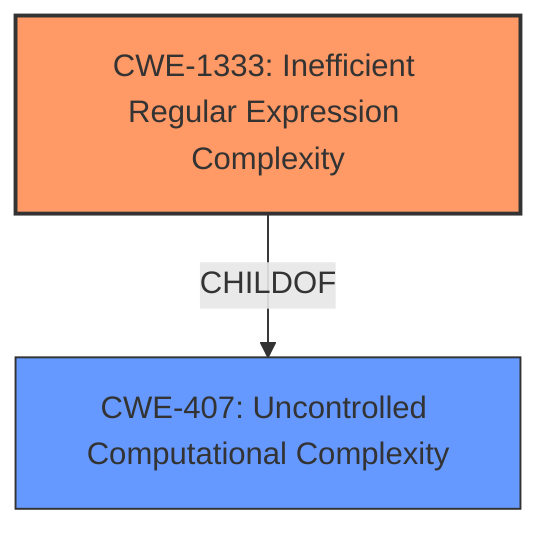

# Enhanced Analysis for CVE-2022-29167

# Summary
| CWE ID | CWE Name | Confidence | CWE Abstraction Level | CWE Vulnerability Mapping Label | CWE-Vulnerability Mapping Notes |
|---|---|---|---|---|---|
| CWE-1333 | Inefficient Regular Expression Complexity | 1.0 | Base | Allowed | Primary CWE |

## Evidence and Confidence

*   **Confidence Score:** 1.0
*   **Evidence Strength:** HIGH

## Relationship Analysis
The primary relationship that influenced the decision was the ChildOf relationship between CWE-1333 and CWE-407 (Uncontrolled Computational Complexity). CWE-1333 is a specific instance of uncontrolled computational complexity arising from inefficient regular expressions. There are no other relevant relationships to consider in this case.



## Vulnerability Chain
The vulnerability chain consists of the use of an inefficient regular expression, leading to excessive CPU consumption, and ultimately resulting in a denial-of-service.
  - **Root Cause:** Use of an inefficient regular expression (`Hawk.utils.parseHost()`).
  - **Weakness:** **Regular expression denial of service**.
  - **Impact:** Increase in computation time, potentially leading to a denial-of-service.

## Summary of Analysis
The primary CWE identified is CWE-1333 (Inefficient Regular Expression Complexity).

The vulnerability description explicitly mentions that the **weakness** is a **regular expression denial of service** due to the use of an inefficient regular expression in the `Hawk.utils.parseHost()` function. The CVE Reference Links Content Summary reinforces this, stating "The regular expression used for parsing the `Host` header was susceptible to ReDoS attacks." The **impact** of this vulnerability is that an attacker can "cause a denial-of-service (DoS) by sending specially crafted `Host` headers" which "increase exponentially with each added character".

The "Retriever Results" section lists CWE-1333 as the top combined result with a score of 1.0. The description of CWE-1333 states: "The product uses a regular expression with an inefficient, possibly exponential worst-case computational complexity that consumes excessive CPU cycles." This aligns directly with the vulnerability description.

Therefore, based on the vulnerability description, CVE Reference Links Content Summary, and Retriever Results, CWE-1333 is the most appropriate mapping. The confidence in this mapping is high (1.0) due to the strong evidence and direct match with the CWE description.

Other CWEs Considered and Rejected:

*   CWE-295 (Improper Certificate Validation): While listed in the Retriever Results, this CWE is not relevant to the vulnerability description, which focuses on regular expression complexity rather than certificate validation.
*   CWE-212 (Improper Removal of Sensitive Information Before Storage or Transfer): This CWE is also listed in the Retriever Results but does not align with the vulnerability, which is about ReDoS rather than information leakage.
*   CWE-625 (Permissive Regular Expression): While related to regular expressions, this CWE focuses on regular expressions that do not sufficiently restrict allowed values, leading to partial comparisons. In contrast, CWE-1333 is specifically about inefficient regular expressions that cause excessive CPU consumption, which is the exact issue described in the vulnerability.
*   CWE-201 (Insertion of Sensitive Information Into Sent Data): This CWE is about sensitive data being included in transmitted data, which is unrelated to the ReDoS vulnerability.

The selected CWE is at the optimal level of specificity because it directly addresses the root cause of the vulnerability, which is the use of an inefficient regular expression leading to denial of service.


## CWE Relationship Analysis

Current CWEs represent these abstraction levels: .


### Vulnerability Chain Analysis

**Chain starting from CWE-201:**
- 201 (Insertion of Sensitive Information Into Sent Data) - ROOT


**Chain starting from CWE-625:**
- 625 (Permissive Regular Expression) - ROOT


### CWE Relationship Diagram

```mermaid
graph TD
    classDef primary fill:#f96,stroke:#333,stroke-width:2px
    classDef secondary fill:#69f,stroke:#333
    classDef tertiary fill:#9e9,stroke:#333
```