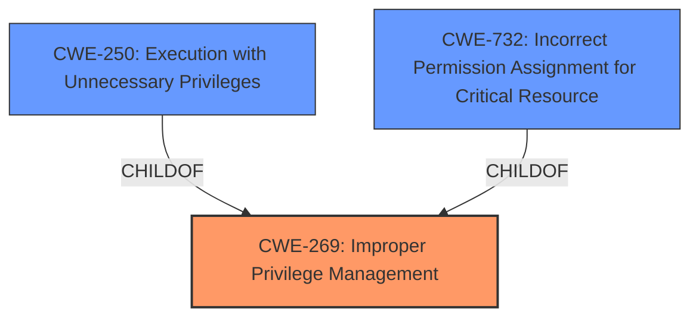

# Raw Analyzer Response for CVE-2022-29179

# Summary
| CWE ID | CWE Name | Confidence | CWE Abstraction Level | CWE Vulnerability Mapping Label | CWE-Vulnerability Mapping Notes |
|---|---|---|---|---|---|
| CWE-269 | Improper Privilege Management | 0.8 | Class | Primary | The product does not properly assign, modify, track, or check privileges for an actor, creating an unintended sphere of control for that actor. |
| CWE-250 | Execution with Unnecessary Privileges | 0.7 | Base | Secondary | The product performs an operation at a privilege level that is higher than the minimum level required, which creates new weaknesses or amplifies the consequences of other weaknesses. |
| CWE-732 | Incorrect Permission Assignment for Critical Resource | 0.6 | Class | Secondary | The product specifies permissions for a security-critical resource in a way that allows that resource to be read or modified by unintended actors. |

## Evidence and Confidence

*   **Confidence Score:** 0.7
*   **Evidence Strength:** MEDIUM

## Relationship Analysis
The primary CWE identified is CWE-269, Improper Privilege Management, which is a Class-level CWE. The vulnerability involves an attacker escalating privileges to cluster admin due to overly permissive access granted to Cilium's Kubernetes service account. CWE-269 is a general classification for issues related to privilege management, making it a reasonable initial choice. However, since it is discouraged due to frequent misuse, we also consider its child CWEs for a more precise mapping.

CWE-250, Execution with Unnecessary Privileges (Base), is considered because the Cilium agent's ClusterRole had excessive permissions, suggesting that the agent was running with more privileges than necessary. This CWE is at the Base level of abstraction, which is preferred.

CWE-732, Incorrect Permission Assignment for Critical Resource (Class), is considered as the **root cause** relates to the ClusterRole permissions assigned to the Cilium agent.

## Vulnerability Chain
The vulnerability chain starts with the **weakness** of overly permissive access granted to Cilium's Kubernetes service account.
1.  **Root Cause**: The Cilium agent's ClusterRole was not sufficiently restricted, granting excessive permissions.
2.  **Vulnerability**: An attacker performs a container escape.
3.  **Impact**: The attacker escalates privileges to cluster admin by using Cilium's Kubernetes service account, leading to a complete compromise of the cluster.

## Summary of Analysis
The initial assessment pointed towards CWE-269 (Improper Privilege Management) due to the escalation of privileges. However, CWE-269 is a high-level class, and the mapping guidance discourages its use when more specific CWEs are applicable. The evidence from the CVE Reference Links Content Summary states that "Cilium's Kubernetes service account had overly permissive access to modify and delete `Pod` and `Node` resources," which more directly relates to incorrect privilege management.

The description also notes that "The Cilium agent's ClusterRole was not sufficiently restricted, granting excessive permissions." This suggests that the agent was running with more privileges than necessary (CWE-250), or that the permissions for critical resources were incorrectly assigned (CWE-732).

Given the available information, CWE-269 best captures the overall issue, with CWE-250 and CWE-732 providing more context to the specific type of privilege management **weakness**. CWE-269 is selected as the primary CWE because it represents the core **weakness** of improper privilege management that allowed the privilege escalation.

Relevant CWE Information:

# Enhanced Context (25 CWEs)
The following CWEs were identified as potentially relevant to this vulnerability:

## CWE-668: Exposure of Resource to Wrong Sphere
**Abstraction Level**: Class
**Similarity Score**: 0.78
**Source**: dense

**Description**:
The product exposes a resource to the wrong control sphere, providing unintended actors with inappropriate access to the resource.

**Mapping Guidance**:
- Usage: Discouraged
- Rationale: CWE-668 is high-level and is often misused as a catch-all when lower-level CWE IDs might be applicable. It is sometimes used for low-information vulnerability reports [REF-1287]. It is a level-1 Class (i.e., a child of a Pillar). It is not useful for trend analysis.

## CWE-212: Improper Removal of Sensitive Information Before Storage or Transfer
**Abstraction Level**: Base
**Similarity Score**: 0.77
**Source**: dense

**Description**:
The product stores, transfers, or shares a resource that contains sensitive information, but it does not properly remove that information before the product makes the resource available to unauthorized actors.

**Mapping Guidance**:
- Usage: Allowed
- Rationale: This CWE entry is at the Base level of abstraction, which is a preferred level of abstraction for mapping to the root causes of vulnerabilities.

## CWE-226: Sensitive Information in Resource Not Removed Before Reuse
**Abstraction Level**: Base
**Similarity Score**: 0.76
**Source**: dense

**Description**:
The product releases a resource such as memory or a file so that it can be made available for reuse, but it does not clear or "zeroize" the information contained in the resource before the product performs a critical state transition or makes the resource available for reuse by other entities.

**Mapping Guidance**:
- Usage: Allowed
- Rationale: This CWE entry is at the Base level of abstraction, which is a preferred level of abstraction for mapping to the root causes of vulnerabilities.

## CWE-807: Reliance on Untrusted Inputs in a Security Decision
**Abstraction Level**: Base
**Similarity Score**: 0.76
**Source**: dense

**Description**:
The product uses a protection mechanism that relies on the existence or values of an input, but the input can be modified by an untrusted actor in a way that bypasses the protection mechanism.

**Mapping Guidance**:
- Usage: Allowed
- Rationale: This CWE entry is at the Base level of abstraction, which is a preferred level of abstraction for mapping to the root causes of vulnerabilities.

## CWE-274: Improper Handling of Insufficient Privileges
**Abstraction Level**: Base
**Similarity Score**: 0.76
**Source**: dense

**Description**:
The product does not handle or incorrectly handles when it has insufficient privileges to perform an operation, leading to resultant weaknesses.

**Mapping Guidance**:
- Usage: Discouraged
- Rationale: This CWE entry could be deprecated in a future version of CWE.

## CWE-538: Insertion of Sensitive Information into Externally-Accessible File or Directory
**Abstraction Level**: Base
**Similarity Score**: 0.76
**Source**: dense

**Description**:
The product places sensitive information into files or directories that are accessible to actors who are allowed to have access to the files, but not to the sensitive information.

**Mapping Guidance**:
- Usage: Allowed
- Rationale: This CWE entry is at the Base level of abstraction, which is a preferred level of abstraction for mapping to the root causes of vulnerabilities.

## CWE-280: Improper Handling of Insufficient Permissions or Privileges 
**Abstraction Level**: Base
**Similarity Score**: 0.76
**Source**: dense

**Description**:
The product does not handle or incorrectly handles when it has insufficient privileges to access resources or functionality as specified by their permissions. This may cause it to follow unexpected code paths that may leave the product in an invalid state.

**Mapping Guidance**:
- Usage: Allowed
- Rationale: This CWE entry is at the Base level of abstraction, which is a preferred level of abstraction for mapping to the root causes of vulnerabilities.

## CWE-404: Improper Resource Shutdown or Release
**Abstraction Level**: Class
**Similarity Score**: 0.75
**Source**: dense

**Description**:
The product does not release or incorrectly releases a resource before it is made available for re-use.

**Mapping Guidance**:
- Usage: Allowed-with-Review
- Rationale: This CWE entry is a Class and might have Base-level children that would be more appropriate

## CWE-497: Exposure of Sensitive System Information to an Unauthorized Control Sphere
**Abstraction Level**: Base
**Similarity Score**: 0.75
**Source**: dense

**Description**:
The product does not properly prevent sensitive system-level information from being accessed by unauthorized actors who do not have the same level of access to the underlying system as the product does.

**Mapping Guidance**:
- Usage: Allowed
- Rationale: This CWE entry is at the Base level of