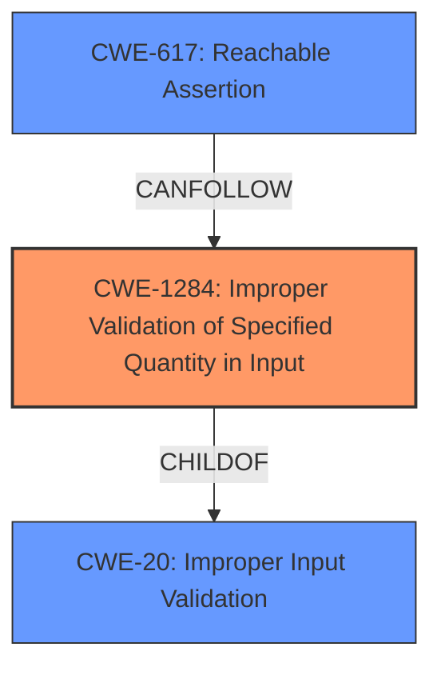

# Analysis Report for CVE-2022-29194

# Vulnerability Analysis Report: CVE-2022-29194

## Description


## Analysis (with Relationship Data)

# Summary
| CWE ID | CWE Name | Confidence | CWE Abstraction Level | CWE Vulnerability Mapping Label | CWE-Vulnerability Mapping Notes |
|---|---|---|---|---|---|
| CWE-1284 | Improper Validation of Specified Quantity in Input | 0.9 | Base | Allowed | Primary CWE |
| CWE-617 | Reachable Assertion | 0.7 | Base | Allowed | Secondary Candidate |

## Evidence and Confidence

*   **Confidence Score:** 0.8
*   **Evidence Strength:** HIGH

## Relationship Analysis
The primary relationship that influenced my decision was the parent-child relationship between CWE-20 (Improper Input Validation) and CWE-1284 (Improper Validation of Specified Quantity in Input). CWE-1284 is a more specific case of CWE-20, and it directly addresses the vulnerability described. CWE-617 relates to how the application handles the invalid input, leading to an assertion.



## Vulnerability Chain
The vulnerability chain starts with the **missing input validation** (CWE-1284) in `tf.raw_ops.DeleteSessionTensor`. This leads to a type confusion and ultimately results in a `CHECK` failure, which triggers a denial of service (CWE-617).

## Summary of Analysis
The initial analysis strongly suggests that the vulnerability stems from **improper input validation**. The provided information highlights that the `tf.raw_ops.DeleteSessionTensor` operation **does not fully validate the input arguments**, specifically the shape of the `handle` tensor. This aligns perfectly with CWE-1284 (Improper Validation of Specified Quantity in Input) as the code expects the `handle` to be a scalar but **fails to validate** this condition.

The vulnerability description key phrases include: "**does not fully validate the input arguments**"

The CVE Reference Links Content Summary states: "The vulnerability stems from a **missing input validation** in the `tf.raw_ops.DeleteSessionTensor` operation within TensorFlow. Specifically, the code assumes that the `handle` input is always a scalar (a single value) without explicitly checking its shape."

The fix involves adding a check using `TensorShapeUtils::IsScalar` to ensure the input `handle` is indeed a scalar.

The retriever results also suggest CWE-1284 as a strong candidate.

CWE-617 (Reachable Assertion) is also considered because the **impact** is a `CHECK` failure, which can be triggered by an attacker, leading to an application exit or other behavior that is more severe than necessary, but this is a consequence of the missing input validation.

Therefore, the selected CWEs are at the optimal level of specificity, with CWE-1284 as the primary cause and CWE-617 as a secondary effect.

Relevant CWE Information:

# Enhanced Context (25 CWEs)
The following CWEs were identified as potentially relevant to this vulnerability:

## CWE-1284: Improper Validation of Specified Quantity in Input
**Abstraction Level**: Base

**Description**:
The product receives input that is expected to specify a quantity (such as size or length), but it does not validate or incorrectly validates that the quantity has the required properties.

**Mapping Guidance**:
- Usage: Allowed
- Rationale: This CWE entry is at the Base level of abstraction, which is a preferred level of abstraction for mapping to the root causes of vulnerabilities.

## CWE-617: Reachable Assertion
**Abstraction Level**: Base

**Description**:
The product contains an assert() or similar statement that can be triggered by an attacker, which leads to an application exit or other behavior that is more severe than necessary.

## CWE-1284: Improper Validation of Specified Quantity in Input
**Technical Explanation:** The `tf.raw_ops.DeleteSessionTensor` operation expects the `handle` input to be a scalar tensor. The code **fails to validate** that the input is indeed a scalar, leading to a crash if a non-scalar tensor is provided. This aligns with CWE-1284, which describes scenarios where a product **does not validate** that a quantity (in this case, the shape of the tensor) has the required properties.
**Security Implications:** An attacker can trigger a denial of service by providing a malicious input (a non-scalar tensor) to the `tf.raw_ops.DeleteSessionTensor` operation.
**Relationship:** CWE-1284 is a child of CWE-20 (Improper Input Validation), representing a more specific case of input validation failure.
**Mapping Guidance Influence:** The MITRE mapping guidance allows the use of CWE-1284 as it is a Base level CWE.
**Confidence:** 0.9

## CWE-617: Reachable Assertion
**Technical Explanation:** The lack of input validation leads to a `CHECK` failure, which results in an application exit. This maps to CWE-617, where an assertion can be triggered by an attacker.
**Security Implications:** This can lead to a denial of service as the application terminates.
**Relationship:** CWE-617 can follow CWE-1284, as the missing validation results in an assertion being triggered.
**Mapping Guidance Influence:** The MITRE mapping guidance allows the use of CWE-617 as it is a Base level CWE.
**Confidence:** 0.7

### Considered but not used

CWE-20 was considered but not used as CWE-1284 is a more specific CWE and provides a better description of the vulnerability. Other CWEs such as CWE-1287, CWE-824, and CWE-1286 were also considered, but they did not accurately describe the root cause of the vulnerability as the primary issue is the **lack of validation** of the tensor's shape.


## CWE Relationship Analysis

Current CWEs represent these abstraction levels: .


### Vulnerability Chain Analysis

**Chain starting from CWE-617:**
- 617 (Reachable Assertion) - ROOT


**Chain starting from CWE-20:**
- 20 (Improper Input Validation) - ROOT


### CWE Relationship Diagram

```mermaid
graph TD
    classDef primary fill:#f96,stroke:#333,stroke-width:2px
    classDef secondary fill:#69f,stroke:#333
    classDef tertiary fill:#9e9,stroke:#333
```


*Report generated on 2025-03-31 12:40:52*
