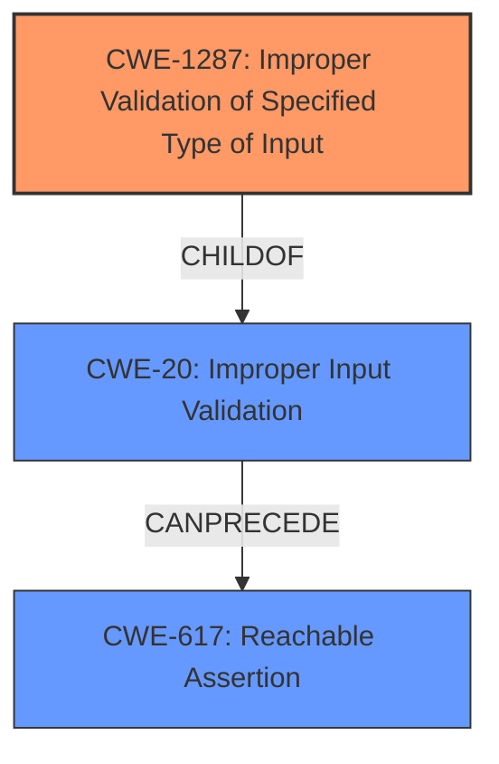

# Analysis Report for CVE-2022-29196

# Vulnerability Analysis Report: CVE-2022-29196

## Description


## Analysis (with Relationship Data)

# Summary
| CWE ID  | CWE Name                                                  | Confidence | CWE Abstraction Level | CWE Vulnerability Mapping Label | CWE-Vulnerability Mapping Notes |
| :-------- | :-------------------------------------------------------- | :--------- | :-------------------- | :------------------------------ | :------------------------------ |
| CWE-1287  | Improper Validation of Specified Type of Input          | 0.9        | Base                  | Primary CWE                     | Allowed                       |
| CWE-20    | Improper Input Validation                                 | 0.6        | Class                 | Secondary CWE                   | Discouraged                    |
| CWE-617   | Reachable Assertion                                       | 0.7        | Base                  | Secondary CWE                   | Allowed                       |

## Evidence and Confidence

*   **Confidence Score:** 0.8
*   **Evidence Strength:** HIGH

## Relationship Analysis
The primary relationship that influenced the decision was the parent-child relationship between CWE-20 and CWE-1287. While CWE-20 is a broader classification, CWE-1287 provides a more specific description of the **improper validation** issue, focusing on the type of the input. There also exists a causal relationship where **improper input validation** can lead to a **reachable assertion**.



## Vulnerability Chain
The vulnerability chain starts with the **improper validation** of the input argument type (CWE-1287), which leads to a `CHECK` failure, resulting in a denial-of-service attack (CWE-617).

## Summary of Analysis
The initial assessment identified that the root cause was the **failure to fully validate input arguments**. The provided evidence strongly supports the selection of CWE-1287 (Improper Validation of Specified Type of Input) as the primary CWE. The "CVE Reference Links Content Summary" clearly states that "the code did not validate if the shape of filter_sizes was a vector which leads to an error." This aligns directly with the description of CWE-1287, which focuses on the **improper validation** of input types.

The vulnerability description key phrases also highlight the **rootcause** as **"does not fully validate the input arguments."**

CWE-20 (Improper Input Validation) was considered but classified as a secondary CWE because it is a broader, more generic category. The MITRE mapping guidance discourages the use of CWE-20 when more specific CWEs are available.

CWE-617 (Reachable Assertion) was considered because the **improper validation** leads to a `CHECK` failure, which can trigger a denial of service.

The selection of CWE-1287 is at the optimal level of specificity because it directly addresses the root cause, which is the **improper validation** of the input type.
Relevant CWE Information:

# Enhanced Context (25 CWEs)
The following CWEs were identified as potentially relevant to this vulnerability:

## CWE-1287: Improper Validation of Specified Type of Input
**Abstraction Level**: Base
**Similarity Score**: 0.77
**Source**: dense

**Description**:
The product receives input that is expected to be of a certain type, but it does not validate or incorrectly validates that the input is actually of the expected type.

**Mapping Guidance**:
- Usage: Allowed
- Rationale: This CWE entry is at the Base level of abstraction, which is a preferred level of abstraction for mapping to the root causes of vulnerabilities.

## CWE-1284: Improper Validation of Specified Quantity in Input
**Abstraction Level**: Base
**Similarity Score**: 6635.51
**Source**: sparse

**Description**:
The product receives input that is expected to specify a quantity (such as size or length), but it does not validate or incorrectly validates that the quantity has the required properties.

**Mapping Guidance**:
- Usage: Allowed
- Rationale: This CWE entry is at the Base level of abstraction, which is a preferred level of abstraction for mapping to the root causes of vulnerabilities.

## CWE-617: Reachable Assertion
**Abstraction Level**: Base
**Similarity Score**: 0.75
**Source**: dense

**Description**:
The product contains an assert() or similar statement that can be triggered by an attacker, which leads to an application exit or other behavior that is more severe than necessary.

**Mapping Guidance**:
- Usage: Allowed
- Rationale: This CWE entry is at the Base level of abstraction, which is a preferred level of abstraction for mapping to the root causes of vulnerabilities.

## CWE Technical Explanations:

*   **CWE-1287: Improper Validation of Specified Type of Input**
    *   The vulnerability lies in the fact that the `filter_sizes` argument, which is expected to be a vector, is not validated for its type. This **lack of validation** allows an attacker to potentially provide a non-vector input, leading to a `CHECK` failure.
    *   The security implication is a denial of service. An attacker can craft a malicious input that triggers the `CHECK` failure, causing the application to terminate.
    *   This CWE is the primary cause of the vulnerability.
    *   The official MITRE mapping guidance allows the use of this CWE, as it is at the Base level of abstraction and directly addresses the root cause.
*   **CWE-20: Improper Input Validation**
    *   This CWE is a broader classification that encompasses the **improper validation** of any input. In this case, the specific input is the `filter_sizes` argument.
    *   The security implication is that an attacker can provide unexpected input that leads to a denial of service.
    *   This CWE is a secondary classification because it is a more general category than CWE-1287.
    *   The MITRE mapping guidance discourages the use of this CWE when more specific CWEs are available.
*   **CWE-617: Reachable Assertion**
    *   The **improper validation** leads to a `CHECK` failure which is similar to an assertion.
    *   The security implication is a denial of service.
    *   This CWE is a secondary classification because it is a consequence of the **improper validation**, not the primary cause.
    *   The official MITRE mapping guidance allows the use of this CWE.

Other CWEs Considered:

*   CWE-1284 (Improper Validation of Specified Quantity in Input): This CWE was considered because the size or length of the input could be relevant. However, the primary issue is the type of the input (vector vs. non-vector), not the quantity.
*   CWE-824 (Access of Uninitialized Pointer): This CWE was considered because **improper validation** could potentially lead to the use of uninitialized pointers. However, there is no direct evidence of this in the vulnerability description.
*   CWE-787 (Out-of-bounds Write): This CWE was considered because **improper validation** could lead to writing outside of expected memory boundaries. However, this isn't explicitly stated.


## CWE Relationship Analysis

Current CWEs represent these abstraction levels: .


### Vulnerability Chain Analysis

**Chain starting from CWE-617:**
- 617 (Reachable Assertion) - ROOT


**Chain starting from CWE-20:**
- 20 (Improper Input Validation) - ROOT


### CWE Relationship Diagram

```mermaid
graph TD
    classDef primary fill:#f96,stroke:#333,stroke-width:2px
    classDef secondary fill:#69f,stroke:#333
    classDef tertiary fill:#9e9,stroke:#333
```


*Report generated on 2025-03-30 12:10:52*
