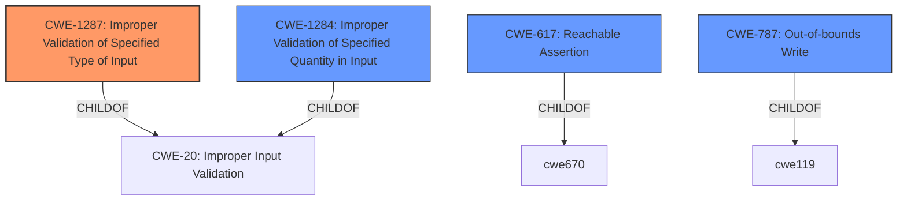

# Analysis for CVE-2022-29198

# Summary
| CWE ID  | CWE Name                                                                                                  | Confidence | CWE Abstraction Level | CWE Vulnerability Mapping Label | CWE-Vulnerability Mapping Notes |
| :-------- | :---------------------------------------------------------------------------------------------------------- | :--------- | :---------------------- | :------------------------------ | :------------------------------ |
| CWE-1287 | Improper Validation of Specified Type of Input                                                              | 0.90       | Base                    | Primary CWE                    | Allowed                       |
| CWE-1284 | Improper Validation of Specified Quantity in Input                                                              | 0.70       | Base                    | Secondary Candidate            | Allowed                       |
| CWE-617  | Reachable Assertion                                                                                           | 0.60       | Base                    | Secondary Candidate            | Allowed                       |
| CWE-787  | Out-of-bounds Write                                                                                           | 0.10       | Base                    | Secondary Candidate            | Allowed                       |

## Evidence and Confidence

*   **Confidence Score:** 0.80
*   **Evidence Strength:** HIGH

## Relationship Analysis
The primary CWE is CWE-1287 (**Improper Validation of Specified Type of Input**), which is a child of CWE-20 (**Improper Input Validation**). The vulnerability stems from the lack of validation of the input types, specifically whether `dense_shape` is a vector and `indices` is a matrix. The suggested alternative CWEs like CWE-1284 (**Improper Validation of Specified Quantity in Input**), CWE-617 (**Reachable Assertion**) and CWE-787 (**Out-of-bounds Write**) are related because a failure to validate input can lead to quantity issues, trigger assertions, or potentially write beyond buffer boundaries. However, CWE-1287 directly addresses the core issue of not validating the type of input.

## Vulnerability Chain
The vulnerability chain starts with the **improper validation of input arguments**.

1.  **Root Cause:** **Improper validation of input arguments** (CWE-1287) - The code does not validate whether `dense_shape` is a vector and `indices` is a matrix.
2.  **Impact:** A `CHECK`-failure is triggered.
3.  **Result:** Denial of service.

## Summary of Analysis
The initial analysis identified the **improper validation of input arguments** as the root cause, leading to a denial of service. The primary evidence supporting this is the "Vulnerability Description Key Phrases" section which states: "**rootcause:** **improper validation of input arguments**" and the "CVE Reference Links Content Summary" which states: "The vulnerability arises from a **missing input validation** in the `tf.raw_ops.SparseTensorToCSRSparseMatrix` operation. Specifically, the code does not validate if the `dense_shape` input is a vector (rank 1) and if `indices` is a matrix (rank 2) as required for sparse tensors."

The retriever results suggested CWE-1287 (**Improper Validation of Specified Type of Input**) as the top candidate, which aligns directly with the root cause. The graph relationships and mapping guidance confirm that CWE-1287 is the most appropriate and specific CWE.

CWE-1284 (**Improper Validation of Specified Quantity in Input**) was also considered, but it focuses more on the quantity of input, whereas the core issue here is the type of input. CWE-617 (**Reachable Assertion**) is a potential consequence of the **improper validation**, as the invalid input leads to a `CHECK`-failure, but it is not the root cause. CWE-787 (**Out-of-bounds Write**) is a more remote possibility if the invalid input leads to memory corruption.

Therefore, CWE-1287 is the most accurate and specific representation of the vulnerability's root cause.