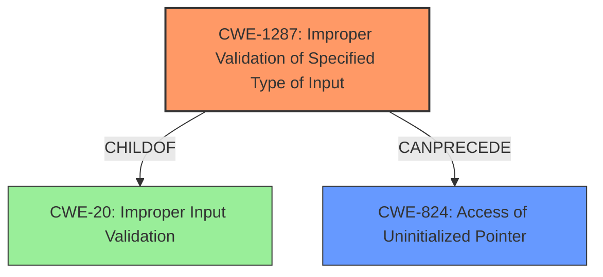

# Analysis Report for CVE-2022-29201

# Vulnerability Analysis Report: CVE-2022-29201

## Description


## Analysis (with Relationship Data)

# Summary
| CWE ID | CWE Name | Confidence | CWE Abstraction Level | CWE Vulnerability Mapping Label | CWE-Vulnerability Mapping Notes |
|---|---|---|---|---|---|
| CWE-1287 | Improper Validation of Specified Type of Input | 0.8 | Base | Allowed | Primary CWE. The vulnerability stems from the fact that the input arguments were not fully validated for their expected type, which in this case, are non-empty scalar tensors.|
| CWE-824 | Access of Uninitialized Pointer | 0.7 | Base | Allowed | Secondary CWE. This is a potential consequence of the missing validation, where null pointers are dereferenced due to the code not handling empty tensors correctly.|
| CWE-20 | Improper Input Validation | 0.5 | Class | Discouraged | Considered but not the best fit, as it is a high-level class. The more specific CWE-1287 is more descriptive of the vulnerability. |

## Evidence and Confidence

*   **Confidence Score:** 0.75
*   **Evidence Strength:** HIGH

## Relationship Analysis
The primary relationship is that CWE-1287 (Improper Validation of Specified Type of Input) is a child of CWE-20 (Improper Input Validation). CWE-824 (Access of Uninitialized Pointer) can be a consequence of the initial **improper validation**. The abstraction levels were considered, preferring the Base level CWE-1287 over the Class level CWE-20.



## Vulnerability Chain
The vulnerability chain starts with **improper validation** (CWE-1287) of the input tensors, leading to the potential for a null pointer dereference (CWE-824).

## Summary of Analysis
The initial assessment focused on the **missing input validation** as the root cause, with CWE-20 (Improper Input Validation) being a broad candidate. However, the retriever results and the vulnerability description's key phrases pointed towards more specific CWEs. The fact that the input was not validated for being of a certain type (non-empty scalar tensor) led to the selection of CWE-1287 (Improper Validation of Specified Type of Input) as the primary CWE.

The evidence from the vulnerability description includes the phrase "**does not fully validate the input arguments**". The CVE Reference Links Content Summary states: "The root cause is a missing input validation in the `QuantizedConv2D` operation implementation. Specifically, the code did not check if the input tensors for `min_input`, `max_input`, `min_filter`, and `max_filter` were non-empty scalar tensors." This clearly indicates a **lack of proper type validation** on the input arguments.

The possibility of a null pointer dereference (CWE-824) arising from the missing validation was considered, making it a secondary CWE as a potential consequence.

The CWEs selected are at the optimal level of specificity because CWE-1287 describes the exact type of validation that is missing.


## CWE Relationship Analysis

Current CWEs represent these abstraction levels: .


### Vulnerability Chain Analysis

**Chain starting from CWE-20:**
- 20 (Improper Input Validation) - ROOT


**Chain starting from CWE-1287:**
- 1287 (Improper Validation of Specified Type of Input) - ROOT


### CWE Relationship Diagram

```mermaid
graph TD
    classDef primary fill:#f96,stroke:#333,stroke-width:2px
    classDef secondary fill:#69f,stroke:#333
    classDef tertiary fill:#9e9,stroke:#333
```


*Report generated on 2025-03-30 16:46:32*
