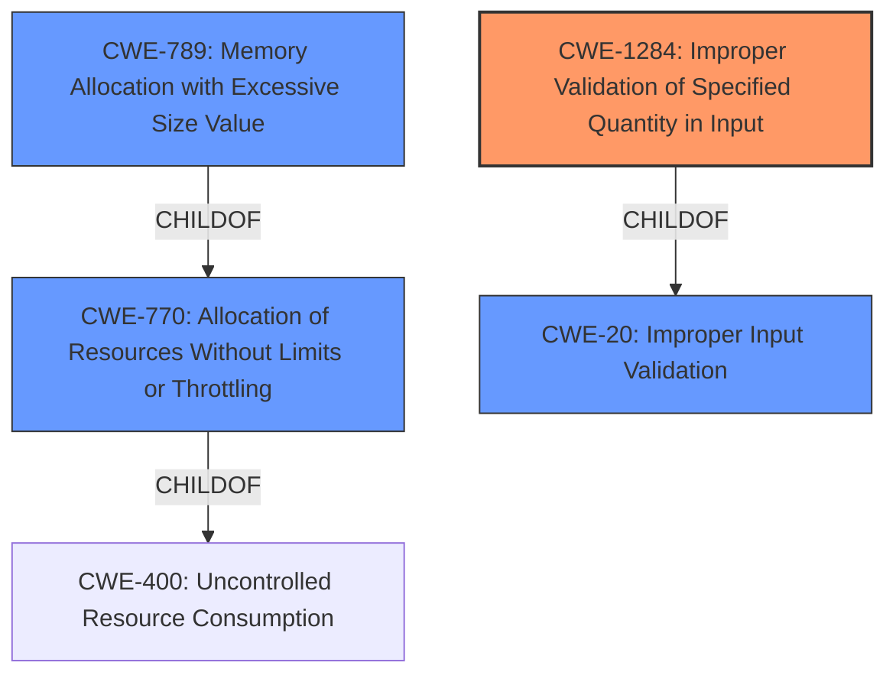

# Analysis Report for CVE-2022-29202

# Vulnerability Analysis Report: CVE-2022-29202

## Description


## Analysis (with Relationship Data)

# Summary
| CWE ID | CWE Name | Confidence | CWE Abstraction Level | CWE Vulnerability Mapping Label | CWE-Vulnerability Mapping Notes |
|---|---|---|---|---|---|
| CWE-1284 | Improper Validation of Specified Quantity in Input | 0.9 | Base | Allowed | Primary CWE |
| CWE-789 | Memory Allocation with Excessive Size Value | 0.8 | Variant | Allowed | Secondary Candidate |
| CWE-770 | Allocation of Resources Without Limits or Throttling | 0.6 | Base | Allowed | Secondary Candidate |
| CWE-20 | Improper Input Validation | 0.5 | Class | Discouraged | Secondary Candidate |

## Evidence and Confidence

*   **Confidence Score:** 0.9
*   **Evidence Strength:** HIGH

## Relationship Analysis
The primary CWE is CWE-1284, which focuses on the **improper validation** of input quantities. The vulnerability occurs because the code doesn't validate the `ragged_rank` parameter, which represents a quantity related to the dimensions of the input. This leads to excessive memory allocation and a denial-of-service. CWE-789, which is a child of CWE-770, describes the allocation of memory based on an untrusted, large size value, aligning with the impact of this vulnerability. CWE-770 describes allocating resources without limits, providing a broader context for the memory allocation issue. Finally, the more general CWE-20 is considered but deemed less specific than CWE-1284.



## Vulnerability Chain
The vulnerability chain starts with **improper input validation** of the `ragged_rank` parameter (CWE-1284). This leads to the allocation of an excessive amount of memory (CWE-789), eventually causing a denial of service by exhausting available resources (CWE-400, although not explicitly selected).

## Summary of Analysis
The initial assessment identified that the root cause of the vulnerability is the **improper input validation** within the `tf.ragged.constant` function, specifically the lack of validation for the `ragged_rank` parameter when an empty list is provided for `pylist`. The CVE Reference Links Content Summary states: "Missing input validation on the `ragged_rank` parameter within the `tf.ragged.constant` function. Specifically, it doesn't check if the provided `ragged_rank` is compatible with the dimensions of the input list, allowing an attacker to specify an arbitrarily large `ragged_rank` which causes excessive memory allocation." This directly supports the selection of CWE-1284, "Improper Validation of Specified Quantity in Input," as the primary CWE.

The retriever results also support this choice, with CWE-1284 being the top-ranked CWE. The description of CWE-1284, "The product receives input that is expected to specify a quantity (such as size or length), but it does not validate or incorrectly validates that the quantity has the required properties," aligns perfectly with the vulnerability description.

CWE-789, "Memory Allocation with Excessive Size Value," is considered a secondary CWE as it describes the direct consequence of the **improper input validation**. The vulnerability leads to allocating memory based on an untrusted, large size value, causing a denial of service.

CWE-770, "Allocation of Resources Without Limits or Throttling," is another related CWE, as the lack of validation allows an attacker to allocate resources without limits, contributing to the denial of service.

CWE-20, "Improper Input Validation," is a more general CWE and is discouraged by MITRE when more specific CWEs are available. Since CWE-1284 directly addresses the specific type of **improper input validation** (quantity), it is the preferred choice.

The selected CWEs are at the optimal level of specificity. CWE-1284 accurately captures the root cause, while CWE-789 and CWE-770 describe the resulting impact on memory allocation. This provides a comprehensive understanding of the vulnerability and its potential consequences.


## CWE Relationship Analysis

Current CWEs represent these abstraction levels: .


### Vulnerability Chain Analysis

**Chain starting from CWE-400:**
- 400 (Uncontrolled Resource Consumption) - ROOT


**Chain starting from CWE-20:**
- 20 (Improper Input Validation) - ROOT


### CWE Relationship Diagram

```mermaid
graph TD
    classDef primary fill:#f96,stroke:#333,stroke-width:2px
    classDef secondary fill:#69f,stroke:#333
    classDef tertiary fill:#9e9,stroke:#333
```


*Report generated on 2025-03-30 21:37:43*
