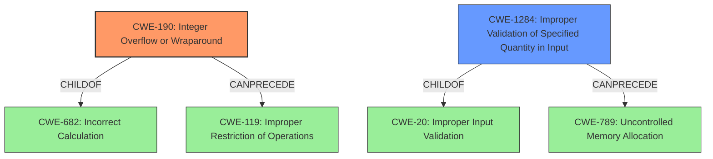

# Raw Analyzer Response for CVE-2022-29203

# Summary
| CWE ID  | CWE Name                          | Confidence | CWE Abstraction Level | CWE Vulnerability Mapping Label | CWE-Vulnerability Mapping Notes |
| :------- | :-------------------------------- | :--------- | :-------------------- | :------------------------------ | :------------------------------ |
| CWE-190 | Integer Overflow or Wraparound   | 1          | Base                  | Primary CWE                     | Allowed                       |
| CWE-1284 | Improper Validation of Specified Quantity in Input | 0.7          | Base                  | Secondary CWE                     | Allowed                       |

## Evidence and Confidence

*   **Confidence Score:** 0.9
*   **Evidence Strength:** HIGH

## Relationship Analysis
The primary CWE is CWE-190 (Integer Overflow or Wraparound), which is a base-level CWE. It relates to CWE-682 (Incorrect Calculation), a class-level CWE, as a child. It can precede CWE-119 (Improper Restriction of Operations Within the Bounds of a Memory Buffer). CWE-1284 (Improper Validation of Specified Quantity in Input) is a child of CWE-20 (Improper Input Validation) and can precede CWE-789 (Uncontrolled Memory Allocation). The choice of CWE-190 as the primary CWE is based on the evidence of an integer overflow leading to a denial of service, and it is a base-level CWE which is preferred. CWE-1284 is added as the input was not validated.

## Vulnerability Chain
The vulnerability chain starts with the **lack of validation** of the input `block_shape` (CWE-1284), which leads to an **integer overflow** (CWE-190) when calculating the output tensor's size. This overflow results in an assertion failure, causing a denial of service.

## Summary of Analysis
The analysis indicates that the primary weakness is an **integer overflow** (CWE-190) in the `tf.raw_ops.SpaceToBatchND` implementation, triggered by a **lack of validation** of the input `block_shape` (CWE-1284). The root cause is the integer overflow, which leads to a denial-of-service due to an assertion failure. The evidence from the CVE description and the reference links content summary confirms this.

The selection of CWE-190 is based on the clear evidence of an integer overflow when calculating the output tensor's size: "The vulnerability stems from an **integer overflow** in the implementation of `tf.raw_ops.SpaceToBatchND`."

CWE-1284 is added as the input was not validated: "The product receives input that is expected to specify a quantity (such as size or length), but it does not validate or incorrectly validates that the quantity has the required properties." and "The attacker needs to be able to control the inputs to the `tf.raw_ops.SpaceToBatchND` operation, specifically the `block_shape` parameter. This could be achieved by providing manipulated data to a TensorFlow model that uses this operation."

CWE-787 (Out-of-bounds Write) and CWE-122 (Heap-based Buffer Overflow) were considered due to the potential memory corruption issues that can arise from integer overflows, but they were deemed less relevant because the immediate impact is a denial-of-service via an assertion failure, not necessarily memory corruption in this specific case.

The selected CWEs are at the optimal level of specificity as they accurately describe the root cause (integer overflow) and the contributing factor (lack of input validation) of the vulnerability.

Relevant CWE Information:
- CWE-190: Integer Overflow or Wraparound
- CWE-1284: Improper Validation of Specified Quantity in Input