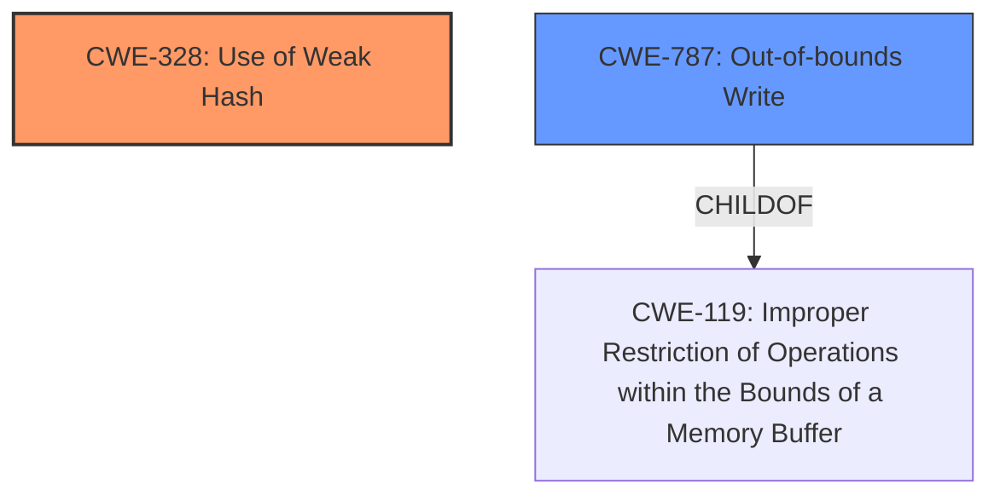

# Enhanced Analysis for CVE-2022-29210

# Summary
| CWE ID    | CWE Name                                                        | Confidence | CWE Abstraction Level | CWE Vulnerability Mapping Label | CWE-Vulnerability Mapping Notes |
| --------- | --------------------------------------------------------------- | ---------- | ----------------------- | ----------------------------- | ----------------------------- |
| CWE-328   | Use of Weak Hash                                                | 0.9        | Base                    | Primary                       | Allowed                      |
| CWE-787   | Out-of-bounds Write                                             | 0.7        | Base                    | Secondary                     | Allowed                      |

## Evidence and Confidence

*   **Confidence Score:** 0.8
*   **Evidence Strength:** HIGH

## Relationship Analysis
The primary relationship that influenced the decision was the direct identification of the **"very poor hash function for constants"** as a root cause, directly aligning with CWE-328. The secondary consideration was the potential for out-of-bounds access due to the incorrect size calculation which relates to CWE-787.



## Vulnerability Chain
The vulnerability chain starts with the **poor hash function** (CWE-328). This leads to incorrect memory access and potential **out-of-bounds write** (CWE-787), ultimately resulting in ASAN failures.

## Summary of Analysis
The primary focus of this analysis is based on the **root cause** as identified in the vulnerability description and CVE reference. The **"very poor hash function for constants"** is the key phrase that directly supports the selection of CWE-328 (Use of Weak Hash).

The vulnerability description states: "In version 2.8.0, the `TensorKey` hash function used total estimated `AllocatedBytes()`, which (a) is an estimate per tensor, and (b) is a **very poor hash function for constants** (e.g. `int32_t`)."

The CVE Reference Links Content Summary provides further evidence: "The vulnerability is caused by an **incorrect hash function** used for `TensorKey` objects in TensorFlow. The original hash function used an estimated `AllocatedBytes()` value, which is not suitable for hashing tensor contents..."

While the description also mentions potential **out-of-bounds access**, this is a consequence of the initial weakness and not the primary **root cause**. Therefore, CWE-787 (Out-of-bounds Write) is considered a secondary CWE.

The selection of CWE-328 is at the Base level of abstraction, which is the preferred level.

CWE-1284 (Improper Validation of Specified Quantity in Input) was considered due to the mention of `AllocatedBytes()`, but the core issue isn't the lack of validation, but rather the **use of an inappropriate metric for hashing**.
CWE-122 (Heap-based Buffer Overflow) was considered, but the description points more directly to an **out-of-bounds write** rather than specifically a heap overflow, making CWE-787 more appropriate.
CWE-190 (Integer Overflow or Wraparound) and CWE-125 (Out-of-bounds Read) were considered, but the description focuses more on the **incorrect hash function** and resultant **out-of-bounds write** rather than integer-specific issues.
CWE-335 (Incorrect Usage of Seeds in Pseudo-Random Number Generator (PRNG)) is not relevant as the issue is with a hash function, not a random number generator.

Relevant CWE Information:

# Enhanced Context (25 CWEs)
The following CWEs were identified as potentially relevant to this vulnerability:

## CWE-191: Integer Underflow (Wrap or Wraparound)
**Abstraction Level**: Base
**Similarity Score**: 0.79
**Source**: dense

**Description**:
The product subtracts one value from another, such that the result is less than the minimum allowable integer value, which produces a value that is not equal to the correct result.

**Mapping Guidance**:
- Usage: Allowed
- Rationale: This CWE entry is at the Base level of abstraction, which is a preferred level of abstraction for mapping to the root causes of vulnerabilities.


## CWE-131: Incorrect Calculation of Buffer Size
**Abstraction Level**: Base
**Similarity Score**: 0.78
**Source**: dense

**Description**:
The product does not correctly calculate the size to be used when allocating a buffer, which could lead to a buffer overflow.

**Mapping Guidance**:
- Usage: Allowed
- Rationale: This CWE entry is at the Base level of abstraction, which is a preferred level of abstraction for mapping to the root causes of vulnerabilities.


## CWE-125: Out-of-bounds Read
**Abstraction Level**: Base
**Similarity Score**: 0.78
**Source**: dense

**Description**:
The product reads data past the end, or before the beginning, of the intended buffer.

**Mapping Guidance**:
- Usage: Allowed
- Rationale: This CWE entry is at the Base level of abstraction, which is a preferred level of abstraction for mapping to the root causes of vulnerabilities.


## CWE-805: Buffer Access with Incorrect Length Value
**Abstraction Level**: Base
**Similarity Score**: 0.77
**Source**: dense

**Description**:
The product uses a sequential operation to read or write a buffer, but it uses an incorrect length value that causes it to access memory that is outside of the bounds of the buffer.

**Mapping Guidance**:
- Usage: Allowed
- Rationale: This CWE entry is at the Base level of abstraction, which is a preferred level of abstraction for mapping to the root causes of vulnerabilities.


## CWE-824: Access of Uninitialized Pointer
**Abstraction Level**: Base
**Similarity Score**: 0.77
**Source**: dense

**Description**:
The product accesses or uses a pointer that has not been initialized.

**Mapping Guidance**:
- Usage: Allowed
- Rationale: This CWE entry is at the Base level of abstraction, which is a preferred level of abstraction for mapping to the root causes of vulnerabilities.


## CWE-681: Incorrect Conversion between Numeric Types
**Abstraction Level**: Base
**Similarity Score**: 0.77
**Source**: dense

**Description**:
When converting from one data type to another, such as long to integer, data can be omitted or translated in a way that produces unexpected values. If the resulting values are used in a sensitive context, then dangerous behaviors may occur.

**Mapping Guidance**:
- Usage: Allowed
- Rationale: This CWE entry is at the Base level of abstraction, which is a preferred level of abstraction for mapping to the root causes of vulnerabilities.


## CWE-126: Buffer Over-read
**Abstraction Level**: Variant
**Similarity Score**: 0.77
**Source**: dense

**Description**:
The product reads from a buffer using buffer access mechanisms such as indexes or pointers that reference memory locations after the targeted buffer.

**Mapping Guidance**:
- Usage: Allowed
- Rationale: This CWE entry is at the Variant level of abstraction, which is a preferred level of abstraction for mapping to the root causes of vulnerabilities.


## CWE-197: Numeric Truncation Error
**Abstraction Level**: Base
**Similarity Score**: 0.76
**Source**: dense

**Description**:
Truncation errors occur when a primitive is cast to a primitive of a smaller size and data is lost in the conversion.

**Mapping Guidance**:
- Usage: Allowed
- Rationale: This CWE entry is at the Base level of abstraction, which is a preferred level of abstraction for mapping to the root causes of vulnerabilities.


## CWE-667: Improper Locking
**Abstraction Level**: Class
**Similarity Score**: 0.76
**Source**: dense

**Description**:
The product does not properly acquire or release a lock on a resource, leading to unexpected resource state changes and behaviors.

**Mapping Guidance**:
- Usage: Allowed-with-Review
- Rationale: This CWE entry is a Class and might have Base-level children that would be more appropriate


## CWE-823: Use of Out-of-range Pointer Offset
**Abstraction Level**: Base
**Similarity Score**: 0.76
**Source**: dense

**Description**:
The product performs pointer arithmetic on a valid pointer, but it uses an offset that can point outside of the intended range of valid memory locations for the resulting pointer.

**Mapping Guidance**:
- Usage: Allowed
- Rationale: This CWE entry is at the Base level of abstraction, which is a preferred level of abstraction for mapping to the root causes of vulnerabilities.


## CWE-190: Integer Overflow or Wraparound
**Abstraction Level**: Base
**Similarity Score**: 6917.92
**Source**: sparse

**Description**:
The product


## CWE Relationship Analysis

Current CWEs represent these abstraction levels: .


### Vulnerability Chain Analysis

**Chain starting from CWE-190:**
- 190 (Integer Overflow or Wraparound) - ROOT


**Chain starting from CWE-131:**
- 131 (Incorrect Calculation of Buffer Size) - ROOT


### CWE Relationship Diagram

```mermaid
graph TD
    classDef primary fill:#f96,stroke:#333,stroke-width:2px
    classDef secondary fill:#69f,stroke:#333
    classDef tertiary fill:#9e9,stroke:#333
```