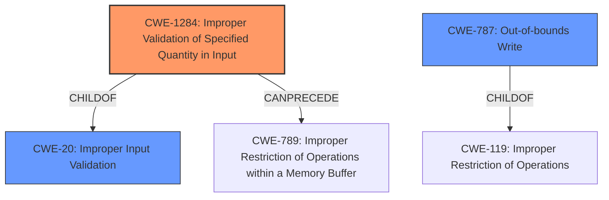

# Analysis Report for CVE-2022-29213

# Vulnerability Analysis Report: CVE-2022-29213

## Description


## Analysis (with Relationship Data)

# Summary
| CWE ID    | CWE Name                                                    | Confidence | CWE Abstraction Level | CWE Vulnerability Mapping Label | CWE-Vulnerability Mapping Notes |
| :-------- | :---------------------------------------------------------- | :--------- | :-------------------- | :------------------------------ | :------------------------------ |
| CWE-1284  | Improper Validation of Specified Quantity in Input         | 0.95       | Base                  | Primary CWE                     | Allowed                       |
| CWE-787   | Out-of-bounds Write                                         | 0.6        | Base                  | Secondary CWE                   | Allowed                       |
| CWE-20    | Improper Input Validation                                  | 0.5        | Class                 | Secondary CWE                   | Discouraged                    |

## Evidence and Confidence

*   **Confidence Score:** 0.8
*   **Evidence Strength:** HIGH

## Relationship Analysis

The primary relationship that influenced the CWE selection was the hierarchical relationship. CWE-1284 is a child of CWE-20, making it a more specific representation of the **improper input validation** issue. The graph also shows that CWE-1284 can precede CWE-789 (Improper Restriction of Operations within a Memory Buffer). While CWE-787 is related to buffer issues, it's less directly supported by the provided evidence, and it is connected to CWE-119 (Improper Restriction of Operations within the Memory Buffer).



## Vulnerability Chain

The vulnerability chain starts with **missing input validation** (CWE-1284) on the `fft_length` parameter, which leads to a crash. There is potential for an out-of-bounds write (CWE-787) as a consequence, but this is not explicitly stated and is inferred from the crash due to `CHECK`-failures.

## Summary of Analysis

The primary CWE, CWE-1284 (Improper Validation of Specified Quantity in Input), is strongly supported by the vulnerability description and the CVE reference summary. The reference summary explicitly states: "The `tf.compat.v1.signal.rfft2d` and `tf.compat.v1.signal.rfft3d` operations **lack input validation**, specifically regarding the `fft_length` parameter." and "Providing crafted input to the `tf.compat.v1.signal.rfft2d` or `tf.compat.v1.signal.rfft3d` operations, specifically an `fft_length` parameter containing negative values." This directly aligns with CWE-1284's description of a product receiving input that specifies a quantity but **does not validate or incorrectly validates** that the quantity has the required properties.

CWE-20 is a more general case of **improper input validation**, but CWE-1284 is more specific and therefore a better fit. While CWE-20 is listed in the retriever results, it is discouraged.

CWE-787 (Out-of-bounds Write) is a possible consequence of the **missing input validation**, leading to a crash. However, without explicit evidence of a buffer being overflowed, it's assigned with lower confidence.

The selection of CWE-1284 is at the optimal level of specificity because it directly addresses the **root cause** of the vulnerability, which is the **lack of validation** of the `fft_length` parameter.

Relevant CWE Information:

# Enhanced Context (25 CWEs)

## CWE-606: Unchecked Input for Loop Condition
**Abstraction Level**: Base
**Similarity Score**: 0.77
**Source**: dense

**Description**:
The product does not properly check inputs that are used for loop conditions, potentially leading to a denial of service or other consequences because of excessive looping.
**Not Used**: While related to input, the vulnerability doesn't explicitly mention a loop condition.

## CWE-1289: Improper Validation of Unsafe Equivalence in Input
**Abstraction Level**: Base
**Similarity Score**: 0.76
**Source**: dense

**Description**:
The product receives an input value that is used as a resource identifier or other type of reference, but it does not validate or incorrectly validates that the input is equivalent to a potentially-unsafe value.
**Not Used**: The vulnerability doesn't involve unsafe equivalence.

## CWE-703: Improper Check or Handling of Exceptional Conditions
**Abstraction Level**: Pillar
**Similarity Score**: 0.74
**Source**: dense

**Description**:
The product does not properly anticipate or handle exceptional conditions that rarely occur during normal operation of the product.
**Not Used**: Too abstract.

## CWE-835: Loop with Unreachable Exit Condition ('Infinite Loop')
**Abstraction Level**: Base
**Similarity Score**: 0.74
**Source**: dense

**Description**:
The product contains an iteration or loop with an exit condition that cannot be reached, i.e., an infinite loop.
**Not Used**: The vulnerability doesn't explicitly mention an infinite loop.

## CWE-824: Access of Uninitialized Pointer
**Abstraction Level**: Base
**Similarity Score**: 0.74
**Source**: dense

**Description**:
The product accesses or uses a pointer that has not been initialized.
**Not Used**: Not directly related to the described vulnerability.

## CWE-691: Insufficient Control Flow Management
**Abstraction Level**: Pillar
**Similarity Score**: 0.74
**Source**: dense

**Description**:
The code does not sufficiently manage its control flow during execution, creating conditions in which the control flow can be modified in unexpected ways.
**Not Used**: Too abstract.

## CWE-617: Reachable Assertion
**Abstraction Level**: Base
**Similarity Score**: 0.74
**Source**: dense

**Description**:
The product contains an assert() or similar statement that can be triggered by an attacker, which leads to an application exit or other behavior that is more severe than necessary.
**Not Used**: While the vulnerability mentions `CHECK`-failures, the primary issue is the input validation, not the assertion itself.

## CWE-754: Improper Check for Unusual or Exceptional Conditions
**Abstraction Level**: Class
**Similarity Score**: 0.74
**Source**: dense

**Description**:
The product does not check or incorrectly checks for unusual or exceptional conditions that are not expected to occur frequently during day to day operation of the product.
**Not Used**: Too general.

## CWE-667: Improper Locking
**Abstraction Level**: Class
**Similarity Score**: 0.74
**Source**: dense

**Description**:
The product does not properly acquire or release a lock on a resource, leading to unexpected resource state changes and behaviors.
**Not Used**: Not related to locking.

## CWE-404: Improper Resource Shutdown or Release
**Abstraction Level**: Class
**Similarity Score**: 0.74
**Source**: dense

**Description**:
The product does not release or incorrectly releases a resource before it is made available for re-use.
**Not Used**: Not related to resource shutdown.

## CWE-1284: Improper Validation of Specified Quantity in Input
**Abstraction Level**: Base
**Similarity Score**: 6272.52
**Source**: sparse

**Description**:
The product receives input that is expected to specify a quantity (such as size or length), but it does not validate or incorrectly validates that the quantity has the required properties.
**Used**: Primary CWE.

## CWE-190: Integer Overflow or Wraparound
**Abstraction Level**: Base
**Similarity Score**: 6181.21
**Source**: sparse

**Description**:
The product performs a calculation that can
         produce an integer overflow or wraparound when the logic
         assumes that the resulting value will always be larger than
         the original value. This occurs when an integer value is
         incremented to a value that is too large to store in the
         associated representation. When this occurs, the value may
         become a very small or negative number.
**Not Used**: While an integer overflow is possible, it's not explicitly mentioned in the vulnerability description.

## CWE-125: Out-of-bounds Read
**Abstraction Level**: Base
**Similarity Score**: 6124.38
**Source


## CWE Relationship Analysis

Current CWEs represent these abstraction levels: .


### Vulnerability Chain Analysis

**Chain starting from CWE-190:**
- 190 (Integer Overflow or Wraparound) - ROOT


**Chain starting from CWE-835:**
- 835 (Loop with Unreachable Exit Condition ('Infinite Loop')) - ROOT


### CWE Relationship Diagram

```mermaid
graph TD
    classDef primary fill:#f96,stroke:#333,stroke-width:2px
    classDef secondary fill:#69f,stroke:#333
    classDef tertiary fill:#9e9,stroke:#333
```


*Report generated on 2025-03-31 12:40:00*
