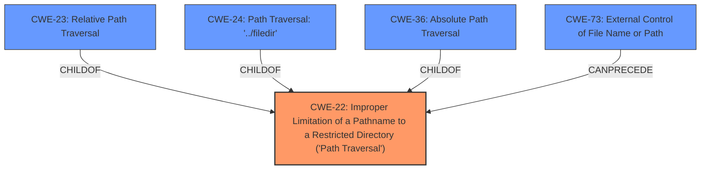

# Raw Analyzer Response for CVE-2022-2922

# Summary
| CWE ID  | CWE Name                                                                          | Confidence | CWE Abstraction Level | CWE Vulnerability Mapping Label | CWE-Vulnerability Mapping Notes |
| :-------- | :---------------------------------------------------------------------------------- | :--------- | :---------------------- | :------------------------------ | :------------------------------ |
| CWE-22    | Improper Limitation of a Pathname to a Restricted Directory ('Path Traversal') | 1          | Base                    | Primary                         | Allowed                       |

## Evidence and Confidence

*   **Confidence Score:** 1
*   **Evidence Strength:** HIGH

## Relationship Analysis

The primary CWE identified is CWE-22, which represents the core issue of improper limitation of a pathname to a restricted directory. CWE-23, CWE-24, and CWE-36 are all children of CWE-22 and represent specific types of path traversal. The relationships indicate that CWE-22 is the most appropriate base CWE, encompassing the general vulnerability. CWE-73 relates to external control of filenames/paths, which can precede path traversal vulnerabilities.

## Vulnerability Chain

The vulnerability chain starts with external control over the filename (CWE-73). This is followed by the **improper limitation** of the pathname to a restricted directory (**CWE-22**). This allows the attacker to use **relative path traversal** techniques to access unintended files.

## Summary of Analysis

The analysis is based on the provided evidence, which clearly indicates a **relative path traversal** vulnerability. The "**rootcause:** **relative path traversal**" from the Vulnerability Description Key Phrases is strong evidence. Furthermore, the CVE Reference Links Content Summary details how the original code **was vulnerable to path traversal** due to the **lack of proper filename sanitization.** The fix implemented, using `Path.GetFileName()` to clean the filename, directly addresses path traversal concerns.

The retriever results also strongly support CWE-22 as the primary CWE, with high similarity scores. The relationship graph confirms that CWE-22 is a parent of more specific path traversal variants.

CWE-22 is at the optimal level of specificity, as it captures the general class of path traversal vulnerabilities without being overly specific about the traversal method (relative vs. absolute).

CWEs considered but not used:

*   CWE-23, CWE-24, and CWE-36 are more specific types of path traversal (relative, '../filedir', and absolute, respectively). While the vulnerability involves relative path traversal, CWE-22 is a more general and appropriate classification for the **improper limitation of the path.**
*   CWE-73 (External Control of File Name or Path) was considered as it relates to providing external input for filenames. However, the core issue is the **improper limitation of the path**, making CWE-22 more accurate.
*   CWE-98 (Improper Control of Filename for Include/Require Statement in PHP Program ('PHP Remote File Inclusion')) is specific to PHP applications and remote file inclusion, which is not the case here.
*   CWE-59 (Improper Link Resolution Before File Access ('Link Following')) involves symbolic link vulnerabilities, which is not the primary issue described.
*   CWE-41 (Improper Resolution of Path Equivalence) and CWE-209 (Generation of Error Message Containing Sensitive Information) are not directly related to the root cause of this vulnerability.