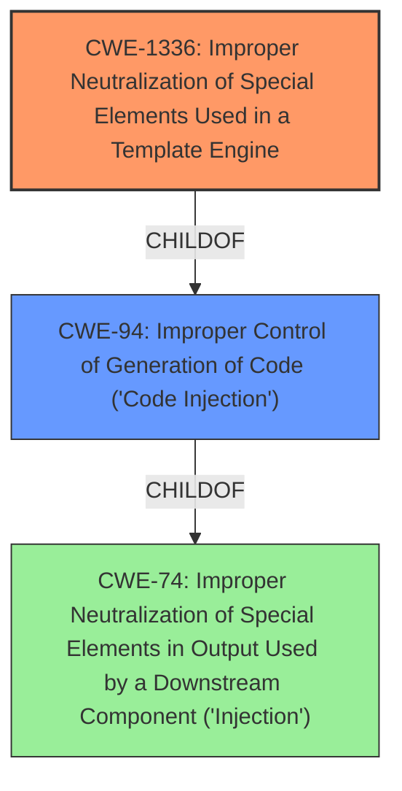

# Raw Analyzer Response for CVE-2022-29221

# Summary
| CWE ID | CWE Name | Confidence | CWE Abstraction Level | CWE Vulnerability Mapping Label | CWE-Vulnerability Mapping Notes |
|---|---|---|---|---|---|
| CWE-1336 | Improper Neutralization of Special Elements Used in a Template Engine | 1.0 | Base | Allowed | Primary CWE |
| CWE-94 | Improper Control of Generation of Code ('Code Injection') | 0.7 | Base | Allowed-with-Review | Secondary Candidate |

## Evidence and Confidence

*   **Confidence Score:** 0.85
*   **Evidence Strength:** HIGH

## Relationship Analysis
The primary CWE selected is CWE-1336 (Base), which is a child of CWE-94 (Base). CWE-94 was considered as a potential candidate but the description for CWE-1336 was more specific to the vulnerability.

## Vulnerability Chain
The vulnerability chain involves the following steps:
1.  The template engine fails to properly neutralize special elements in template names (block, include file names).
2.  This allows an attacker to inject malicious code into the template.
3.  The injected code is then executed by the template engine, leading to remote code execution.

The root cause is the **improper neutralization** of special elements used in the template engine (CWE-1336), leading to code injection (CWE-94) and ultimately remote code execution.

## Summary of Analysis
Initially, the analysis focused on the CVE description, which mentions that template authors can inject PHP code by choosing a malicious {block} name or {include} file name. The CVE reference links content summary highlights the root cause as insufficient sanitization of user-provided input when processing block names and include file names, leading to potential PHP code injection and remote code execution. The Retriever results suggested CWE-1336, CWE-79, and CWE-94 as potential candidates.

The primary CWE selection is CWE-1336, "Improper Neutralization of Special Elements Used in a Template Engine." This aligns with the vulnerability description because the **weakness** stems from the template engine's failure to properly neutralize special elements in block and include file names, allowing for PHP code injection. The evidence from the CVE reference links content summary directly supports this: "The core **weakness** is the lack of proper input validation and sanitization of template content. By crafting malicious block names or include file names, attackers can inject arbitrary PHP code into the compiled template."

CWE-94, "Improper Control of Generation of Code ('Code Injection')", was considered as a secondary CWE. The CVE reference links content summary mentions: "The vulnerability stems from insufficient sanitization of user-provided input when processing block names and include file names within Smarty templates. Specifically, the template engine would use these names directly in generated PHP code, making it possible for attackers to inject arbitrary PHP code." This quote provides evidence that the injected code is used in the generation of code. While code injection is the impact, the root cause is the **improper neutralization** of special elements used in the template engine (CWE-1336) which is why it's the primary CWE.

CWE-79, "Improper Neutralization of Input During Web Page Generation ('Cross-site Scripting')", was not selected because the vulnerability does not directly involve the generation of web pages with un-neutralized user input. While the injected code could potentially lead to XSS-like attacks, the root cause is specifically related to the template engine's handling of special elements.

The decision to use CWE-1336 is based on its specificity to template engines and the **improper neutralization** of special elements within them, which directly aligns with the root cause of the vulnerability. The selection of CWE-1336 provides the most accurate and detailed representation of the vulnerability.

Relevant CWE Information:

# Enhanced Context (25 CWEs)
The following CWEs were identified as potentially relevant to this vulnerability:

## CWE-74: Improper Neutralization of Special Elements in Output Used by a Downstream Component ('Injection')
**Abstraction Level**: Class
**Similarity Score**: 0.78
**Source**: dense

**Description**:
The product constructs all or part of a command, data structure, or record using externally-influenced input from an upstream component, but it does not neutralize or incorrectly neutralizes special elements that could modify how it is parsed or interpreted when it is sent to a downstream component.

**Mapping Guidance**:
- Usage: Discouraged
- Rationale: CWE-74 is high-level and often misused when lower-level weaknesses are more appropriate.

## CWE-1289: Improper Validation of Unsafe Equivalence in Input
**Abstraction Level**: Base
**Similarity Score**: 0.77
**Source**: dense

**Description**:
The product receives an input value that is used as a resource identifier or other type of reference, but it does not validate or incorrectly validates that the input is equivalent to a potentially-unsafe value.

**Mapping Guidance**:
- Usage: Allowed
- Rationale: This CWE entry is at the Base level of abstraction, which is a preferred level of abstraction for mapping to the root causes of vulnerabilities.

## CWE-184: Incomplete List of Disallowed Inputs
**Abstraction Level**: Base
**Similarity Score**: 0.77
**Source**: dense

**Description**:
The product implements a protection mechanism that relies on a list of inputs (or properties of inputs) that are not allowed by policy or otherwise require other action to neutralize before additional processing takes place, but the list is incomplete.

**Mapping Guidance**:
- Usage: Allowed
- Rationale: This CWE entry is at the Base level of abstraction, which is a preferred level of abstraction for mapping to the root causes of vulnerabilities.

## CWE-807: Reliance on Untrusted Inputs in a Security Decision
**Abstraction Level**: Base
**Similarity Score**: 0.76
**Source**: dense

**Description**:
The product uses a protection mechanism that relies on the existence or values of an input, but the input can be modified by an untrusted actor in a way that bypasses the protection mechanism.

**Mapping Guidance**:
- Usage: Allowed
- Rationale: This CWE entry is at the Base level of abstraction, which is a preferred level of abstraction for mapping to the root causes of vulnerabilities.

## CWE-138: Improper Neutralization of Special Elements
**Abstraction Level**: Class
**Similarity Score**: 0.76
**Source**: dense

**Description**:
The product receives input from an upstream component, but it does not neutralize or incorrectly neutralizes special elements that could be interpreted as control elements or syntactic markers when they are sent to a downstream component.

**Mapping Guidance**:
- Usage: Discouraged
- Rationale: This CWE entry is a level-1 Class (i.e., a child of a Pillar). It might have lower-level children that would be more appropriate

## CWE-73: External Control of File Name or Path
**Abstraction Level**: Base
**Similarity Score**: 0.76
**Source**: dense

**Description**:
The product allows user input to control or influence paths or file names that are used in filesystem operations.

**Mapping Guidance**:
- Usage: Allowed
- Rationale: This CWE entry is at the Base level of abstraction, which is a preferred level of abstraction for mapping to the root causes of vulnerabilities.

## CWE-639: Authorization Bypass Through User-Controlled Key
**Abstraction Level**: Base
**Similarity Score**: 0.75
**Source**: dense

**Description**:
The system's authorization functionality does not prevent one user from gaining access to another user's data or record by modifying the key value identifying the data.

**Mapping Guidance**:
- Usage: Allowed
- Rationale: This CWE entry is at the Base level of abstraction, which is a preferred level of abstraction for mapping to the root causes of vulnerabilities.

## CWE-41: Improper Resolution of Path Equivalence
**Abstraction Level**: Base
**Similarity Score**: 0.75
**Source**: dense

**Description**:
The product is vulnerable to file system contents disclosure through path equivalence. Path equivalence involves the use of special characters in file and directory names. The associated manipulations are intended to generate multiple names for the same object.

**Mapping Guidance**:
- Usage: Allowed
- Rationale: This CWE entry is at the Base level of abstraction, which is a preferred level of abstraction for mapping to the root causes of vulnerabilities.

## CWE-183: Permissive List