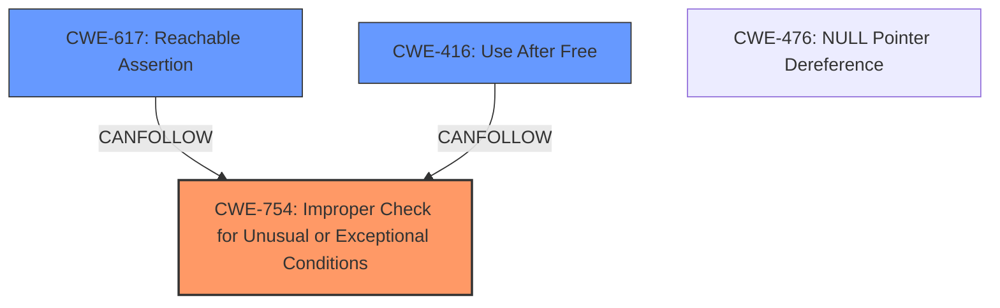

# Analysis Report for CVE-2022-29228

# Vulnerability Analysis Report: CVE-2022-29228

## Description


## Analysis (with Relationship Data)

# Summary
| CWE ID  | CWE Name                                                                                                | Confidence | CWE Abstraction Level | CWE Vulnerability Mapping Label | CWE-Vulnerability Mapping Notes |
| ------- | ------------------------------------------------------------------------------------------------------- | ---------- | ----------------------- | ------------------------------- | ------------------------------- |
| CWE-754 | **CWE-754: Improper Check for Unusual or Exceptional Conditions**                                        | 0.85       | Class                   | Primary                         | Allowed-with-Review             |
| CWE-617 | **CWE-617: Reachable Assertion**                                                                          | 0.75       | Base                    | Secondary                       | Allowed                         |
| CWE-416 | **CWE-416: Use After Free**                                                                             | 0.75       | Variant                 | Secondary                       | Allowed                         |

## Evidence and Confidence

*   **Confidence Score:** 0.8
*   **Evidence Strength:** HIGH

## Relationship Analysis
The primary CWE is CWE-754, which is a class-level CWE describing **improper checks for unusual or exceptional conditions**. The vulnerability description states that the OAuth filter incorrectly calls `continueDecoding()` after sending a local response. This indicates a failure to properly check for the state of the filter chain before proceeding, which aligns with CWE-754.

CWE-617 (Reachable Assertion) is a potential consequence of the **improper check**, as the incorrect call to `continueDecoding()` triggers an `ASSERT()` failure in newer versions. CWE-416 (Use After Free) represents another potential impact, described as memory corruption in older versions. CWE-617 and CWE-416 are connected to CWE-754 via the CANFOLLOW relationship.

The abstraction levels influenced the selection. CWE-754 is a class, but it captures the broad nature of the missing or **improper check**. CWE-617 and CWE-416 are more specific outcomes.



## Vulnerability Chain
The vulnerability chain starts with the **improper handling of the OAuth filter**, specifically the incorrect call to `continueDecoding()` after a local response has been sent. This leads to two possible outcomes:

1.  In newer versions: **improper check** (CWE-754) -> `ASSERT()` failure (CWE-617)
2.  In older versions: **improper check** (CWE-754) -> memory corruption (CWE-416)

## Summary of Analysis
The analysis is based on the vulnerability description and the CVE Reference Links Content Summary, which highlights the **incorrect filter logic** and premature call to `continueDecoding()`.

The graph relationships indicate that the **improper check** (CWE-754) leads to either a reachable assertion (CWE-617) or memory corruption (CWE-416), depending on the Envoy version.

CWE-754 is selected as the primary CWE because it represents the root cause of the vulnerability, which is the **failure to properly check for the state of the filter chain before proceeding**. CWE-617 and CWE-416 are included as secondary CWEs to represent the potential impacts of the vulnerability. The selected CWEs are at the optimal level of specificity, as they accurately capture the nature of the weakness and its potential consequences.

Other CWEs Considered but Not Used:

*   CWE-770 (Allocation of Resources Without Limits or Throttling), CWE-789 (Memory Allocation with Excessive Size Value): These CWEs were considered because the vulnerability leads to memory corruption in older versions. However, the root cause is not related to resource allocation, but rather the **improper check** in the OAuth filter logic.
*   CWE-287 (Improper Authentication): This CWE was considered because the vulnerability involves the OAuth filter. However, the root cause is not related to authentication, but rather the **improper handling** of the filter chain after a local response has been sent.
*   CWE-476 (NULL Pointer Dereference): While a null pointer dereference *could* occur as a consequence of memory corruption, it's not directly indicated in the provided information and is too speculative.

Relevant CWE Information:
```
## CWE-754: Improper Check for Unusual or Exceptional Conditions
**Abstraction:** Class
**Status:** Incomplete

### Description
The product does not check or incorrectly checks for unusual or exceptional conditions that are not expected to occur frequently during day to day operation of the product.

### Extended Description
The programmer may assume that certain events or conditions will never occur or do not need to be worried about, such as low memory conditions, lack of access to resources due to restrictive permissions, or misbehaving clients or components. However, attackers may intentionally trigger these unusual conditions, thus violating the programmer's assumptions, possibly introducing instability, incorrect behavior, or a vulnerability.

## CWE-617: Reachable Assertion
**Abstraction:** Base
**Status:** Incomplete

### Description
CWE-617: Reachable Assertion

**Mapping Guidance**:
- Usage: Allowed
- Rationale: This CWE entry is at the Base level of abstraction, which is a preferred level of abstraction for mapping to the root causes of vulnerabilities.

## CWE-416: Use After Free
**Abstraction:** variant
**Status:** graph

### Description
CWE-416: Use After Free

**Mapping Guidance**:
- Usage: Allowed
- Rationale: This CWE entry is at the Variant level of abstraction, which is a preferred level of abstraction for mapping to the root causes of vulnerabilities.
```


## CWE Relationship Analysis

Current CWEs represent these abstraction levels: .


### Vulnerability Chain Analysis

**Chain starting from CWE-476:**
- 476 (NULL Pointer Dereference) - ROOT


**Chain starting from CWE-617:**
- 617 (Reachable Assertion) - ROOT


### CWE Relationship Diagram

```mermaid
graph TD
    classDef primary fill:#f96,stroke:#333,stroke-width:2px
    classDef secondary fill:#69f,stroke:#333
    classDef tertiary fill:#9e9,stroke:#333
```


*Report generated on 2025-03-31 06:56:59*
