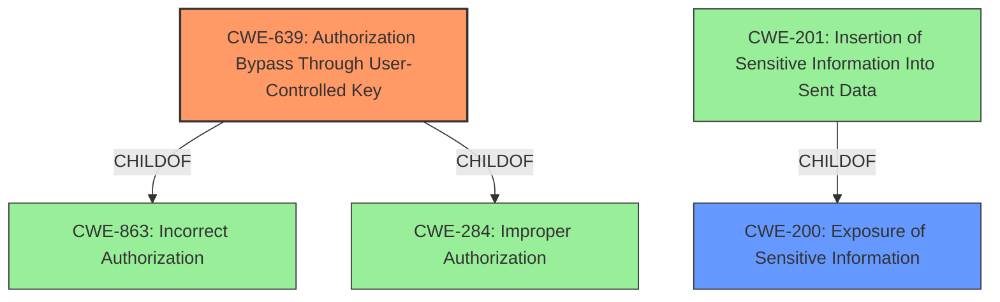

# Enhanced Analysis for CVE-2022-29232

# Summary
| CWE ID    | CWE Name                                                                     | Confidence | CWE Abstraction Level | CWE Vulnerability Mapping Label | CWE-Vulnerability Mapping Notes |
| :-------- | :--------------------------------------------------------------------------- | :--------- | :---------------------- | :------------------------------ | :------------------------------ |
| CWE-639   | Authorization Bypass Through User-Controlled Key                             | 0.9        | Base                    | Primary CWE                   | Allowed                       |
| CWE-200   | Exposure of Sensitive Information                                            | 0.6        | Class                   | Secondary CWE                   | Allowed                       |

## Evidence and Confidence

*   **Confidence Score:** 0.8
*   **Evidence Strength:** HIGH

## Relationship Analysis
The primary relationship influencing the CWE selection is the hierarchical relationship. CWE-639 is a child of CWE-863 (Incorrect Authorization) and CWE-284 (Improper Authorization). This indicates that CWE-639 is a more specific case of authorization issues, which aligns well with the vulnerability description. Additionally, CWE-200 is a parent of CWE-201 (Insertion of Sensitive Information Into Sent Data), suggesting a potential chain from information exposure to the inclusion of sensitive data. We are selecting the higher level CWE-200 because the description says content from different meetings which falls under exposing sensitive information.



## Vulnerability Chain
The vulnerability chain starts with the **insufficient access controls**, leading to an **authorization bypass**, and ultimately resulting in the **exposure of public chat messages from different meetings**.

## Summary of Analysis
The analysis concludes that CWE-639 (Authorization Bypass Through User-Controlled Key) is the most appropriate primary CWE for this vulnerability. This is supported by the CVE Reference Links Content Summary, which highlights that the vulnerability stems from **insufficient access controls** in how chat messages were handled, specifically in the chatIds selector. The system was not properly checking the meeting ID when retrieving chat messages, allowing a user to potentially access messages from other meetings they weren't a part of. This aligns perfectly with the description of CWE-639, where the system's authorization functionality fails to prevent one user from gaining access to another user's data by modifying a key value.

The selection of CWE-639 is further justified by its Base abstraction level, which is the preferred level for mapping root causes. The mapping guidance for CWE-639 also supports this decision, as it directly addresses scenarios where a user can modify a key value to access unauthorized data.

The retriever results also suggested CWE-639, further strengthening the confidence in this mapping.

CWE-200 (Exposure of Sensitive Information) is included as a secondary CWE because the **impact** of the vulnerability is the **exposure of public chat messages from different meetings**. While the root cause is the authorization bypass, the resulting information exposure is a significant aspect of the vulnerability. The messages are from different meetings and so it is exposing information that should be protected.

CWE-79 (Improper Neutralization of Input During Web Page Generation ('Cross-site Scripting')) was considered but not selected because the vulnerability does not involve the injection of malicious script into web pages. The issue is purely related to authorization and access control, not input validation or output encoding.

CWE-863 (Incorrect Authorization) and CWE-285 (Improper Authorization) were considered but not selected as the primary CWE because they are higher-level Class CWEs. CWE-639 provides a more specific and accurate representation of the vulnerability.

The final selection is based on the evidence provided in the vulnerability description and the CVE Reference Links Content Summary. The graph relationships helped refine the selection by highlighting the hierarchical relationships between the CWEs. The selected CWEs are at the optimal level of specificity, addressing both the root cause (authorization bypass) and the impact (information exposure).

Relevant CWE Information:

# Enhanced Context (25 CWEs)
The following CWEs were identified as potentially relevant to this vulnerability:

## CWE-226: Sensitive Information in Resource Not Removed Before Reuse
**Abstraction Level**: Base
**Similarity Score**: 0.77
**Source**: dense

**Description**:
The product releases a resource such as memory or a file so that it can be made available for reuse, but it does not clear or "zeroize" the information contained in the resource before the product performs a critical state transition or makes the resource available for reuse by other entities.

**Mapping Guidance**:
- Usage: Allowed
- Rationale: This CWE entry is at the Base level of abstraction, which is a preferred level of abstraction for mapping to the root causes of vulnerabilities.


## CWE-639: Authorization Bypass Through User-Controlled Key
**Abstraction Level**: Base
**Similarity Score**: 0.77
**Source**: dense

**Description**:
The system's authorization functionality does not prevent one user from gaining access to another user's data or record by modifying the key value identifying the data.

**Mapping Guidance**:
- Usage: Allowed
- Rationale: This CWE entry is at the Base level of abstraction, which is a preferred level of abstraction for mapping to the root causes of vulnerabilities.


## CWE-668: Exposure of Resource to Wrong Sphere
**Abstraction Level**: Class
**Similarity Score**: 0.76
**Source**: dense

**Description**:
The product exposes a resource to the wrong control sphere, providing unintended actors with inappropriate access to the resource.

**Mapping Guidance**:
- Usage: Discouraged
- Rationale: CWE-668 is high-level and is often misused as a catch-all when lower-level CWE IDs might be applicable. It is sometimes used for low-information vulnerability reports [REF-1287]. It is a level-1 Class (i.e., a child of a Pillar). It is not useful for trend analysis.


## CWE-1390: Weak Authentication
**Abstraction Level**: Class
**Similarity Score**: 0.75
**Source**: dense

**Description**:
The product uses an authentication mechanism to restrict access to specific users or identities, but the mechanism does not sufficiently prove that the claimed identity is correct.

**Mapping Guidance**:
- Usage: Allowed-with-Review
- Rationale: This CWE entry is a Class and might have Base-level children that would be more appropriate


## CWE-212: Improper Removal of Sensitive Information Before Storage or Transfer
**Abstraction Level**: Base
**Similarity Score**: 0.75
**Source**: dense

**Description**:
The product stores, transfers, or shares a resource that contains sensitive information, but it does not properly remove that information before the product makes the resource available to unauthorized actors.

**Mapping Guidance**:
- Usage: Allowed
- Rationale: This CWE entry is at the Base level of abstraction, which is a preferred level of abstraction for mapping to the root causes of vulnerabilities.


## CWE-41: Improper Resolution of Path Equivalence
**Abstraction Level**: Base
**Similarity Score**: 0.75
**Source**: dense

**Description**:
The product is vulnerable to file system contents disclosure through path equivalence. Path equivalence involves the use of special characters in file and directory names. The associated manipulations are intended to generate multiple names for the same object.

**Mapping Guidance**:
- Usage: Allowed
- Rationale: This CWE entry is at the Base level of abstraction, which is a preferred level of abstraction for mapping to the root causes of vulnerabilities.


## CWE-404: Improper Resource Shutdown or Release
**Abstraction Level**: Class
**Similarity Score**: 0.75
**Source**: dense

**Description**:
The product does not release or incorrectly releases a resource before it is made available for re-use.

**Mapping Guidance**:
- Usage: Allowed-with-Review
- Rationale: This CWE entry is a Class and might have Base-level children that would be more appropriate


## CWE-807: Reliance on Untrusted Inputs in a Security Decision
**Abstraction Level**: Base
**Similarity Score**: 0.75
**Source**: dense

**Description**:
The product uses a protection mechanism that relies on the existence or values of an input, but the input can be modified by an untrusted actor in a way that bypasses the protection mechanism.

**Mapping Guidance**:
- Usage: Allowed
- Rationale: This CWE entry is at the Base


## CWE Relationship Analysis

Current CWEs represent these abstraction levels: .


### Vulnerability Chain Analysis

**Chain starting from CWE-201:**
- 201 (Insertion of Sensitive Information Into Sent Data) - ROOT


**Chain starting from CWE-200:**
- 200 (Exposure of Sensitive Information to an Unauthorized Actor) - ROOT


### CWE Relationship Diagram

```mermaid
graph TD
    classDef primary fill:#f96,stroke:#333,stroke-width:2px
    classDef secondary fill:#69f,stroke:#333
    classDef tertiary fill:#9e9,stroke:#333
```