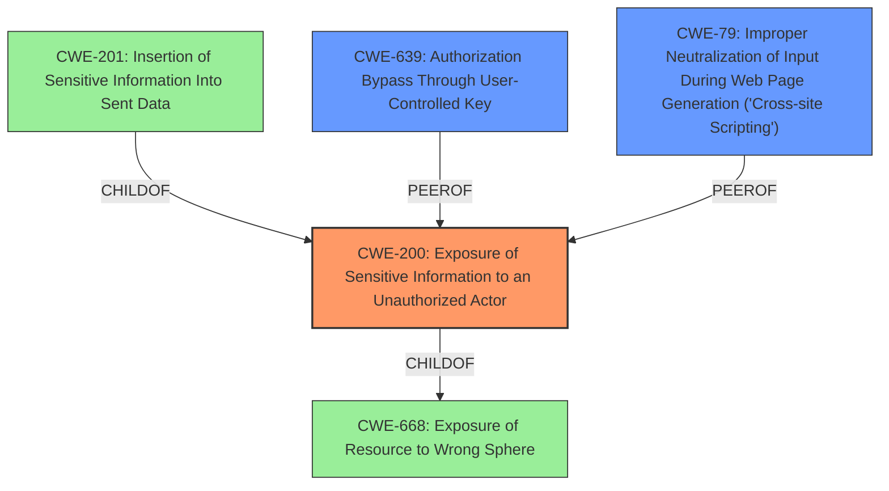

# Analysis Report for CVE-2022-29241

# Vulnerability Analysis Report: CVE-2022-29241

## Description


## Analysis (with Relationship Data)

# Summary
| CWE ID  | CWE Name                                                                     | Confidence | CWE Abstraction Level | CWE Vulnerability Mapping Label | CWE-Vulnerability Mapping Notes |
| :-------- | :--------------------------------------------------------------------------- | :--------- | :---------------------- | :------------------------------ | :------------------------------ |
| CWE-200   | Exposure of Sensitive Information to an Unauthorized Actor                  | 0.9        | Class                   | Primary                       | Discouraged                  |
| CWE-639   | Authorization Bypass Through User-Controlled Key                           | 0.7        | Base                    | Secondary                     | Allowed                        |
| CWE-79    | Improper Neutralization of Input During Web Page Generation ('Cross-site Scripting') | 0.6        | Base                    | Secondary                     | Allowed                        |

## Evidence and Confidence

*   **Confidence Score:** 0.8
*   **Evidence Strength:** MEDIUM

## Relationship Analysis
The primary CWE selected is CWE-200, which is a Class-level CWE. This has a ChildOf relationship to CWE-668 (Exposure of Resource to Wrong Sphere). The retriever results included CWE-201 (Insertion of Sensitive Information Into Sent Data), which is a ChildOf CWE-200. However, CWE-200 is selected because the vulnerability is about the exposure of the access token, not specifically about the insertion of the token into sent data. CWE-639 (Authorization Bypass Through User-Controlled Key) is included as a secondary CWE because the vulnerability relies on guessing/brute forcing the PID, effectively bypassing authorization. CWE-79 (Improper Neutralization of Input During Web Page Generation ('Cross-site Scripting')) is included as a secondary CWE because the access token leakage can be exploited via XSS payloads.



## Vulnerability Chain
The vulnerability chain starts with a **misconfiguration** (`root_dir` includes user's home directory), leading to a **vulnerable REST API**. This allows an attacker to **leak the access token** by guessing/brute-forcing the PID. The leaked token can then be used to **modify critical files** and potentially **gain control of the system**.

## Summary of Analysis
The initial assessment focused on the **impact** of leaking the access token, which led to considering CWE-200. The evidence supporting this includes "impact: **leak the access token**" and "The core vulnerability is the ability to **leak the server's access token** by guessing/brute-forcing the server's PID."

The relationship graph helped to clarify the connections between potential CWEs. While CWE-201 is a child of CWE-200, the vulnerability isn't directly about inserting sensitive data into sent data, but about the exposure of the token itself.

The final selection of CWE-200, CWE-639 and CWE-79 aims to capture both the root cause and contributing factors. CWE-200 addresses the primary impact of sensitive information exposure. CWE-639 covers the authorization bypass aspect through PID guessing. CWE-79 addresses how XSS could be used to exploit the vulnerability. These CWEs are at an appropriate level of specificity, providing a balance between detail and broad applicability.

Relevant CWE Information:

# Enhanced Context (25 CWEs)
The following CWEs were identified as potentially relevant to this vulnerability:

## CWE-200: Exposure of Sensitive Information to an Unauthorized Actor
**Abstraction Level**: Class
**Similarity Score**: 8621.93
**Source**: sparse

**Description**:
The product exposes sensitive information to an actor that is not explicitly authorized to have access to that information.

**Mapping Guidance**:
- Usage: Discouraged
- Rationale: CWE-200 is commonly misused to represent the loss of confidentiality in a vulnerability, but confidentiality loss is a technical impact - not a root cause error. As of CWE 4.9, over 400 CWE entries can lead to a loss of confidentiality. Other options are often available. [REF-1287].

## CWE-639: Authorization Bypass Through User-Controlled Key
**Abstraction Level**: Base
**Similarity Score**: 8808.75
**Source**: sparse

**Description**:
The system's authorization functionality does not prevent one user from gaining access to another user's data or record by modifying the key value identifying the data.

**Mapping Guidance**:
- Usage: Allowed
- Rationale: This CWE entry is at the Base level of abstraction, which is a preferred level of abstraction for mapping to the root causes of vulnerabilities.

## CWE-79: Improper Neutralization of Input During Web Page Generation ('Cross-site Scripting')
**Abstraction Level**: Base
**Similarity Score**: 8687.00
**Source**: sparse

**Description**:
The product does not neutralize or incorrectly neutralizes user-controllable input before it is placed in output that is used as a web page that is served to other users.

**Mapping Guidance**:
- Usage: Allowed
- Rationale: This CWE entry is at the Base level of abstraction, which is a preferred level of abstraction for mapping to the root causes of vulnerabilities.

### Technical Explanation for Selected CWEs:

*   **CWE-200: Exposure of Sensitive Information to an Unauthorized Actor**
    *   **Match:** The vulnerability allows the access token to be leaked, exposing sensitive information to unauthorized actors. The access token is sensitive because it allows interaction with Jupyter services and notebooks.
    *   **Security Implications:** An attacker can use the leaked token to read sensitive data, modify critical files, and potentially gain control of the affected system.
    *   **Relationships:** This is a Class-level CWE. It's a general category that covers many types of information exposure.
    *   **Mapping Guidance:** The mapping guidance discourages using CWE-200 as a catch-all. However, in this case, the primary impact is the exposure of the access token. The other CWEs listed address the mechanism by which this exposure occurs.
    *   **Primary**

*   **CWE-639: Authorization Bypass Through User-Controlled Key**
    *   **Match:** The vulnerability arises from the ability to guess/brute-force the PID of the Jupyter server. This is a form of authorization bypass where the attacker gains access to the access token by manipulating a key value (the PID).
    *   **Security Implications:** Allows unauthorized access to the Jupyter server's REST API, enabling malicious activities.
    *   **Relationships:** This is a Base-level CWE and can be a child of CWE-863 (Incorrect Authorization).
    *   **Mapping Guidance:** The mapping guidance allows this CWE.
    *   **Secondary**

*   **CWE-79: Improper Neutralization of Input During Web Page Generation ('Cross-site Scripting')**
    *   **Match:** The description states, "this URL can be used from a cross-site scripting payload or from a hooked or otherwise compromised browser to leak this access token to a malicious third party." This indicates that XSS can be used to exploit this vulnerability.
    *   **Security Implications:** Allows an attacker to inject malicious scripts into web pages viewed by other users, potentially stealing credentials or performing other malicious actions.
    *   **Relationships:** Base-level CWE.
    *   **Mapping Guidance:** The mapping guidance allows this CWE.
    *   **Secondary**

### Considered but Not Used:

*   **CWE-22: Improper Limitation of a Pathname to a Restricted Directory ('Path Traversal')**: While the `root_dir` configuration is mentioned, the vulnerability is not directly related to path traversal. The core issue is the exposure of the access token.
*   **CWE-863: Incorrect Authorization**: This is a class-level CWE. While authorization is bypassed, CWE-639 is more specific.
*   **CWE-379: Creation of Temporary File in Directory with Insecure Permissions**: This doesn't directly relate to the vulnerability description. The exposure of the access token is not due to insecure temporary file permissions.
*   **C


## CWE Relationship Analysis

Current CWEs represent these abstraction levels: .


### Vulnerability Chain Analysis

**Chain starting from CWE-201:**
- 201 (Insertion of Sensitive Information Into Sent Data) - ROOT


**Chain starting from CWE-200:**
- 200 (Exposure of Sensitive Information to an Unauthorized Actor) - ROOT


### CWE Relationship Diagram

```mermaid
graph TD
    classDef primary fill:#f96,stroke:#333,stroke-width:2px
    classDef secondary fill:#69f,stroke:#333
    classDef tertiary fill:#9e9,stroke:#333
```


*Report generated on 2025-03-31 02:34:07*
