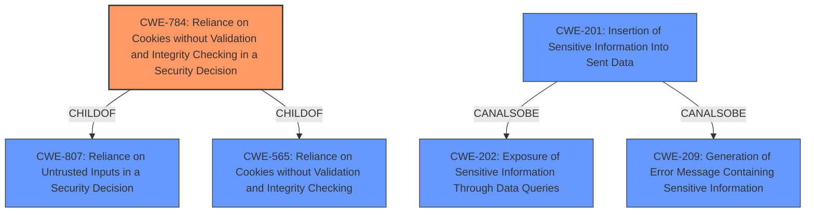

# Enhanced Analysis for CVE-2022-29248

# Summary
| CWE ID    | CWE Name                                                                             | Confidence | CWE Abstraction Level | CWE Vulnerability Mapping Label | CWE-Vulnerability Mapping Notes |
| :-------- | :----------------------------------------------------------------------------------- | :--------- | :---------------------- | :------------------------------ | :------------------------------ |
| CWE-784   | Reliance on Cookies without Validation and Integrity Checking in a Security Decision | 0.9        | Variant                 | Allowed                       | Primary CWE                     |
| CWE-565   | Reliance on Cookies without Validation and Integrity Checking                       | 0.7        | Base                    | Allowed                       | Secondary Candidate             |
| CWE-201   | Insertion of Sensitive Information Into Sent Data                       | 0.6        | Base                    | Allowed                       | Secondary Candidate             |

## Evidence and Confidence

*   **Confidence Score:** 0.9
*   **Evidence Strength:** HIGH

## Relationship Analysis
The primary CWE, CWE-784, is a variant of CWE-807 and CWE-565, indicating a more specific form of the general weakness of relying on untrusted inputs in security decisions related to cookies. The vulnerability involves **improper cookie domain checking**, which directly aligns with the description of CWE-784. CWE-565 is a broader base class that encompasses the general issue of relying on cookies without proper validation. CWE-201, Insertion of Sensitive Information Into Sent Data, has a CANALSOBE relationship with CWE-202 and CWE-209 and is related to sensitive information.



## Vulnerability Chain
The vulnerability chain starts with the **improper cookie domain checking** in Guzzle's cookie middleware (CWE-784). This leads to the possibility of a malicious server setting cookies for unrelated domains. If the Guzzle client then makes a request to one of these unrelated domains, it sends the injected cookie, potentially leading to session hijacking or other malicious activities.
  - The root cause is **improper validation of cookie domains**.
  - The weakness that follows is the ability to set cookies for arbitrary domains.
  - The potential impact includes session hijacking and private API data leakage.

## Summary of Analysis
The initial assessment focused on the **improper cookie domain checking** vulnerability in Guzzle. The primary CWE match, CWE-784, accurately reflects this weakness. The analysis considered the relationships between CWEs, particularly the parent-child relationships and potential vulnerability chains.

The evidence for CWE-784 is strong. The "Vulnerability Description Key Phrases" section explicitly mentions "**improper cookie domain checking**". The "CVE Reference Links Content Summary" further details how the Guzzle client "**does not verify if the cookie's domain attribute matches the domain of the server setting the cookie**". This aligns directly with the description of CWE-784, which states that the product "**does not properly ensure that the cookie is valid for the associated user**".

CWE-565 was also considered, as it represents a broader issue of relying on cookies without validation, and CWE-784 is a variant of CWE-565. I decided to use CWE-784 because it is a more specific variant.

CWE-201 was also considered. The "CVE Reference Links Content Summary" section discusses the potential for "**Private API Data Leakage**". If the Guzzle client is logged into a malicious account via a crafted cookie, the attacker could retrieve the client's private API requests from their security log or other available logs of their malicious account on another service.
The selected CWEs are at the optimal level of specificity, with CWE-784 providing a detailed description of the vulnerability.


## CWE Relationship Analysis

Current CWEs represent these abstraction levels: .


### Vulnerability Chain Analysis

**Chain starting from CWE-201:**
- 201 (Insertion of Sensitive Information Into Sent Data) - ROOT


**Chain starting from CWE-202:**
- 202 (Exposure of Sensitive Information Through Data Queries) - ROOT


### CWE Relationship Diagram

```mermaid
graph TD
    classDef primary fill:#f96,stroke:#333,stroke-width:2px
    classDef secondary fill:#69f,stroke:#333
    classDef tertiary fill:#9e9,stroke:#333
```