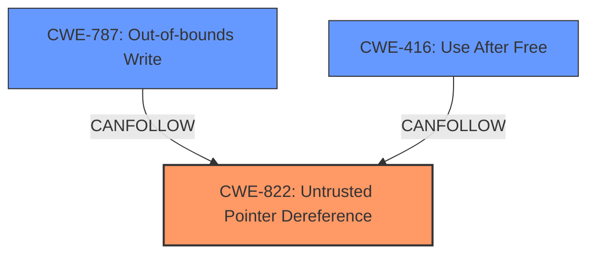

# Analysis Report for CVE-2022-29279

# Vulnerability Analysis Report: CVE-2022-29279

## Description


## Analysis (with Relationship Data)

# Summary
| CWE ID | CWE Name | Confidence | CWE Abstraction Level | CWE Vulnerability Mapping Label | CWE-Vulnerability Mapping Notes |
|---|---|---|---|---|---|
| CWE-822 | Untrusted Pointer Dereference | 0.9 | Base | Primary | Allowed |
| CWE-787 | Out-of-bounds Write | 0.7 | Base | Secondary | Allowed |
| CWE-416 | Use After Free | 0.6 | Variant | Secondary | Allowed |

## Evidence and Confidence

*   **Confidence Score:** 0.8
*   **Evidence Strength:** HIGH

## Relationship Analysis
The primary relationship is between the **CWE-822 (Untrusted Pointer Dereference)** and its potential to lead to memory corruption, such as **CWE-787 (Out-of-bounds Write)** or **CWE-416 (Use After Free)**. **CWE-822 (Untrusted Pointer Dereference)** is the root cause where an attacker provides a malicious pointer. This could then lead to an out-of-bounds write or use-after-free if the dereferenced pointer points to an invalid memory location.



## Vulnerability Chain
The vulnerability chain starts with the **use of an untrusted pointer (CWE-822)**, which is then dereferenced, potentially leading to **memory corruption either through an out-of-bounds write (CWE-787)** or by **accessing already freed memory (CWE-416)**. The final impact is **tampering with SMRAM and OS memory**.

## Summary of Analysis
The initial assessment focuses on the **use of untrusted pointer**, which the vulnerability description identifies as the root cause. The evidence from the "CVE Reference Links Content Summary" confirms that the **vulnerability stems from the use of an untrusted pointer within the `SdHostDriver` and `SdMmcDevice` components**. The description states that "**Use of a untrusted pointer** allows tampering with SMRAM and OS memory in SdHostDriver and SdMmcDevice". This aligns strongly with **CWE-822 (Untrusted Pointer Dereference)**, where the product obtains a value from an untrusted source, converts this value to a pointer, and dereferences the resulting pointer.

The untrusted pointer dereference can further lead to memory corruption. Specifically, the summary mentions that this vulnerability allows an attacker to corrupt SMRAM and OS memory. This could result in **CWE-787 (Out-of-bounds Write)** if the pointer is used to write data outside the intended buffer.
Alternatively, the **weakness:** **use-after-free** key phrase indicates that the pointer might be pointing to freed memory, resulting in **CWE-416 (Use After Free)**.

The selection of **CWE-822 (Untrusted Pointer Dereference)** is at the optimal level of specificity because it directly addresses the root cause of the vulnerability which is the **use of a untrusted pointer**. This is a base level CWE. The potential consequences of this vulnerability are addressed by additionally including **CWE-787 (Out-of-bounds Write)** and **CWE-416 (Use After Free)**.

CWEs considered but not used:

*   CWE-121 (Stack-based Buffer Overflow): While a buffer overflow could occur, the root cause is the untrusted pointer, not necessarily a stack-specific overflow.
*   CWE-367 (Time-of-check Time-of-use (TOCTOU) Race Condition): There's no explicit mention of a TOCTOU condition in the description.
*   CWE-823 (Use of Out-of-range Pointer Offset): This could be a possibility, but the primary issue is the untrusted source of the pointer itself, which is better captured by **CWE-822 (Untrusted Pointer Dereference)**.
*   CWE-123 (Write-what-where Condition): The vulnerability description does not provide sufficient detail to conclude that the attacker has full control over both the address and data written.
*   CWE-1285 (Improper Validation of Specified Index, Position, or Offset in Input): The root cause is not the validation of the offset, but the **use of a untrusted pointer**.
*   CWE-362 (Concurrent Execution using Shared Resource with Improper Synchronization ('Race Condition')): There's no explicit mention of concurrency issues in the description.
*   CWE-401 (Missing Release of Memory after Effective Lifetime): While memory corruption is possible, the description focuses on the **use of a untrusted pointer** rather than a memory leak.


## CWE Relationship Analysis

Current CWEs represent these abstraction levels: .


### Vulnerability Chain Analysis

**Chain starting from CWE-823:**
- 823 (Use of Out-of-range Pointer Offset) - ROOT


**Chain starting from CWE-822:**
- 822 (Untrusted Pointer Dereference) - ROOT


### CWE Relationship Diagram

```mermaid
graph TD
    classDef primary fill:#f96,stroke:#333,stroke-width:2px
    classDef secondary fill:#69f,stroke:#333
    classDef tertiary fill:#9e9,stroke:#333
```


*Report generated on 2025-03-30 11:35:02*
