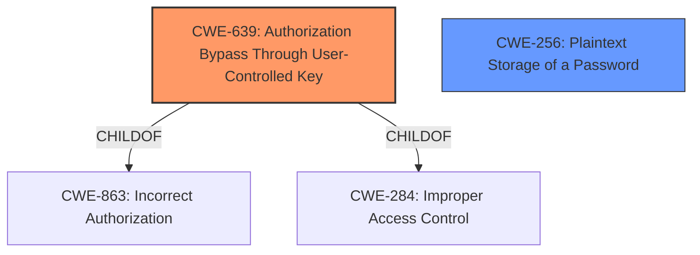

# Enhanced Analysis for CVE-2022-29287

# Summary
| CWE ID | CWE Name | Confidence | CWE Abstraction Level | CWE Vulnerability Mapping Label | CWE-Vulnerability Mapping Notes |
|---|---|---|---|---|---|
| CWE-639 | Authorization Bypass Through User-Controlled Key | 1.0 | Base | Allowed | Primary CWE |
| CWE-256 | Plaintext Storage of a Password | 0.7 | Base | Allowed | Secondary Candidate |

## Evidence and Confidence

*   **Confidence Score:** 0.9
*   **Evidence Strength:** HIGH

## Relationship Analysis
The primary CWE, CWE-639, is a Base level weakness and a child of CWE-863 (Incorrect Authorization) and CWE-284 (Improper Access Control). The vulnerability involves an **insecure direct object reference**, which aligns with the description of CWE-639 where a user can modify a key value to access another user's data. CWE-256 is included as a secondary because the exported XML contains the hashed password, which is not ideal.



## Vulnerability Chain
The chain of events is as follows:

1.  **Insecure Direct Object Reference (CWE-639):** The system **fails to properly authorize** the user's request to export user options based on a user-controlled key (user ID).
2.  **Exposure of Sensitive Information:** The exported XML contains sensitive information (hashed password), potentially leading to further compromise if the password hashing algorithm is weak or the attacker can crack the hash.

## Summary of Analysis
The primary weakness is the **insecure direct object reference** (IDOR), where an attacker with user management rights can export the user options of other users, including those with higher privileges. This aligns perfectly with CWE-639 (Authorization Bypass Through User-Controlled Key), where the authorization functionality **does not prevent one user from gaining access to another user's data by modifying the key value**. The CVE Reference Links Content Summary explicitly mentions "Insecure Direct Object Reference".

> "Authenticated **Insecure Direct Object Reference** in Kentico CMS allows an administrator to access sensitive data of higher privileged users...However, this step can be bypassed by directly sending the second POST request with the objectId parameter, which allows a lower privileged user to export the settings of higher privileged users."

The fact that the exported XML contains the hashed password suggests a secondary weakness related to the storage of sensitive information, leading to the inclusion of CWE-256 (Plaintext Storage of a Password) as a secondary candidate. While the password is not stored in plaintext, exporting it in a way that it can be accessed by an unauthorized user is still a security concern.

The choice of CWE-639 is at the Base level, which is the preferred level of abstraction. It accurately represents the root cause of the vulnerability, which is the **lack of proper authorization** when accessing user data via a user-controlled key.

Relevant CWE Information:

# Enhanced Context (25 CWEs)

## CWE-639: Authorization Bypass Through User-Controlled Key
**Abstraction Level**: Base
**Similarity Score**: 0.78
**Source**: dense

**Description**:
The system's authorization functionality **does not prevent** one user from gaining access to another user's data or record by modifying the key value identifying the data.

**Mapping Guidance**:
- Usage: Allowed
- Rationale: This CWE entry is at the Base level of abstraction, which is a preferred level of abstraction for mapping to the root causes of vulnerabilities.

## CWE-256: Plaintext Storage of a Password
**Abstraction Level**: Base
**Similarity Score**: 0.276
**Source**: sparse

### Description
Storing a password in plaintext may result in a system compromise.

### Extended Description
Password management issues occur when a password is stored in plaintext in an application's properties, configuration file, or memory.

### Mapping Guidance
**Usage:** Allowed
**Rationale:** This CWE entry is at the Base level of abstraction, which is a preferred level of abstraction for mapping to the root causes of vulnerabilities.


## CWE Relationship Analysis

Current CWEs represent these abstraction levels: .


### Vulnerability Chain Analysis

**Chain starting from CWE-863:**
- 863 (Incorrect Authorization) - ROOT


**Chain starting from CWE-639:**
- 639 (Authorization Bypass Through User-Controlled Key) - ROOT


### CWE Relationship Diagram

```mermaid
graph TD
    classDef primary fill:#f96,stroke:#333,stroke-width:2px
    classDef secondary fill:#69f,stroke:#333
    classDef tertiary fill:#9e9,stroke:#333
```