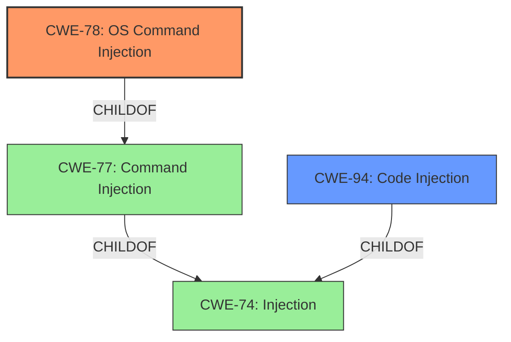

# Analysis for CVE-2022-29307

# Summary
| CWE ID | CWE Name | Confidence | CWE Abstraction Level | CWE Vulnerability Mapping Label | CWE-Vulnerability Mapping Notes |
|---|---|---|---|---|---|
| CWE-78 | Improper Neutralization of Special Elements used in an OS Command ('OS Command Injection') | 1.0 | Base | Allowed | Primary CWE |
| CWE-94 | Improper Control of Generation of Code ('Code Injection') | 0.7 | Base | Allowed-with-Review | Secondary Candidate |

## Evidence and Confidence

*   **Confidence Score:** 0.9
*   **Evidence Strength:** HIGH

## Relationship Analysis
The primary CWE, CWE-78, is a `Base` level CWE which is `ChildOf` CWE-77 (Improper Neutralization of Special Elements used in a Command). The secondary CWE, CWE-94, is also a `Base` level CWE, and is `ChildOf` CWE-74 (Improper Neutralization of Special Elements in Output Used by a Downstream Component ('Injection')).

## Vulnerability Chain
The vulnerability chain involves taking the POST parameter `from`, incorporating it into the `create_function` function's content parameter without sanitization, leading to remote command execution.

## Summary of Analysis
The vulnerability is a **command injection** in IonizeCMS v1.0.8.1, specifically within the `copy_lang_content` function in `application/models/lang_model.php`. The `from` POST parameter is used without sanitization in `create_function`, allowing attackers to inject arbitrary system commands.

The primary CWE is CWE-78, because the injected commands are OS commands. The secondary CWE is CWE-94, because the injected commands are being used to construct a code segment.

Evidence from the CVE Reference Links Content Summary:
*   "The vulnerability stems from the `copy_lang_content` method in the `application/models/lang_model.php` file of Ionize CMS. The `POST` parameter `from` is directly incorporated into the `create_function` function's content parameter without any sanitization or validation."
*   "Code injection: The lack of input sanitization allows arbitrary code to be injected via the `from` POST parameter."
*   "Remote command execution: Attackers can execute arbitrary system commands on the server by injecting malicious code."

The selection of CWE-78 is based on the fact that the injected code is directly used to execute OS commands, which aligns perfectly with the description of CWE-78. The mapping guidance for CWE-78 indicates that it is at the Base level of abstraction, which is preferred.

CWE-94 is considered as a secondary CWE because the vulnerability also involves the construction of a code segment using externally-influenced input, but the ultimate impact is OS command execution, making CWE-78 more specific and appropriate.

Other CWEs Considered:
*   CWE-77: While command injection is present, CWE-78 (OS Command Injection) is more specific and accurate because the commands executed are OS commands.
*   CWE-94: Code is being generated, but the commands that are executed are OS commands, making it a better fit for CWE-78.
*   CWE-1336: Improper Neutralization of Special Elements Used in a Template Engine was considered, but the vulnerability does not involve the use of a template engine.

The final selection of CWE-78 is based on the evidence that the vulnerability leads to the execution of OS commands due to improper neutralization of special elements in the `from` POST parameter. The code is injected into the `create_function` function.

Relevant CWE Information:
*   CWE-78: Improper Neutralization of Special Elements used in an OS Command ('OS Command Injection')
*   CWE-94: Improper Control of Generation of Code ('Code Injection')