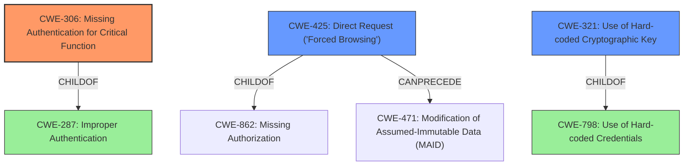

# Analysis Report for CVE-2022-29330

# Vulnerability Analysis Report: CVE-2022-29330

## Description


## Analysis (with Relationship Data)

# Summary
| CWE ID | CWE Name | Confidence | CWE Abstraction Level | CWE Vulnerability Mapping Label | CWE-Vulnerability Mapping Notes |
|---|---|---|---|---|---|
| CWE-306 | Missing Authentication for Critical Function | 0.9 | Base | Primary | Allowed |
| CWE-425 | Direct Request ('Forced Browsing') | 0.7 | Base | Secondary | Allowed |
| CWE-321 | Use of Hard-coded Cryptographic Key | 0.6 | Variant | Secondary | Allowed |

## Evidence and Confidence

*   **Confidence Score:** 0.8
*   **Evidence Strength:** HIGH

## Relationship Analysis
The primary weakness is the **missing access control**, which directly aligns with CWE-306 (Missing Authentication for Critical Function). The backup files being directly accessible via the web server without authentication further supports this. CWE-425 (Direct Request) is a related weakness as the files were directly accessible due to the **missing access control**. CWE-321 (Use of Hard-coded Cryptographic Key) is included because the backup files contained cryptographic keys. All three are Base or Variant level CWEs and are therefore at an appropriate level of abstraction.



## Vulnerability Chain
The vulnerability chain starts with **missing access control** (CWE-306). Because access control was **missing**, this allowed direct request or forced browsing (CWE-425) to access the backup files. The backup files contained sensitive information including cryptographic keys (CWE-321).

## Summary of Analysis
The initial assessment correctly identified the **missing access control** as a key issue. The **CVE Reference Links Content Summary** provided more detail: "The vulnerability stems from a lack of access control on the backup files generated by VitalPBX. These backup files were stored in a publicly accessible directory (`/var/lib/vitalpbx/static`) served by the web server. The web server configuration allowed direct access to files within this directory without authentication." This confirms that CWE-306 (Missing Authentication for Critical Function) is the primary issue. The vulnerability description states: "**Missing access control** in the backup system of Telesoft VitalPBX before 3.2.1 allows attackers to access the PJSIP and SIP extension credentials, cryptographic keys and voicemails files via unspecified vectors."

CWE-425 (Direct Request) is a secondary factor because the **missing access control** allowed direct access to the files.
CWE-321 (Use of Hard-coded Cryptographic Key) is also relevant because cryptographic keys were exposed in the backup files.
CWE-284 (Improper Access Control) was considered but rejected, as the CWE Mapping Guidance states it is a discouraged high-level CWE. Instead, the more specific CWE-306 (Missing Authentication for Critical Function) was selected.

Relevant CWE Information:
- CWE-306: Missing Authentication for Critical Function
- CWE-425: Direct Request ('Forced Browsing')
- CWE-321: Use of Hard-coded Cryptographic Key


## CWE Relationship Analysis

Current CWEs represent these abstraction levels: .


### Vulnerability Chain Analysis

**Chain starting from CWE-862:**
- 862 (Missing Authorization) - ROOT


**Chain starting from CWE-425:**
- 425 (Direct Request ('Forced Browsing')) - ROOT


### CWE Relationship Diagram

```mermaid
graph TD
    classDef primary fill:#f96,stroke:#333,stroke-width:2px
    classDef secondary fill:#69f,stroke:#333
    classDef tertiary fill:#9e9,stroke:#333
```


*Report generated on 2025-03-31 13:22:35*
