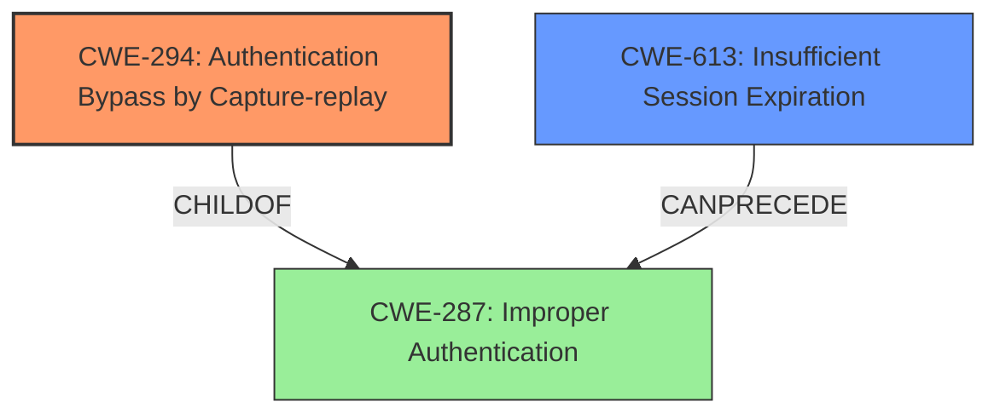

# Analysis Report for CVE-2022-29334

# Vulnerability Analysis Report: CVE-2022-29334

## Description


## Analysis (with Relationship Data)

# Summary
| CWE ID | CWE Name | Confidence | CWE Abstraction Level | CWE Vulnerability Mapping Label | CWE-Vulnerability Mapping Notes |
|---|---|---|---|---|---|
| CWE-294 | Authentication Bypass by Capture-replay | 0.9 | Base | Allowed | Primary CWE |
| CWE-613 | Insufficient Session Expiration | 0.6 | Base | Allowed | Secondary Candidate |

## Evidence and Confidence

*   **Confidence Score:** 0.9
*   **Evidence Strength:** HIGH

## Relationship Analysis
The primary CWE, CWE-294 **Authentication Bypass by Capture-replay**, is a base level CWE. It is a child of CWE-287 **Improper Authentication**, which is a class level CWE. The secondary CWE, CWE-613 **Insufficient Session Expiration**, is also a base level CWE and can precede CWE-287. The relationships show that authentication issues are at play, but the specific attack vector is the replay of a captured session.



## Vulnerability Chain
The vulnerability chain starts with the **lack of proper session management**, specifically the **insufficient session expiration** (CWE-613). This allows an attacker to capture a valid session and replay it, leading to **authentication bypass** (CWE-294) and ultimately unauthorized access to the system.

## Summary of Analysis
The initial analysis pointed towards session management issues and authentication bypass. After reviewing the evidence, the primary weakness is CWE-294 **Authentication Bypass by Capture-replay**, because the vulnerability description clearly states that the authentication is bypassed via a session replay attack.

Supporting evidence:
*   "An issue in H v1.0 allows attackers to **bypass authentication** via a **session replay attack**."
*   "The root cause is the use of a fixed/predictable cookie for administrator authentication. The application does not invalidate or randomize the session cookie when an administrator logs in. This allows an attacker to reuse the same cookie to gain unauthorized administrator access."

The graph relationships and retriever results also support this assessment. The retriever results show CWE-294 as the top combined result. The CWE-294 description matches the vulnerability description almost exactly.

The secondary weakness is CWE-613 **Insufficient Session Expiration**. This is because the root cause of the replay attack is that the session is not invalidated. If the session was invalidated, then the session replay attack would not be successful.

Relevant CWE Information:

# Enhanced Context (25 CWEs)
The following CWEs were identified as potentially relevant to this vulnerability:

## CWE-294: Authentication Bypass by Capture-replay
**Abstraction Level**: Base
**Similarity Score**: 0.041

**Description**:
A capture-replay flaw exists when the design of the product makes it possible for a malicious user to sniff network traffic and **bypass authentication** by **replaying** it to the server in question to the same effect as the original message (or with minor changes).

**Mapping Guidance**:
- Usage: Allowed
- Rationale: This CWE entry is at the Base level of abstraction, which is a preferred level of abstraction for mapping to the root causes of vulnerabilities.

## CWE-613: Insufficient Session Expiration
**Abstraction Level**: base
**Similarity Score**: 0.029

**Description**:
CWE-613: Insufficient Session Expiration

**Mapping Guidance**:
- Usage: Allowed
- Rationale: This CWE entry is at the Base level of abstraction, which is a preferred level of abstraction for mapping to the root causes of vulnerabilities.

**Relationships**:
- REQUIREDBY -> CWE-352
- CANPRECEDE -> CWE-287
- CHILDOF -> CWE-672
- CHILDOF -> CWE-672
- PARENTOF -> CWE-613

The selected CWEs are at the optimal level of specificity because they directly address the root cause (session replay) and a contributing factor (insufficient session expiration). They are also base level CWEs which are preferred.


## CWE Relationship Analysis

Current CWEs represent these abstraction levels: .


### Vulnerability Chain Analysis

**Chain starting from CWE-294:**
- 294 (Authentication Bypass by Capture-replay) - ROOT


**Chain starting from CWE-672:**
- 672 (Operation on a Resource after Expiration or Release) - ROOT


### CWE Relationship Diagram

```mermaid
graph TD
    classDef primary fill:#f96,stroke:#333,stroke-width:2px
    classDef secondary fill:#69f,stroke:#333
    classDef tertiary fill:#9e9,stroke:#333
```


*Report generated on 2025-03-30 23:55:47*
