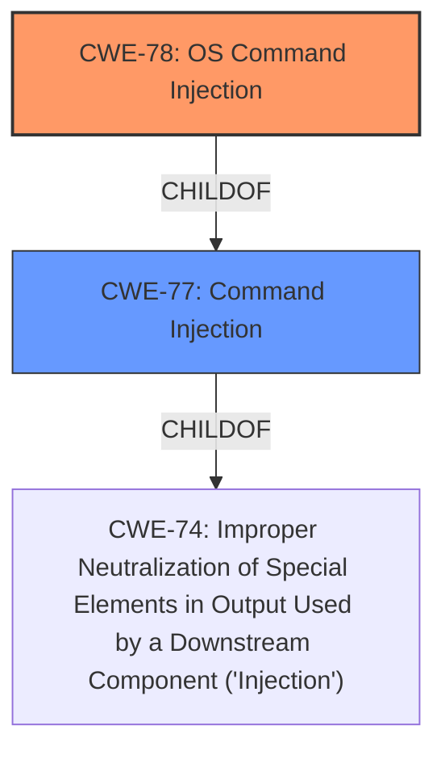

# Analysis Report for CVE-2022-29337

# Vulnerability Analysis Report: CVE-2022-29337

## Description


## Analysis (with Relationship Data)

# Summary
| CWE ID | CWE Name | Confidence | CWE Abstraction Level | CWE Vulnerability Mapping Label | CWE-Vulnerability Mapping Notes |
|---|---|---|---|---|---|
| CWE-78 | Improper Neutralization of Special Elements used in an OS Command ('OS Command Injection') | 1.0 | Base | Allowed | Primary CWE |
| CWE-77 | Improper Neutralization of Special Elements used in a Command ('Command Injection') | 0.7 | Class | Allowed-with-Review | Secondary Candidate |

## Evidence and Confidence

*   **Confidence Score:** 0.9
*   **Evidence Strength:** HIGH

## Relationship Analysis
The primary relationship that influenced the decision was the parent-child relationship between CWE-77 and CWE-78. CWE-78 is a more specific Base level CWE than CWE-77. Since the vulnerability involves OS commands, CWE-78 is the more appropriate choice.



## Vulnerability Chain
The vulnerability chain starts with the lack of proper neutralization of special elements within the `va_cmd` parameter, leading to the ability to inject OS commands. This results in arbitrary command execution on the system.

## Summary of Analysis
The initial analysis identified **command injection** as the main weakness. The Retriever results also point to CWE-77 and CWE-78 as top candidates. Based on the vulnerability description, the **command injection** occurs within an OS command, making CWE-78 a more specific and accurate choice than the more general CWE-77. The evidence explicitly states that the vulnerability allows attackers to "execute arbitrary commands" via a crafted HTTP request, which aligns directly with the description of CWE-78.

The selected CWE is at the optimal level of specificity because it accurately reflects the nature of the **weakness** which is related to OS commands.

Relevant CWE Information:

# Enhanced Context (25 CWEs)
The following CWEs were identified as potentially relevant to this vulnerability:

## CWE-74: Improper Neutralization of Special Elements in Output Used by a Downstream Component ('Injection')
**Abstraction Level**: Class
**Similarity Score**: 0.76
**Source**: dense

**Description**:
The product constructs all or part of a command, data structure, or record using externally-influenced input from an upstream component, but it does not neutralize or incorrectly neutralizes special elements that could modify how it is parsed or interpreted when it is sent to a downstream component.

**Mapping Guidance**:
- Usage: Discouraged
- Rationale: CWE-74 is high-level and often misused when lower-level weaknesses are more appropriate.

## CWE-78: Improper Neutralization of Special Elements used in an OS Command ('OS Command Injection')
**Abstraction Level**: Base
**Similarity Score**: 5.03
**Source**: graph

**Description**:
The product constructs all or part of an OS command using externally-influenced input from an upstream component, but it does not neutralize or incorrectly neutralizes special elements that could modify the intended OS command when it is sent to a downstream component.

**Mapping Guidance**:
- Usage: Allowed
- Rationale: This CWE entry is at the Base level of abstraction, which is a preferred level of abstraction for mapping to the root causes of vulnerabilities.

## CWE-77: Improper Neutralization of Special Elements used in a Command ('Command Injection')
**Abstraction Level:** Class
**Status:** Draft

### Description
The product constructs all or part of a command using externally-influenced input from an upstream component, but it does not neutralize or incorrectly neutralizes special elements that could modify the intended command when it is sent to a downstream component.

### Mapping Guidance
**Usage:** Allowed-with-Review
**Rationale:** CWE-77 is often misused when OS command injection (CWE-78) was intended instead [REF-1287].
**Comments:** Ensure that the analysis focuses on the root-cause error that allows the execution of commands, as there are many weaknesses that can lead to this consequence. See Terminology Notes. If the weakness involves a command language besides OS shell invocation, then CWE-77 could be used.
**Reasons:**
- Frequent Misuse
**Suggested Alternatives:**
- CWE-78: OS Command Injection

## CWE-78: Improper Neutralization of Special Elements used in an OS Command ('OS Command Injection')

### Technical Explanation for CWE-78
The vulnerability description states that there is a **command injection** vulnerability via the `va_cmd` parameter. This aligns with CWE-78 because the product is constructing an OS command using external input, and it **fails to neutralize** special elements. This allows an attacker to inject arbitrary OS commands.

### Security Implications for CWE-78
The security implication of CWE-78 is that an attacker can execute arbitrary commands on the system. This can lead to complete system compromise, data theft, or denial of service.

### Relationship Analysis for CWE-78
CWE-78 is a child of CWE-77, which is a more general type of **command injection**. Since the vulnerability involves OS commands, CWE-78 is the more specific and accurate choice.
### Mapping Guidance Analysis for CWE-78
The MITRE mapping guidance for CWE-78 states that its usage is "Allowed" and that it is at the Base level of abstraction, which is a preferred level.
### Technical Explanation for CWE-77
CWE-77 describes a situation where a product constructs a command using external input without proper neutralization. While this could apply, CWE-78 is more specific because it explicitly mentions OS commands.

### Mapping Guidance Analysis for CWE-77
The MITRE mapping guidance for CWE-77 states that its usage is "Allowed-with-Review" and that it is often misused when OS command injection (CWE-78) was intended. This further supports the choice of CWE-78 over CWE-77.


## CWE Relationship Analysis

Current CWEs represent these abstraction levels: .


### Vulnerability Chain Analysis

**Chain starting from CWE-78:**
- 78 (Improper Neutralization of Special Elements used in an OS Command ('OS Command Injection')) - ROOT


**Chain starting from CWE-77:**
- 77 (Improper Neutralization of Special Elements used in a Command ('Command Injection')) - ROOT


### CWE Relationship Diagram

```mermaid
graph TD
    classDef primary fill:#f96,stroke:#333,stroke-width:2px
    classDef secondary fill:#69f,stroke:#333
    classDef tertiary fill:#9e9,stroke:#333
```


*Report generated on 2025-03-30 22:37:11*
