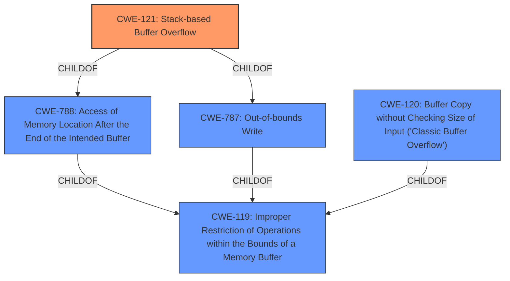

# Analysis for CVE-2022-29395

# Summary
| CWE ID | CWE Name | Confidence | CWE Abstraction Level | CWE Vulnerability Mapping Label | CWE-Vulnerability Mapping Notes |
|---|---|---|---|---|---|
| CWE-121 | Stack-based Buffer Overflow | 1.0 | Variant | Allowed | Primary CWE |
| CWE-120 | Buffer Copy without Checking Size of Input ('Classic Buffer Overflow') | 0.7 | Base | Allowed-with-Review | Secondary Candidate. Considered because of the buffer copy operation, but CWE-121 is a better fit. |

## Evidence and Confidence

*   **Confidence Score:** 1.0
*   **Evidence Strength:** HIGH

## Relationship Analysis
The primary CWE is CWE-121, which is a variant of CWE-787 (Out-of-bounds Write) and CWE-119 (Improper Restriction of Operations within the Bounds of a Memory Buffer). The relationship shows that CWE-121 is a specific type of buffer overflow that occurs on the stack. CWE-120 is a parent of CWE-121, but CWE-121 is more specific.

## Vulnerability Chain
The vulnerability chain starts with the **lack of** input validation, specifically the **absence of** a length check on the `apcliKey` parameter, leading to a **stack overflow** when the overly long input is copied to a stack-based buffer. The overflow can then lead to arbitrary code execution by overwriting the return address.

## Summary of Analysis
The initial analysis identified CWE-121 as the most relevant based on the description containing "**stack overflow**" and the CVE Reference Links Content Summary section indicating that the `apcliKey` parameter is copied into a local stack variable without any length validation. This aligns with the description of CWE-121 as a condition where a buffer being overwritten is allocated on the stack.

The "**weakness:** **stack overflow**" key phrase reinforces this determination. The description "This function retrieves the `apcliKey` parameter from a JSON request and copies it into a local stack variable without performing any length validation" is direct evidence for CWE-121.

The retriever results also listed CWE-121 as the top result with a score of 1.0.

CWE-120 was considered because the vulnerability involves a buffer copy operation, as stated in the "Root cause of vulnerability" from the CVE Reference Links Content Summary: "This function retrieves the `apcliKey` parameter from a JSON request and copies it into a local stack variable without performing any length validation." However, since the overflow occurs specifically on the stack, CWE-121 is the more precise and appropriate choice.

The choice of CWE-121 is at the Variant level of abstraction, which is a preferred level according to MITRE mapping guidance.