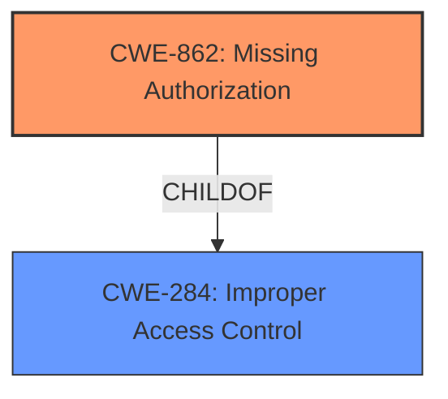

# Enhanced Analysis for CVE-2022-29417

# Summary
| CWE ID | CWE Name | Confidence | CWE Abstraction Level | CWE Vulnerability Mapping Label | CWE-Vulnerability Mapping Notes |
|---|---|---|---|---|---|
| CWE-862 | Missing Authorization | 1.0 | Class | Allowed-with-Review | Primary CWE. The plugin lacks authorization checks, allowing unauthorized users to change settings. |
| CWE-284 | Improper Access Control | 0.7 | Pillar | Discouraged | Secondary CWE. The plugin exhibits a broader access control issue by not properly restricting access based on user roles. |

## Evidence and Confidence

*   **Confidence Score:** 0.9
*   **Evidence Strength:** HIGH

## Relationship Analysis
The primary relationship impacting the decision is the hierarchical structure where CWE-862 (Missing Authorization) is a child of CWE-284 (Improper Access Control). While CWE-284 represents a broader category, CWE-862 more specifically captures the **root cause** of the vulnerability, which is the **lack of authorization checks**. The retriever results also support the selection of CWE-862, though it is a class, it is more specific than the pillar, CWE-284.mermaid



## Vulnerability Chain
The vulnerability chain starts with the **missing authorization check (CWE-862)**, which leads to the **impact of unauthorized users changing plugin settings**.

## Summary of Analysis
The analysis is primarily based on the provided evidence from the vulnerability description and the CVE Reference Links Content Summary.

The vulnerability description states: "Plugin Settings Update vulnerability in ShortPixels ShortPixel Adaptive Images plugin <= 3.3.1 at WordPress allows an attacker with a low user role like a subscriber or higher to change the plugin settings."

The CVE Reference Links Content Summary states: "The vulnerability is due to a **missing authorization**, authentication, or nonce token check in a function within the ShortPixel Adaptive Images plugin. This allows an unprivileged user to execute actions that should require higher privileges." It also mentions "**Broken Access Control:** The plugin lacks proper checks to ensure that only authorized users can perform certain actions."

The relationship graph influenced the selection by showing that CWE-862 is a more specific child of CWE-284.

CWE-862 is chosen as the primary CWE because the **root cause** is the **missing authorization check**. While CWE-284 (Improper Access Control) is also applicable, it's a broader category, and CWE-862 provides a more precise description of the vulnerability.

Relevant CWE Information:

# Enhanced Context (25 CWEs)

## CWE-434: Unrestricted Upload of File with Dangerous Type
**Abstraction Level**: Base
**Similarity Score**: 0.78
**Source**: dense

**Description**:
The product allows the upload or transfer of dangerous file types that are automatically processed within its environment.
**NOT USED:** This CWE is not related to the vulnerability, as it involves file uploads, which is not the case here.

## CWE-552: Files or Directories Accessible to External Parties
**Abstraction Level**: Base
**Similarity Score**: 0.78
**Source**: dense

**Description**:
The product makes files or directories accessible to unauthorized actors, even though they should not be.
**NOT USED:** This CWE is not related to the vulnerability, as it involves file access and directory permissions, which is not the case here.

## CWE-472: External Control of Assumed-Immutable Web Parameter
**Abstraction Level**: Base
**Similarity Score**: 0.78
**Source**: dense

**Description**:
The web application does not sufficiently verify inputs that are assumed to be immutable but are actually externally controllable, such as hidden form fields.
**NOT USED:** This CWE is related to tampering with parameters, which is not the **root cause** of the vulnerability.

## CWE-184: Incomplete List of Disallowed Inputs
**Abstraction Level**: Base
**Similarity Score**: 0.78
**Source**: dense

**Description**:
The product implements a protection mechanism that relies on a list of inputs (or properties of inputs) that are not allowed by policy or otherwise require other action to neutralize before additional processing takes place, but the list is incomplete.
**NOT USED:** This CWE is related to incomplete lists of disallowed inputs, which is not the **root cause** of the vulnerability.

## CWE-425: Direct Request ('Forced Browsing')
**Abstraction Level**: Base
**Similarity Score**: 0.77
**Source**: dense

**Description**:
The web application does not adequately enforce appropriate authorization on all restricted URLs, scripts, or files.
**NOT USED:** While related to authorization, this is more about accessing restricted resources directly, whereas the identified vulnerability is about missing authorization checks leading to settings changes.

## CWE-41: Improper Resolution of Path Equivalence
**Abstraction Level**: Base
**Similarity Score**: 0.77
**Source**: dense

**Description**:
The product is vulnerable to file system contents disclosure through path equivalence. Path equivalence involves the use of special characters in file and directory names. The associated manipulations are intended to generate multiple names for the same object.
**NOT USED:** This CWE is related to path equivalence issues, which is not the case here.

## CWE-639: Authorization Bypass Through User-Controlled Key
**Abstraction Level**: Base
**Similarity Score**: 0.77
**Source**: dense

**Description**:
The system's authorization functionality does not prevent one user from gaining access to another user's data or record by modifying the key value identifying the data.
**NOT USED:** This CWE is related to authorization bypass through user-controlled keys, which is not the **root cause** of the vulnerability.

## CWE-807: Reliance on Untrusted Inputs in a Security Decision
**Abstraction Level**: Base
**Similarity Score**: 0.77
**Source**: dense

**Description**:
The product uses a protection mechanism that relies on the existence or values of an input, but the input can be modified by an untrusted actor in a way that bypasses the protection mechanism.
**NOT USED:** This CWE is related to reliance on untrusted inputs, which is not the **root cause** of the vulnerability.

## CWE-1289: Improper Validation of Unsafe Equivalence in Input
**Abstraction Level**: Base
**Similarity Score**: 0.77
**Source**: dense

**Description**:
The product receives an input value that is used as a resource identifier or other type of reference, but it does not validate or incorrectly validates that the input is equivalent to a potentially-unsafe value.
**NOT USED:** This CWE is related to improper validation of unsafe equivalence, which is not the **root cause** of the vulnerability.

## CWE-23: Relative Path Traversal
**Abstraction Level**: Base
**Similarity Score**: 0.76
**Source**: dense

**Description**:
The product uses external input to construct a pathname that should be within a restricted directory, but it does not properly neutralize sequences such as ".." that can resolve to a location that is outside of that directory.
**NOT USED:** This CWE is related to path traversal issues, which is not the case here.

## CWE-863: Incorrect Authorization
**Abstraction Level**: Class
**Similarity Score**: 5994.76
**Source**: sparse

**Description**:
The product performs an authorization check when an actor attempts to access a resource or perform an action, but it does not correctly perform the check.
**NOT USED:** The vulnerability is due to a *missing* authorization check, not an incorrect one.

## CWE-285: Improper Authorization
**Abstraction Level**: Class
**Similarity Score**: 5913.34
**Source**: sparse

**Description**:
The product does not perform or incorrectly performs an authorization check when an actor attempts to access a resource or perform an action.

## CWE-178: Improper Handling of Case Sensitivity
**Abstraction Level**: base
**Similarity Score**: 4.51
**Source**: graph

**Description**:
CWE-178: Improper Handling of Case Sensitivity
**NOT USED:** This CWE is related to case sensitivity, which is not the case here.

## CWE-430: Deployment of Wrong Handler
**Abstraction Level**: base
**Similarity Score**: 4.51
**Source**: graph

**Description**:
CWE-430: Deployment of Wrong Handler
**NOT USED:** This CWE is related to deployment of wrong handlers, which is not the case here.

## CWE-613: Insufficient Session Expiration
**Abstraction Level**: base
**Similarity Score**: 4.33
**Source**: graph

**Description**:
CWE-613: Insufficient Session Expiration
**NOT USED:** This CWE is related to insufficient session expiration, which is not the case here.


## CWE Relationship Analysis

Current CWEs represent these abstraction levels: .


### Vulnerability Chain Analysis

**Chain starting from CWE-862:**
- 862 (Missing Authorization) - ROOT


**Chain starting from CWE-552:**
- 552 (Files or Directories Accessible to External Parties) - ROOT


### CWE Relationship Diagram

```mermaid
graph TD
    classDef primary fill:#f96,stroke:#333,stroke-width:2px
    classDef secondary fill:#69f,stroke:#333
    classDef tertiary fill:#9e9,stroke:#333
```