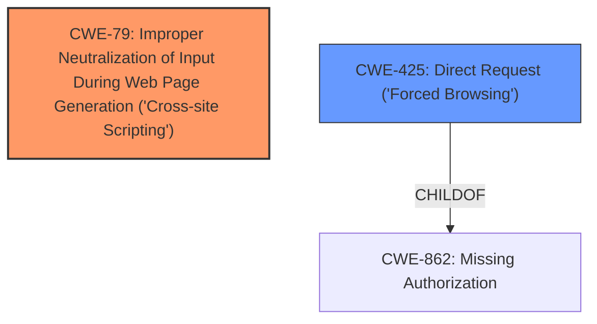

# Analysis Report for CVE-2022-29444

# Vulnerability Analysis Report: CVE-2022-29444

## Description


## Analysis (with Relationship Data)

# Summary
| CWE ID | CWE Name | Confidence | CWE Abstraction Level | CWE Vulnerability Mapping Label | CWE-Vulnerability Mapping Notes |
|---|---|---|---|---|---|
| CWE-79 | Improper Neutralization of Input During Web Page Generation ('Cross-site Scripting') | 1.0 | Base | Allowed | Primary CWE: The plugin does not neutralize user-controllable input before placing it in output used as a web page, leading to XSS. |
| CWE-425 | Direct Request ('Forced Browsing') | 0.7 | Base | Allowed | Secondary CWE: Users with subscriber roles can directly request wp_ajax actions without proper authorization checks. |

## Evidence and Confidence

*   **Confidence Score:** 0.85
*   **Evidence Strength:** HIGH

## Relationship Analysis
The primary CWE is CWE-79, which is a base-level CWE that directly addresses the improper neutralization of input leading to XSS. CWE-425 is a related weakness where the application does not enforce appropriate authorization on restricted URLs, scripts, or files. It is classified as a base level CWE and a child of CWE-862.



## Vulnerability Chain
The vulnerability chain starts with the **improper input sanitization** (CWE-79) combined with **insufficient authorization** (CWE-425), allowing users with lower privileges to modify plugin settings, leading to XSS.
  - CWE-425: Direct Request ('Forced Browsing') allows unauthorized access to wp_ajax actions.
  - CWE-79: Improper Neutralization of Input During Web Page Generation ('Cross-site Scripting') leads to XSS by injecting malicious scripts.

## Summary of Analysis
The primary weakness is clearly Cross-Site Scripting (CWE-79) due to the **improper input sanitization**. Secondary weakness is Direct Request (CWE-425) which enables the vulnerability.

The vulnerability description explicitly mentions that users with subscriber roles can change plugin settings, including the CDN setting, which can then be used for an XSS attack.

Evidence: "Plugin Settings Change leading to Cross-Site Scripting (XSS) vulnerability in Cloudways Breeze plugin <= 2.0.2 on WordPress allows users with a subscriber or higher user role to execute any of the wp_ajax_* actions in the class Breeze_Configuration which includes the ability to change any of the plugins settings including CDN setting which could be further used for XSS attack."

The selection of CWE-79 is at the optimal level of specificity because it directly addresses the root cause of the XSS vulnerability, which is the **improper neutralization** of input. The secondary CWE-425 is at the optimal level as well because it represents the **missing authorization** that allows lower privileged users to access sensitive functionalities.

Relevant CWE Information:

# Enhanced Context (25 CWEs)
The following CWEs were identified as potentially relevant to this vulnerability:

## CWE-639: Authorization Bypass Through User-Controlled Key
**Abstraction Level**: Base
**Similarity Score**: 0.76
**Source**: dense

**Description**:
The system's authorization functionality does not prevent one user from gaining access to another user's data or record by modifying the key value identifying the data.
**Rationale for Not Selecting**: This CWE is not applicable as the vulnerability doesn't involve modification of key values to access another user's data.

## CWE-1220: Insufficient Granularity of Access Control
**Abstraction Level**: Base
**Similarity Score**: 0.75
**Source**: dense

**Description**:
The product implements access controls via a policy or other feature with the intention to disable or restrict accesses (reads and/or writes) to assets in a system from untrusted agents. However, implemented access controls lack required granularity, which renders the control policy too broad because it allows accesses from unauthorized agents to the security-sensitive assets.
**Rationale for Not Selecting**: This is related to access control issues but doesn't precisely match the vulnerability where subscriber-level users have access to sensitive settings.

## CWE-799: Improper Control of Interaction Frequency
**Abstraction Level**: Class
**Similarity Score**: 0.75
**Source**: dense

**Description**:
The product does not properly limit the number or frequency of interactions that it has with an actor, such as the number of incoming requests.
**Rationale for Not Selecting**: This is not related to limiting interaction frequency.

## CWE-807: Reliance on Untrusted Inputs in a Security Decision
**Abstraction Level**: Base
**Similarity Score**: 0.75
**Source**: dense

**Description**:
The product uses a protection mechanism that relies on the existence or values of an input, but the input can be modified by an untrusted actor in a way that bypasses the protection mechanism.
**Rationale for Not Selecting**: While the vulnerability involves **untrusted input**, the reliance on this input is not the primary factor; the main issue is the lack of neutralization.

## CWE-653: Improper Isolation or Compartmentalization
**Abstraction Level**: Class
**Similarity Score**: 0.75
**Source**: dense

**Description**:
The product does not properly compartmentalize or isolate functionality, processes, or resources that require different privilege levels, rights, or permissions.
**Rationale for Not Selecting**: This is more about internal compartmentalization, not the external exposure leading to XSS.

## CWE-184: Incomplete List of Disallowed Inputs
**Abstraction Level**: Base
**Similarity Score**: 0.75
**Source**: dense

**Description**:
The product implements a protection mechanism that relies on a list of inputs (or properties of inputs) that are not allowed by policy or otherwise require other action to neutralize before additional processing takes place, but the list is incomplete.
**Rationale for Not Selecting**: This CWE describes a situation where a list of disallowed inputs is incomplete. While related to input validation, the primary issue is **improper neutralization**, not an incomplete list.

## CWE-472: External Control of Assumed-Immutable Web Parameter
**Abstraction Level**: Base
**Similarity Score**: 0.75
**Source**: dense

**Description**:
The web application does not sufficiently verify inputs that are assumed to be immutable but are actually externally controllable, such as hidden form fields.
**Rationale for Not Selecting**: This CWE is about assumed-immutable web parameters, which isn't the primary issue here.

## CWE-552: Files or Directories Accessible to External Parties
**Abstraction Level**: Base
**Similarity Score**: 0.75
**Source**: dense

**Description**:
The product makes files or directories accessible to unauthorized actors, even though they should not be.
**Rationale for Not Selecting**: This CWE is not about file access; it's about **improper input neutralization** leading to XSS.

## CWE-274: Improper Handling of Insufficient Privileges
**Abstraction Level**: Base
**Similarity Score**: 0.74
**Source**: dense

**Description**:
The product does not handle or incorrectly handles when it has insufficient privileges to perform an operation, leading to resultant weaknesses.
**Rationale for Not Selecting**: This CWE describes the situation where the product doesn't handle insufficient privileges, not about XSS due to **improper input neutralization**.

## CWE-1289: Improper Validation of Unsafe Equivalence in Input
**Abstraction Level**: Base
**Similarity Score**: 0.74
**Source**: dense

**Description**:
The product receives an input value that is used as a resource identifier or other type of reference, but it does not validate or incorrectly validates that the input is equivalent to a potentially-unsafe value.
**Rationale for Not Selecting**: The vulnerability isn't about validating unsafe equivalences in input.

## CWE-116: Improper Encoding or Escaping of Output
**Abstraction Level**: Class
**Similarity Score**: 8558.55
**Source**: sparse

**Description**:
The product prepares a structured message for communication with another component, but encoding or escaping of the data is either missing or done incorrectly. As a result, the intended structure of the message is not preserved.
**Rationale for Not Selecting**: CWE-116 is a valid candidate. Improper encoding or escaping of output is related to XSS. However, the description and key phrases point to the **improper neutralization of input** as the root cause.

## CWE-352: Cross-Site Request Forgery (CSRF)
**Abstraction Level**: Compound
**Similarity Score**: 8149.27
**Source**: sparse

**Description**:
The web application does not, or can not, sufficiently verify whether a well-formed, valid, consistent request was intentionally provided by the user who submitted the request.
**Rationale for


## CWE Relationship Analysis

Current CWEs represent these abstraction levels: .


### Vulnerability Chain Analysis

**Chain starting from CWE-862:**
- 862 (Missing Authorization) - ROOT


**Chain starting from CWE-552:**
- 552 (Files or Directories Accessible to External Parties) - ROOT


### CWE Relationship Diagram

```mermaid
graph TD
    classDef primary fill:#f96,stroke:#333,stroke-width:2px
    classDef secondary fill:#69f,stroke:#333
    classDef tertiary fill:#9e9,stroke:#333
```


*Report generated on 2025-03-31 09:21:10*
