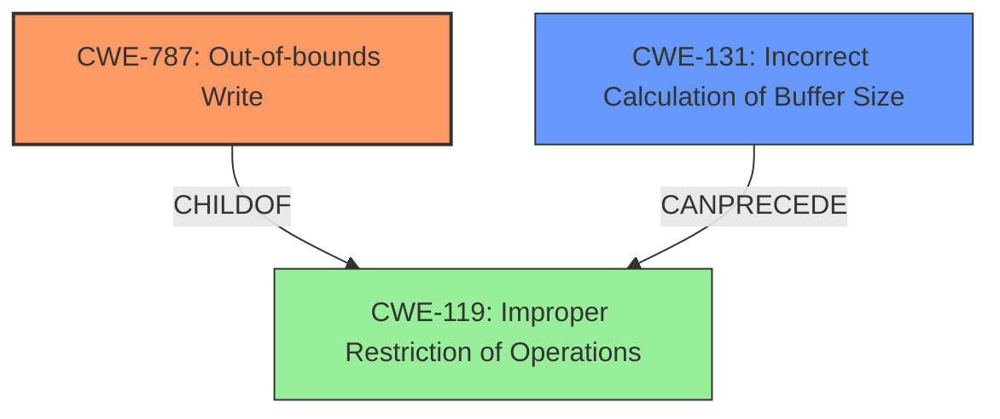

# Analysis Report for CVE-2022-29465

# Vulnerability Analysis Report: CVE-2022-29465

## Description


## Analysis (with Relationship Data)

# Summary
| CWE ID | CWE Name | Confidence | CWE Abstraction Level | CWE Vulnerability Mapping Label | CWE-Vulnerability Mapping Notes |
|---|---|---|---|---|---|
| CWE-787 | Out-of-bounds Write | 1.0 | Base | Allowed | Primary CWE |
| CWE-131 | Incorrect Calculation of Buffer Size | 0.8 | Base | Allowed | Secondary Candidate |

## Evidence and Confidence

*   **Confidence Score:** 0.9
*   **Evidence Strength:** HIGH

## Relationship Analysis
The primary CWE is CWE-787 (**Out-of-bounds Write**), which is a **Base** level CWE. It has a parent-child relationship with CWE-119 (**Improper Restriction of Operations Within the Bounds of a Memory Buffer**). CWE-131 (**Incorrect Calculation of Buffer Size**) can precede CWE-119, and thus can also precede CWE-787 in a vulnerability chain. This relationship influenced the inclusion of CWE-131 as a secondary weakness.



## Vulnerability Chain
The vulnerability chain starts with an **incorrect calculation of buffer size (CWE-131)**, which leads to an undersized buffer. Subsequently, when data is written to this buffer, it results in an **out-of-bounds write (CWE-787)**, ultimately causing memory corruption.
  - Root Cause: CWE-131
  - Weakness: CWE-787
  - Impact: Memory Corruption

## Summary of Analysis
The initial analysis strongly points to CWE-787 (**Out-of-bounds Write**) as the primary weakness, based on the vulnerability description explicitly stating an **out-of-bounds write** vulnerability. The CVE reference links content summary further supports this by detailing how the `allocation_function_mem` function **lacks sufficient memory allocation checks, resulting in a smaller buffer and subsequent out-of-bounds write**.
```
Root cause of vulnerability: The vulnerability lies in the allocation_function_mem function of Accusoft ImageGear library, where a missing check for memory bounds within a heap buffer leads to a buffer overflow. Specifically, the size of the allocated buffer (psd_buffer_oobw) is calculated based on the width and bits per channel from the PSD file, but this calculation doesn't account for a minimum buffer size when bits_per_channel is 1. This allows for a smaller buffer than required, resulting in an out-of-bounds write during subsequent operations.
```

The retriever results also identify CWE-787 as a relevant candidate. The relationship analysis reveals that CWE-787 is a child of CWE-119 (**Improper Restriction of Operations Within the Bounds of a Memory Buffer**).

Considering the root cause analysis and the description of the vulnerability, it is clear that the buffer size calculation is flawed. The `allocation_function_mem` function calculates the buffer size based on the width and bits per channel of the PSD file, but fails to account for minimum buffer sizes when `bits_per_channel` is 1. This leads to allocating a smaller buffer than required, and subsequently, a write operation goes beyond the intended boundary. This indicates an incorrect calculation of the buffer size, making CWE-131 (**Incorrect Calculation of Buffer Size**) a relevant secondary CWE.

Therefore, the selected CWEs (CWE-787 and CWE-131) are at the optimal level of specificity, accurately representing both the direct cause and the contributing factor of the vulnerability.

**CWE Considerations:**

*   CWE-190 (**Integer Overflow or Wraparound**) and CWE-197 (**Numeric Truncation Error**) were considered because the root cause involves an integer calculation related to memory allocation. However, the evidence indicates that the primary issue is not an overflow or truncation, but rather a flawed calculation logic.
*   CWE-125 (**Out-of-bounds Read**) was considered, but the vulnerability description and CVE summary clearly state that the issue is an **out-of-bounds write**, not a read.

# Relevant CWE Information:

# Enhanced Context (25 CWEs)

## CWE-197: Numeric Truncation Error
**Abstraction Level**: Base
**Similarity Score**: 0.80
**Source**: dense

**Description**:
Truncation errors occur when a primitive is cast to a primitive of a smaller size and data is lost in the conversion.

**Mapping Guidance**:
- Usage: Allowed
- Rationale: This CWE entry is at the Base level of abstraction, which is a preferred level of abstraction for mapping to the root causes of vulnerabilities.


## CWE-191: Integer Underflow (Wrap or Wraparound)
**Abstraction Level**: Base
**Similarity Score**: 0.80
**Source**: dense

**Description**:
The product subtracts one value from another, such that the result is less than the minimum allowable integer value, which produces a value that is not equal to the correct result.

**Mapping Guidance**:
- Usage: Allowed
- Rationale: This CWE entry is at the Base level of abstraction, which is a preferred level of abstraction for mapping to the root causes of vulnerabilities.


## CWE-131: Incorrect Calculation of Buffer Size
**Abstraction Level**: Base
**Similarity Score**: 0.79
**Source**: dense

**Description**:
The product does not correctly calculate the size to be used when allocating a buffer, which could lead to a buffer overflow.

**Mapping Guidance**:
- Usage: Allowed
- Rationale: This CWE entry is at the Base level of abstraction, which is a preferred level of abstraction for mapping to the root causes of vulnerabilities.


## CWE-681: Incorrect Conversion between Numeric Types
**Abstraction Level**: Base
**Similarity Score**: 0.78
**Source**: dense

**Description**:
When converting from one data type to another, such as long to integer, data can be omitted or translated in a way that produces unexpected values. If the resulting values are used in a sensitive context, then dangerous behaviors may occur.

**Mapping Guidance**:
- Usage: Allowed
- Rationale: This CWE entry is at the Base level of abstraction, which is a preferred level of abstraction for mapping to the root causes of vulnerabilities.


## CWE-823: Use of Out-of-range Pointer Offset
**Abstraction Level**: Base
**Similarity Score**: 0.77
**Source**: dense

**Description**:
The product performs pointer arithmetic on a valid pointer, but it uses an offset that can point outside of the intended range of valid memory locations for the resulting pointer.

**Mapping Guidance**:
- Usage: Allowed
- Rationale: This CWE entry is at the Base level of abstraction, which is a preferred level of abstraction for mapping to the root causes of vulnerabilities.


## CWE-125: Out-of-bounds Read
**Abstraction Level**: Base
**Similarity Score**: 0.77
**Source**: dense

**Description**:
The product reads data past the end, or before the beginning, of the intended buffer.

**Mapping Guidance**:
- Usage: Allowed
- Rationale: This CWE entry is at the Base level of abstraction, which is a preferred level of abstraction for mapping to the root causes of vulnerabilities.


## CWE-129: Improper Validation of Array Index
**Abstraction Level**: Variant
**Similarity Score**: 0.77
**Source**: dense

**Description**:
The product uses untrusted input when calculating or using an array index, but the product does not validate or incorrectly validates the index to ensure the index references a valid position within the array.

**Mapping Guidance**:
- Usage: Allowed
- Rationale: This CWE entry is at the Variant level of abstraction, which is a preferred level of abstraction for mapping to the root causes of vulnerabilities.


## CWE-805: Buffer Access with Incorrect Length Value
**Abstraction Level**: Base
**Similarity Score**: 0.76
**Source**: dense

**Description**:
The product uses a sequential operation to read or write a buffer, but it uses an incorrect length value that causes it to access memory that is outside of the bounds of the buffer.

**Mapping Guidance**:
- Usage: Allowed
- Rationale: This CWE entry is at the Base level of abstraction, which is a preferred level of abstraction for mapping to the root causes of vulnerabilities.


## CWE-190: Integer Overflow or Wraparound
**Abstraction Level**: Base
**Similarity Score**: 0.76
**Source**: dense

**Description**:
The product performs a calculation that can
         produce an integer overflow or wraparound when the logic
         assumes


## CWE Relationship Analysis

Current CWEs represent these abstraction levels: .


### Vulnerability Chain Analysis

**Chain starting from CWE-131:**
- 131 (Incorrect Calculation of Buffer Size) - ROOT


**Chain starting from CWE-190:**
- 190 (Integer Overflow or Wraparound) - ROOT


### CWE Relationship Diagram

```mermaid
graph TD
    classDef primary fill:#f96,stroke:#333,stroke-width:2px
    classDef secondary fill:#69f,stroke:#333
    classDef tertiary fill:#9e9,stroke:#333
```


*Report generated on 2025-03-31 08:47:00*
