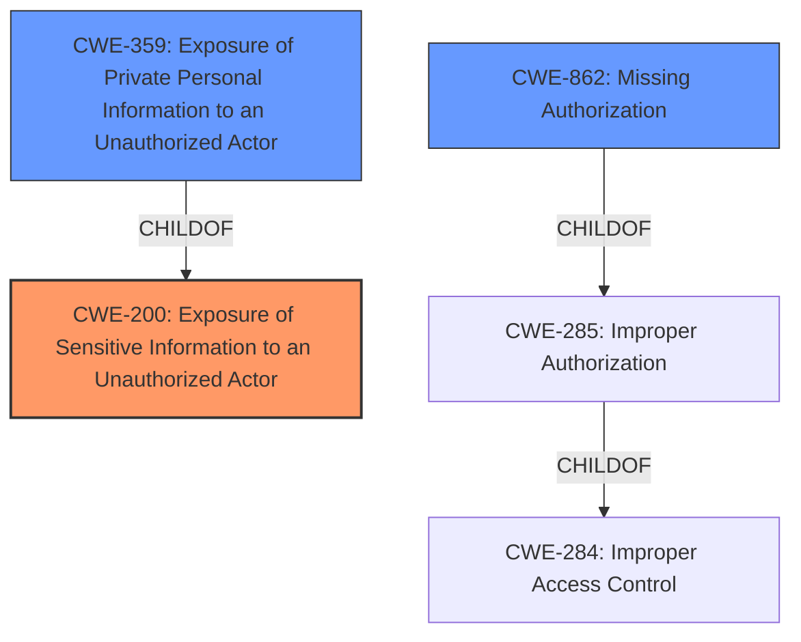

# Analysis Report for CVE-2022-29467

# Vulnerability Analysis Report: CVE-2022-29467

## Description


## Analysis (with Relationship Data)

# Summary
| CWE ID  | CWE Name                                                     | Confidence | CWE Abstraction Level | CWE Vulnerability Mapping Label | CWE-Vulnerability Mapping Notes |
| :-------- | :----------------------------------------------------------- | :--------- | :---------------------- | :------------------------------ | :------------------------------ |
| CWE-200   | Exposure of Sensitive Information to an Unauthorized Actor | 0.85       | Class                   | Primary                         | Discouraged                    |
| CWE-359   | Exposure of Private Personal Information to an Unauthorized Actor | 0.75     | Base                    | Secondary                       | Allowed                        |
| CWE-862   | Missing Authorization | 0.65       | Class                   | Secondary                       | Allowed-with-Review                  |

## Evidence and Confidence

*   **Confidence Score:** 0.80
*   **Evidence Strength:** MEDIUM

## Relationship Analysis
The primary CWE is CWE-200 which is a class level CWE and a parent of CWE-359. CWE-359 is more specific as it relates to the exposure of private personal information, so I have included that as a secondary CWE. CWE-285 is a parent of CWE-862, and CWE-862 is a class level CWE, so I have included that as a secondary CWE.



## Vulnerability Chain
The vulnerability chain starts with a **componentAddress information disclosure** which then leads to the impact of an attacker being able to obtain some data of Address. I have chosen to include CWE-862 (Missing Authorization) as a potential secondary cause for the information disclosure.

## Summary of Analysis
The initial analysis identified the **Address information disclosure vulnerability** as the root cause. The primary CWE selected was CWE-200 Exposure of Sensitive Information to an Unauthorized Actor because the vulnerability description indicates that a remote authenticated attacker can obtain some data of Address. The "CVE Reference Links Content Summary" indicates that "The core issue is that the system improperly handles access to address information, leading to unauthorized disclosure." The Retriever Results also list CWE-200 as the top combined result. However, CWE-200 is a class level CWE and is discouraged from being used, therefore I have also added CWE-359 Exposure of Private Personal Information to an Unauthorized Actor as a secondary CWE because the vulnerability description indicates that the information that is being disclosed is address information.

I considered other CWEs from the Retriever Results, such as CWE-285 and CWE-862, but they seemed less directly related to the core issue of information exposure. However, I am including CWE-862, Missing Authorization, as a secondary CWE since that may also be a contributing factor in the information disclosure.

I believe the selected CWEs are at the optimal level of specificity because they accurately reflect the root cause and impact of the vulnerability, based on the available evidence.


## CWE Relationship Analysis

Current CWEs represent these abstraction levels: .


### Vulnerability Chain Analysis

**Chain starting from CWE-862:**
- 862 (Missing Authorization) - ROOT


**Chain starting from CWE-200:**
- 200 (Exposure of Sensitive Information to an Unauthorized Actor) - ROOT


### CWE Relationship Diagram

```mermaid
graph TD
    classDef primary fill:#f96,stroke:#333,stroke-width:2px
    classDef secondary fill:#69f,stroke:#333
    classDef tertiary fill:#9e9,stroke:#333
```


*Report generated on 2025-03-30 16:00:37*
